# Backend, Transport, and Frontend Abstractions

Status: proposal

Related proof:
[Composable Authoring Proof](composable-authoring-proof.md)

This proposal turns the current runtime architecture into three named
abstractions:

- `Backend`
- `Transport`
- `Frontend`

It also names one transport payload concept:

- `Message`

`ResourceRef` and `Snapshot` are reserved names for a later state/resource
extension, not part of the first implementation target. `Capability` is reserved
even later as a possible packaging concept for repeated cross-boundary feature
patterns. It should not be implemented generically until concrete trace,
control, selection, and morphology bindings prove the shared shape.

The goal is simplification, not a new framework tier. The current architecture
already behaves like a backend/transport/frontend system, but the code and docs
still expose `Session`, update subclasses, and concrete VisPy/Pipe names before
the simpler mental model. This proposal proves that the simpler model can cover
today's static, replay, NEURON, Jaxley, desktop, future notebook, future
WebSocket, document, and headless paths and can be implemented as a direct
breaking refactor.

## Migration Posture

This proposal assumes the current branch can break public API. Backward
compatibility should not drive the design.

Rules:

- Prefer direct renames over aliases.
- Do not keep `Session` and `Backend` as parallel public vocabulary.
- Do not keep old `Scene` and new `AppSpec` as parallel public vocabulary after
  the app-contract split lands.
- Do not add compatibility shims unless they are temporary scaffolding inside a
  single implementation PR.
- Update examples, docs, invariants, and public exports in the same sweep as the
  breaking rename.

The goal is one coherent vocabulary at the end of the refactor, not a migration
layer.

## Core Claim

The runtime core should be explainable in three sentences:

```text
Backend owns model, data, simulation, replay, or document execution.
Frontend owns presentation, interaction, and UI state.
Transport moves Messages between them.
```

`Backend` may be a simple adapter, a simulator wrapper, a replay source, or a
coupled process that coordinates multiple simulation engines. For example, a
C. elegans app may couple a neural simulator to a MuJoCo or Unity physics body
model. That neural-physics coupling belongs inside a backend composition layer,
not in the frontend transport.

Simulator adapters attach to native simulator handles. They must not require a
scientist to rewrite a NEURON, Jaxley, MOOSE, MuJoCo, or custom model into a
CompNeuroVis-owned model class.

The runtime diagram is only:

```text
Backend <-> Transport <-> Frontend
```

Messages cross the transport. The first message shape should be thin:

```text
Message = type + intent + typed payload
```

`Command` and `Update` are message intents, not transport-level primitives:

```text
Message(intent="command"): request to do something
Message(intent="update"):  statement that something changed
```

Either side can send a message with either intent. Direction is a property of a
concrete message instance, not of the intent name.

Everything else is staged extension work:

| Stage | Vocabulary | Rule |
|---|---|---|
| Runtime core | `Backend`, `Transport`, `Frontend`, `Message` | Teach these first and implement them first. |
| Message policy extension | `MessageEnvelope`, `MessagePolicy`, transport delivery policy | Add ids, correlation ids, acknowledgements, resume offsets, and reliable/volatile delivery outside the semantic `Message` when real transports need them. |
| State/resource extension | `ResourceRef`, `Snapshot`, `ResourceTransport` | Add only when large, durable, lazy, or frontend-owned semantic state needs read/subscribe behavior. |
| Feature packaging extension | concrete `TraceBinding`, `ControlBinding`, `SelectionBinding`, `MorphologyBinding`, then maybe `Capability` | Prove repeated concrete bindings before adding a generic capability contract. |

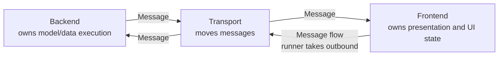

Arrows in high-level architecture diagrams show logical message flow, not object
references. Backends and frontends do not receive a transport object in their
base protocol. A runner or transport worker calls `take_outbound_messages()`
on the actor, then calls `Transport.send(...)` for each produced message.

Future extensions hang off that core, but do not change the ownership model:

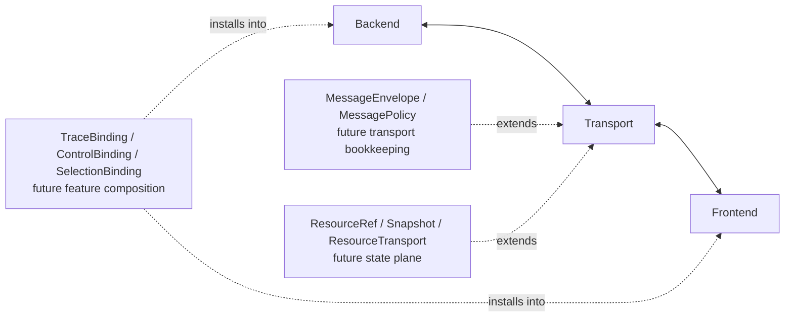

The diagram intentionally has no `Host` layer. Startup, event-loop ownership,
and object construction belong to a composition concern named `AppRuntime` or a
runner such as `run_app(...)`; they are not part of message or state ownership.

## Why This Fits Current Code And Planned Gaps

The current code already maps cleanly onto the runtime abstractions. The table
also names planned gaps so future work does not accidentally make them look
implemented today.

| Proposed name | Stage | Current concrete code | Current role |
|---|---|---|---|
| `Backend` | Runtime core | `Session`, `BufferedSession`, `NeuronSession`, `JaxleySession`, `ReplaySession` | Creates initial scene, advances model, handles semantic commands, emits typed updates. |
| `Transport` | Runtime core | `PipeTransport` | Starts/stops backend worker, polls updates, sends commands. |
| `Frontend` | Runtime core | `VispyFrontendWindow` | Owns Qt/VisPy/pyqtgraph widgets, frontend state, refresh planning, rendering, and user input. |
| `Message` | Runtime core | Not implemented as an envelope yet. Current code sends `SessionCommand` and `SessionUpdate` dataclasses directly. | Thin transport payload with `type`, `intent`, and typed payload. |
| `Command` intent | Runtime core | `SessionCommand` subclasses | Current frontend-to-backend command implementation; target concept means "request to do something" in either direction. |
| `Update` intent | Runtime core | `SessionUpdate` subclasses | Current backend-to-frontend update implementation; target concept means "state changed" in either direction. |
| `MessageEnvelope` / `MessagePolicy` | Future message policy extension | Not implemented yet. | Optional transport bookkeeping for ids, correlation ids, acknowledgements, resume offsets, and reliable/volatile delivery. |
| `AppSpec` | Declarative app contract | `Scene` (target rename) | Declarative boundary object with `DataCatalog`, `ViewCatalog`, `InteractionCatalog`, and `LayoutCatalog`. Not shared mutable state, not a fourth runtime actor, and not inherently backend-owned. See AppSpec section. |
| `DataCatalog` | Declarative app contract | Not yet separated from `Scene` | `FieldSpec` declarations and `GeometrySpec` declarations. Does not contain field values or geometry data. |
| `ViewCatalog` | Declarative app contract | Not yet separated from `Scene` | Named view specs (`LinePlotViewSpec`, `MorphologyViewSpec`, etc.). |
| `InteractionCatalog` | Declarative app contract | Not yet separated from `Scene` | Controls, actions, tools, key bindings, and selection specs. |
| `LayoutCatalog` | Declarative app contract | `LayoutSpec` inside `Scene` | Named dict of `LayoutSpec`s plus an `active` key. Each `LayoutSpec` is a different arrangement of the same views/interactions — e.g. simulation vs. morphology inspection vs. validation perspectives. References views by id. |
| `ResourceRef` | Future state/resource extension | Not implemented yet; closest current forms are field ids, view ids, control ids, and state keys. | Stable reference to backend-owned or frontend-owned state. |
| `Snapshot` | Future state/resource extension | Not implemented yet. Current code sends values through `AppSpecReady`, `FieldReplace`, `FieldAppend`, and `StatePatch`. | Versioned point-in-time value read from a resource. |
| concrete bindings | Future feature-composition extension | Closest current forms are builders, actions, controls, views, panels, and backend-specific session helpers. | Start with `TraceBinding`, `ControlBinding`, `SelectionBinding`, and `MorphologyBinding`. |
| `CoupledBackend` | Future backend composition pattern | Not implemented yet. Closest current shape is custom `BufferedSession` code that owns all stepping and sampling itself. | One backend runtime that coordinates neural, physics, replay, or analysis adapters through internal ports and a coupling policy. |
| `Capability` | Reserved future vocabulary | Not implemented yet. | Promote only if concrete bindings prove a shared cross-boundary package contract. |

Feasibility proof:

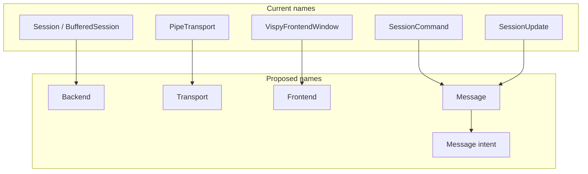

The first code step renames existing classes to the new vocabulary directly.

## Target Protocols

The first implementation should introduce the target protocols through a
breaking rename, not by layering compatibility names around current classes.
Transport-facing names should be message-oriented so direction is not baked
into the API. The core target is deliberately small: four nouns, typed payloads,
and no transport policy fields inside the semantic message.

```python
from __future__ import annotations

from dataclasses import dataclass
from typing import Generic
from typing import Literal
from typing import Protocol
from typing import TypeVar


T = TypeVar("T")
MessageIntent = Literal["command", "update"]


@dataclass(frozen=True)
class MessageType(Generic[T]):
    name: str
    payload_type: type[T]
    allowed_intents: tuple[MessageIntent, ...]


@dataclass(frozen=True)
class Message(Generic[T]):
    type: MessageType[T]
    intent: MessageIntent
    payload: T


class Backend(Protocol):
    def initialize(self) -> None: ...
    def handle(self, message: Message[object]) -> None: ...
    def advance(self) -> None: ...
    def take_outbound_messages(self) -> list[Message[object]]: ...
    def shutdown(self) -> None: ...


class Transport(Protocol):
    def start(self) -> None: ...
    def send(self, message: Message[object]) -> None: ...
    def poll(self) -> list[Message[object]]: ...
    def stop(self) -> None: ...


class Frontend(Protocol):
    def initialize(self) -> None: ...
    def handle(self, message: Message[object]) -> None: ...
    def take_outbound_messages(self) -> list[Message[object]]: ...
    def render(self) -> None: ...
    def close(self) -> None: ...
```

Example message shapes:

```python
CONTROL_SET: MessageType[SetControl]       # allowed_intents={"command"}
FIELD_APPEND: MessageType[FieldAppend]     # allowed_intents={"update"}
APP_SPEC_READY: MessageType[AppSpecReady]  # allowed_intents={"update"}
APP_SPEC_PATCH: MessageType[AppSpecPatch]  # allowed_intents={"update"}
BACKEND_STOP: MessageType[StopBackend]     # allowed_intents={"command"}

Message(type=CONTROL_SET, intent="command", payload=SetControl("gain", 0.8))
Message(type=FIELD_APPEND, intent="update", payload=FieldAppend(...))
Message(type=APP_SPEC_READY, intent="update", payload=AppSpecReady(app_spec))
Message(type=APP_SPEC_PATCH, intent="update", payload=AppSpecPatch(...))
Message(type=BACKEND_STOP, intent="command", payload=StopBackend())
```

Notes:

- `Backend` replaces the current `Session` role. `Session` is renamed to
  `Backend` or an appropriate concrete subclass name in the same sweep.
- The target protocol has an explicit outbound pickup boundary because that
  best matches current `Session.emit(...)` / `read_updates()` pressure and
  future composable backend callbacks. A pure return-value backend can still be
  adapted, but the codebase should not support both emission models as equal
  long-term primitives.
- `startup_scene`, `is_live`, and `idle_sleep` should not remain `Session`
  compatibility hooks. During the breaking refactor, move them either into
  backend metadata/runner policy or remove them from the stable protocol.
- Current `Session.handle(command)` and `Session.read_updates()` prove the
  backend-side shape, but the breaking refactor should rename the public methods
  and payload bases to the target vocabulary.
- `Transport` is already the effective `PipeTransport` interface for today's
  command/update directions. The target shape makes `Transport` move one
  typed message value, like WebSocket and Socket.IO transports move
  application-level envelopes without owning their semantics.
- `read(...)` and `subscribe(...)` do not belong on base `Transport`. They are
  future `ResourceTransport` methods once the state/resource plane is needed.
- `Frontend` is intentionally smaller than `VispyFrontendWindow`. The desktop
  window has application/window lifecycle concerns in addition to frontend
  behavior.
- `APP_SPEC_READY` is the single runtime path for app materialization. A
  concrete frontend may have a private helper such as `_set_app_spec(...)`, but
  `set_app_spec(...)` is not part of the public `Frontend` protocol. Static
  apps should be delivered by `AppRuntime` as an in-process
  `Message(type=APP_SPEC_READY, intent="update", ...)`, not through a second
  conceptual path.
- Backends and frontends expose produced messages through
  `take_outbound_messages()` instead of receiving a transport object directly in
  the base protocol. The call returns and clears pending outbound messages
  produced by that actor since the previous call.
- Message type names should be registered typed constants, not arbitrary strings
  emitted freely from application code. `payload_type` allows runtime validation
  and `allowed_intents` prevents a payload such as `FieldAppend` from being sent
  with command intent.
- Errors in v1 should be update-intent messages with an `Error` payload type.
  There is no separate `intent="error"` until a future request/response
  envelope forces one.
- `id`, `correlation_id`, `delivery`, `resource_ref`, `version`, and
  `attachments` stay out of the core `Message`. They are future envelope,
  policy, or payload concerns.

Future extensions, when forced by real workflows:

```python
DeliveryMode = Literal["reliable", "volatile"]
ExtendedMessageIntent = Literal[
    "command",
    "update",
    "request",
    "response",
    "error",
]


@dataclass(frozen=True)
class MessageEnvelope(Generic[T]):
    message: Message[T]
    id: str | None = None
    correlation_id: str | None = None


@dataclass(frozen=True)
class MessagePolicy:
    delivery: DeliveryMode = "reliable"


@dataclass(frozen=True)
class ResourceRef:
    owner: Literal["backend", "frontend"]
    path: str


@dataclass(frozen=True)
class Snapshot:
    ref: ResourceRef
    version: int
    value: object


class ResourceTransport(Protocol):
    def read(self, ref: ResourceRef) -> Snapshot: ...
    def subscribe(self, ref: ResourceRef) -> None: ...
```

## AppSpec: Declarative Application Contract

`Scene` is currently overloaded. It risks becoming a god object that combines
field registry, geometry registry, view registry, panel registry, layout
registry, controls registry, actions registry, state binding registry, app
initialization payload, frontend render spec, backend-emitted declaration, and
runtime patch target — all at once. Those are different categories with
different owners. Keeping them under one name makes ownership questions
unanswerable.

The fix is not a better philosophical definition of `Scene`. The fix is to split
it into explicit categories.

### Recommended replacement: AppSpec

`AppSpec` should be the declarative application contract: a boundary object that
describes what data, views, interactions, and layout an app declares.

**Naming collision note**: The current codebase already has a class named
`AppSpec` that serves as a run configuration (holding `.session`, `.diagnostics`,
etc.). That class is renamed to `RunSpec` or `AppConfig` in the same sweep that
renames `Scene` to `AppSpec`.

The target decomposition:

```python
GeometrySpec: TypeAlias = MorphologyGeometry | GridGeometry


@dataclass
class FieldSpec:
    id: str
    dims: tuple[str, ...]
    dtype: str
    units: str | None = None


@dataclass
class DataCatalog:
    fields: dict[str, FieldSpec] = field(default_factory=dict)
    geometries: dict[str, GeometrySpec] = field(default_factory=dict)


@dataclass
class ViewCatalog:
    views: dict[str, ViewSpec] = field(default_factory=dict)


@dataclass
class InteractionCatalog:
    controls: dict[str, ControlSpec] = field(default_factory=dict)
    actions: dict[str, ActionSpec] = field(default_factory=dict)


@dataclass
class LayoutCatalog:
    layouts: dict[str, LayoutSpec] = field(default_factory=dict)
    active: str | None = None


@dataclass
class AppSpec:
    data: DataCatalog = field(default_factory=DataCatalog)
    views: ViewCatalog = field(default_factory=ViewCatalog)
    interactions: InteractionCatalog = field(default_factory=InteractionCatalog)
    layout: LayoutCatalog | None = None
```

Each catalog answers one question:

- `DataCatalog`: what data-like entities exist?
- `ViewCatalog`: what visualizations can be made from the data?
- `InteractionCatalog`: what can the user do?
- `LayoutCatalog`: one or more named `LayoutSpec`s describing how the frontend
  can arrange the materialized pieces. Multiple layouts represent different
  perspectives over the same data/views/interactions — e.g. "simulation",
  "morphology inspection", "validation" — not separate apps. `active` names
  the currently active layout.

If `LayoutCatalog.active` is not `None`, it must name a key in `layouts`.
Unknown active layouts are invalid app specs; the runtime/frontend should reject
them rather than silently falling back.

Phase 1 should keep this decomposition compile-ready:

- `GeometrySpec` is a type alias over current geometry declarations
  (`MorphologyGeometry | GridGeometry`) until a real geometry abstraction is
  needed.
- `LayoutSpec` is the current layout declaration. `LayoutNode` belongs to the
  layout workbench proposal and should not be introduced in this phase.
- `ToolSpec` is deferred until reusable tools/bindings are implemented. Phase 1
  keeps controls and actions in `InteractionCatalog`.
- `RetentionPolicy` is deferred until trace binding and bounded-history work.
  Phase 1 should not put an undefined retention type on `FieldSpec`.

### AppSpec ownership rule

`AppSpec` is not inherently owned by backend or frontend. It can be:

- authored directly by app code
- loaded from a file
- contributed to by a backend during initialization
- composed from concrete bindings
- patched at runtime through `AppSpecPatch` messages

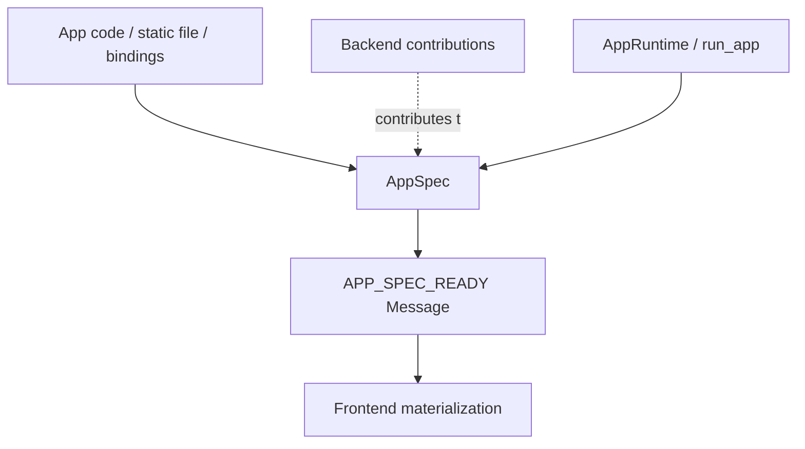

A live backend may still compile down to `Backend.initialize() -> AppSpecReady(app_spec)`,
but the backend is contributing a declarative payload, not becoming the owner of
the entire app state.

Backend initialization contract:

- `Backend.initialize()` returns `None`.
- If a backend contributes the initial app declaration, it emits
  `Message(type=APP_SPEC_READY, intent="update", payload=AppSpecReady(...))`
  as a pending outbound message during `initialize()`.
- `AppRuntime` or the transport worker must call `take_outbound_messages()`
  immediately after `initialize()` and deliver any `APP_SPEC_READY` message
  before normal polling/advancing begins.
- A static no-backend app follows the same semantic path: `AppRuntime` creates
  an in-process `APP_SPEC_READY` message and calls `Frontend.handle(...)`.

### Field ownership

`FieldSpec` belongs in `DataCatalog`. It is a declaration: id, dimensions,
dtype, and optional units. It does not contain field values. Retention policy is
deferred until trace binding and bounded-history work.

Runtime data still moves through typed messages:

```text
FieldReplace   (field.replace)
FieldAppend    (field.append)
```

This prevents `AppSpec` from becoming a data container.

### Geometry ownership

`GeometrySpec` belongs in `DataCatalog`. In Phase 1 it is only a type alias over
the existing `MorphologyGeometry | GridGeometry` declarations. Static morphology
can be included in the initial `AppSpec`. Dynamic geometry changes move through
typed messages (`geometry.replace`, `geometry.patch`).

### Control ownership

Controls split across several concepts:

| Concept | Owner |
|---|---|
| `ControlSpec` | `AppSpec.interactions` / config payload |
| Widget display value and editing state | Frontend |
| Simulator parameter value | Backend |
| Binding behavior | Backend-side binding or callback |
| Control changed event | Message |

### Panel ownership

A panel must be classified as one of:

- **Renderable semantic unit**: belongs in `ViewCatalog`
- **Layout container or arrangement unit**: belongs in `LayoutCatalog`

Avoid allowing `Panel` to mean both. Otherwise `Panel` becomes the next
overloaded abstraction after `Scene`.

### Migration map from current Scene

```text
scene.fields          -> AppSpec.data.fields       (FieldSpec, not FieldData)
scene.geometries      -> AppSpec.data.geometries   (GeometrySpec, not GeometryData)
scene.views           -> AppSpec.views.views
scene.controls        -> AppSpec.interactions.controls
scene.actions         -> AppSpec.interactions.actions
scene.tools           -> deferred; no Phase 1 field until ToolSpec is real
scene.layout          -> AppSpec.layout
scene.panels          -> split: ViewCatalog if renderable, LayoutCatalog if container
SceneReady            -> AppSpecReady
ScenePatch            -> AppSpecPatch
```


## Appendix: WebSocket And Socket.IO Lessons

The proposed thin `Message` and later `MessageEnvelope` staging follows the
same separation used by WebSocket and Socket.IO implementations:

- WebSocket is a transport. RFC 6455 defines a TCP-based protocol whose HTTP
  relationship is the opening upgrade handshake, then carries text or binary
  application data; binary payload interpretation is left to the application
  layer. See [RFC 6455 sections 1.7 and 5.6](https://www.rfc-editor.org/rfc/rfc6455).
- Socket.IO splits low-level plumbing from the high-level API: Engine.IO owns
  transports, upgrades, heartbeat, and disconnection detection, while Socket.IO
  adds events, acknowledgements, namespaces, buffering, recovery, and
  broadcasting. See [Socket.IO "How it works"](https://socket.io/docs/v4/how-it-works/).
- Socket.IO packets are generic envelopes: packet type, namespace, optional
  payload, and optional acknowledgement id. Event semantics live in the payload
  and event name, not in the transport. See the
  [Socket.IO protocol](https://socket.io/docs/v4/socket-io-protocol/).
- Socket.IO uses acknowledgements and timeouts for request/response behavior.
  CompNeuroVis should model that later as `MessageEnvelope.id` plus
  `MessageEnvelope.correlation_id`, not as fields on the semantic `Message` and
  not as blocking cross-endpoint reads. See
  [Socket.IO acknowledgements](https://socket.io/docs/v4/emitting-events/#acknowledgements).
- Delivery should be explicit, but it is transport/message policy rather than
  core message meaning. Socket.IO guarantees ordering for arrived events but
  defaults to at-most-once arrival; stronger delivery needs application ids,
  persistence, and resume offsets. Latest-only visualization messages should be
  allowed to be volatile once CompNeuroVis has a real policy layer. See
  [Socket.IO delivery guarantees](https://socket.io/docs/v4/delivery-guarantees/)
  and [volatile events](https://socket.io/docs/v4/emitting-events/#volatile-events).
- Buffering must stay bounded. The Python `websockets` implementation documents
  that oversized buffers increase memory and latency, and that small buffers
  help backpressure apply quickly. CompNeuroVis transports should use bounded
  queues, coalescing, and drop/merge policy for display-only traffic. See
  [websockets memory and buffers](https://websockets.readthedocs.io/en/stable/topics/memory.html).
- Transport lifecycle messages such as ping, pong, close, reconnect, and
  upgrade belong below the CompNeuroVis message envelope. Domain code should not
  see them unless surfaced through diagnostics or status messages.

Design consequence:

```text
Transport moves Message.
Endpoints interpret Message.intent and Message.type.
Typed dataclasses remain valid payload schemas.
Ids, correlation, delivery, and recovery live in envelope/policy extensions.
```

## Appendix: Capability System Lessons

Several mature systems use a capability/plugin model that spans frontend and
backend while keeping runtime ownership separate:

- Jupyter widgets define both Python/kernel and browser-side pieces over a
  symmetric comm channel. Their low-level tutorial describes JSON-able comm
  messages, synchronized model state, and multiple views over one model. This
  is the closest precedent for inline Python authoring that produces frontend
  controls or views. See
  [ipywidgets low-level widgets](https://ipywidgets.readthedocs.io/en/7.6.5/examples/Widget%20Low%20Level.html)
  and [Jupyter comms](https://jupyter-notebook.readthedocs.io/en/5.4.1/comms.html).
- Backstage treats plugins and extension points as first-class feature
  contracts. A backend instance wires plugins together; modules extend plugins
  through declared extension points. The frontend similarly installs plugins and
  extensions. See the
  [Backstage architecture overview](https://backstage.io/docs/overview/architecture-overview/)
  and [backend system architecture](https://backstage.io/docs/backend-system/architecture/index/).
- Eclipse Theia has separate frontend and backend processes that communicate
  through JSON-RPC over WebSockets or HTTP, and both sides have dependency
  injection containers to which extensions can contribute. See
  [Theia architecture](https://theia-ide.org/docs/architecture/).
- JupyterLab extensions use tokens, services, commands, menus, state, and other
  extension points. That suggests CompNeuroVis capabilities should declare the
  resources and services they provide, not only the widgets they render. See
  [JupyterLab extension points](https://jupyterlab.readthedocs.io/en/stable/extension/extension_points.html).
- VS Code contribution points are declarative manifest entries for commands,
  menus, languages, debuggers, views, and related features. That suggests
  capability metadata should be discoverable before executing arbitrary user
  code. See
  [VS Code contribution points](https://code.visualstudio.com/api/references/contribution-points).
- Unity Netcode separates transient messages from persistent replicated state:
  `NetworkBehaviour` composes network-aware behavior, RPCs/custom messages
  represent point-in-time communication, and `NetworkVariable` handles durable
  state for late joiners. See
  [NetworkBehaviour](https://docs-multiplayer.unity3d.com/netcode/1.1.0/basics/networkbehavior/),
  [NetworkVariables](https://docs-multiplayer.unity3d.com/netcode/current/basics/networkvariable/index.html),
  and [RPC vs NetworkVariable](https://docs-multiplayer.unity3d.com/netcode/2.2.0/learn/rpcvnetvar/).

Design consequence:

```text
Mature systems prove cross-boundary feature packaging can work.
CompNeuroVis should not start with a generic Capability implementation.
First prove concrete TraceBinding, ControlBinding, SelectionBinding, and MorphologyBinding.
Promote a Capability contract only after those bindings show the same shape.
Backend and Frontend remain the runtimes either way.
```

## Message Intents And Payload Families

The current update classes are useful and should not be collapsed into one
generic payload. They carry cost and intent. The simplification is to group
them under one envelope while keeping typed payload schemas.

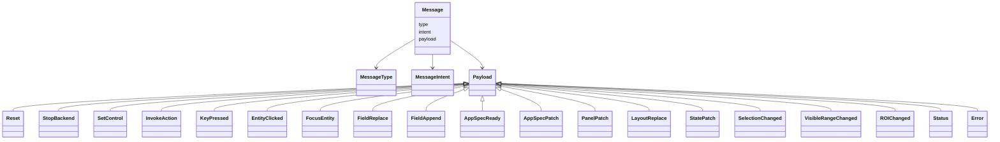

The diagram intentionally avoids intent-specific or domain payload base classes.
Payload schemas are ordinary typed schemas; valid message intents come from the
`MessageType.allowed_intents` registry entry used to construct the message.

Recommended naming policy:

| Old name | New name | Notes |
|---|---|---|
| `SessionCommand` | command-intent message payload | Existing dataclasses become typed payload schemas under the `Message` envelope. |
| `SessionUpdate` | update-intent message payload | Existing update dataclasses keep their names as payload schemas. |
| `StopSession` | `StopBackend` payload | Renamed in the same sweep as `Session` → `Backend`. |
| `Session` | `Backend` / `NeuronBackend` / `JaxleyBackend` / `ReplayBackend` | Renamed directly; no kept alias. |
| `SceneReady` | `AppSpecReady` | Renamed in the `AppSpec` decomposition sweep. |
| `ScenePatch` | `AppSpecPatch` | Renamed in the same sweep. Keep `AppSpecPatch` broad; do not immediately split into per-catalog patch classes. |
| `PanelPatch` | Clarify semantics only | Rename only if panel is cleanly reclassified as view-side; layout-side patching uses layout messages. |

`FieldReplace`, `FieldAppend`, `AppSpecPatch`, `PanelPatch`, and
`LayoutReplace` keep their names. They are precise and useful.
`SelectionChanged`, `VisibleRangeChanged`, `ROIChanged`, `FocusEntity`, and
resource request payloads are illustrative future names, not current
implemented classes.

The registry of message types should be typed and central enough that
contributors can discover the payload schema for a message name. The goal is
not an arbitrary string event bus; it is one envelope around precise payload
schemas.

## Operation Vocabulary

Message type names should use a small, uniform operation vocabulary. The goal
is not to make every payload share one universal mutation class; it is to make
the suffixes mean the same thing wherever they appear.

| Operation | Meaning | Use when | Current examples |
|---|---|---|---|
| `replace` | Authoritative whole-value replacement. | The recipient should treat the supplied value as the new complete value for that subject. | `FieldReplace`, `LayoutReplace` |
| `patch` | Partial update to named fields or structured properties. | The subject remains the same object or logical entity, but selected attributes, lists, or metadata change. | `AppSpecPatch`, `StatePatch`, `PanelPatch` |
| `append` | Ordered extension along a stream or axis. | New samples extend an existing ordered value and may participate in batching, coalescing, replay, trimming, or retention policy. | `FieldAppend` |
| `set` | Command to assign a semantic value. | A sender asks an owner to set a control, parameter, property, or option. | `SetControl` today; future `CONTROL_SET` message type |
| `changed` | Statement that semantic state changed. | A state owner publishes a change without asking the receiver to perform an action. | Future selection, visible-range, or ROI messages |

`append` should not be collapsed into `patch` in the core vocabulary. It can be
modeled as a patch mechanically, but that hides the facts that append has axis,
ordering, retention, and throughput semantics. A generic patch payload would
need to learn stream rules, replay rules, coordinate growth, and coalescing
policy. Keeping `append` explicit lets transports and frontends optimize live
traces without making every patch-like message carry append machinery.

Naming convention:

| Shape | Meaning |
|---|---|
| subject plus `replace` | Whole subject replacement. |
| subject plus `patch` | Partial structured subject mutation. |
| subject plus `append` | Ordered stream/axis extension. |
| subject plus `set` | Command to assign a value owned by the receiver. |
| subject plus `changed` | Update announcing a semantic state change by its owner. |

Examples such as `field.append`, `field.replace`, `app_spec.patch`,
`panel.patch`, `layout.replace`, and `control.set` should be read as message
type names following this vocabulary, not as paths or transport methods.

## State And Resource Plane

Transient messages are not enough for every future workflow. Production systems
usually separate transient messages from versioned readable state. CompNeuroVis
should leave room for the same split, but the split is not part of the first
runtime refactor:

```text
Message plane:
  Message(intent="command" | "update")

Future state/resource plane:
  ResourceRef
  Snapshot(version)
  ResourceTransport.read(ref)
  ResourceTransport.subscribe(ref)
```

Intent rule:

- `intent="command"`: please do something.
- `intent="update"`: something changed.
- future `intent="request"`: please answer with a correlated response, once
  `MessageEnvelope.id` and `correlation_id` exist.
- future `intent="response"`: result for a prior request.
- future `intent="error"`: failed request, invalid message, or runtime fault.
- future `Snapshot`: current value of something at a known version.

Any endpoint can send any intent. The owner of a resource usually sends
update-intent messages about that resource, but a non-owner can still send a
command-intent message that asks the owner to change it.

Ownership remains explicit:

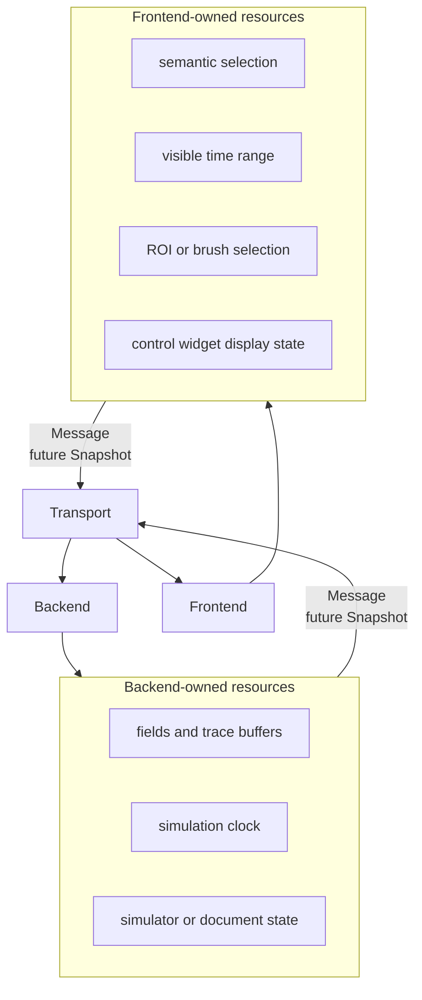

Rule:

- If a value is only presentation state, keep it private to the frontend.
- If the backend needs it, turn it into semantic frontend-owned state and send
  or expose it deliberately.
- If the frontend needs durable backend data, read a backend-owned resource or
  subscribe to update-intent messages for it.

Examples:

| State | Owner | Crosses transport? | Reason |
|---|---|---|---|
| Camera position | Frontend | Usually no | Presentation state. |
| Hover target | Frontend | Usually no | Ephemeral UI state. |
| Panel size or splitter position | Frontend | No for simulation; maybe saved layout later | Presentation/layout state. |
| Selected entity ids | Frontend initially; semantic shared state if backend reacts | Yes as `EntityClicked` today, or future `SelectionChanged` update/resource snapshot | Backend may need to choose traces, annotations, or probes. |
| Visible time range | Frontend initially; semantic shared state if backend query depends on it | Yes as future `VisibleRangeChanged` update or resource snapshot | Backend may need to downsample or query lazily. |
| ROI / brush / lasso selection | Frontend initially; semantic shared state if backend computes from it | Yes as future `ROIChanged` update or resource snapshot | Backend may need to run analysis or filter data. |
| Field values and trace buffers | Backend | Yes | Frontend renders them and may read lazily. |
| Simulation clock | Backend | Yes | Frontend displays or aligns views to it. |

Controls split across several owners and should not be described as simply
frontend-owned:

| Control concept | Owner | Crosses transport? |
|---|---|---|
| `ControlSpec` | `AppSpec.interactions` payload/config | Yes as part of app-spec initialization or app-spec patching. |
| Widget display value and editing state | Frontend | Usually no, unless published as semantic state. |
| Simulator parameter value | Backend | Yes when changed through a command such as `SetControl`. |
| Binding behavior | Backend-side binding, callback, or future concrete binding | Not directly; behavior emits or handles messages. |
| Control changed event | Message | Yes, as command intent today or update intent later when the frontend owns the semantic state being announced. |

This proposal does not require shared mutable objects. The safer model is:

```text
owner stores resource
other side reads Snapshot(version)
owner sends update-intent Message when value changes or cached snapshots are stale
```

That model should be introduced only when a workflow forces it, such as large
trace buffers, lazy remote reads, notebook-visible frontend state, document
undo/redo state, or backend logic that genuinely needs durable semantic
frontend state. Until then, simple typed update messages are enough.

Backend reads of frontend state should be semantic and explicit. A backend
should not synchronously ask a widget for raw GUI internals such as camera
matrices or pixel positions. It can react to an `EntityClicked` or
`SetSelection` command, subscribe to a `frontend/selection` resource, or receive
a future `SelectionChanged` update when the frontend publishes a semantic state
change.

Current code already proves part of this direction:

- frontend-to-backend commands exist through `EntityClicked`, `SetControl`,
  `InvokeAction`, `KeyPressed`, and `Reset`
- backend-to-frontend updates exist through `FieldReplace`, `FieldAppend`,
  `AppSpecPatch`, `StatePatch`, `PanelPatch`, `LayoutReplace`, `Status`, and
  `Error`
- a thin `Message` value, frontend-originated update-intent messages,
  backend-originated command messages, future request/response messages,
  arbitrary `ResourceRef` reads, and frontend-owned snapshots are not
  implemented yet

That gap is acceptable. The important refactor rule is that the names
`Backend`, `Transport`, and `Frontend` must leave room for this resource plane
without turning it into another top-level layer.

## Native Attachment Contract

`attach(...)` means "observe and control a native thing," not "convert this
thing into a CompNeuroVis model."

Target rule:

```text
native simulator root/path/object/callbacks
-> domain adapter
-> concrete bindings
-> AppSpec declarations + backend behavior
-> Messages to/from frontend
```

The attached object stays backend-owned. The frontend receives stable ids,
declarative `AppSpec` entries, and messages. It must never receive native
simulator objects directly.

Acceptable attachment inputs should be deliberately broad:

| Input shape | Meaning | Example |
|---|---|---|
| Native root path | Adapter resolves simulator objects by path. | `cnv.moose.attach("/model")` |
| Native root object | Adapter starts from a simulator object. | `cnv.moose.attach(moose.element("/model"))` |
| Explicit adapter | User supplies a domain adapter when automatic discovery is insufficient. | `cnv.attach(MyMooseAdapter(root="/model"))` |
| Step/time callbacks | User keeps the model native and supplies runtime hooks. | `cnv.moose.attach(root="/model", step=step_fn, time=time_fn)` |
| Read/write callbacks | Binding reads or writes values without assuming simulator internals. | `trace(read=lambda: soma(0.5).v)` |
| Ports | Coupled backend exchanges signals between engines. | `brain.output("muscle_activation")` |

Ambiguous simulator details should become explicit targets, callbacks, or ports
rather than hidden framework magic:

```python
brain = cnv.moose.attach(
    root="/model",
    step=lambda dt: moose.start(dt),
    time=lambda: moose.element("/clock").currentTime,
)

brain.trace("AVAL Vm", target="/model/AVAL/soma", attr="Vm")
brain.control("stim amp", target="/model/stim", attr="level")
brain.output("muscle_activation", read=read_muscle_activation)
brain.input("sensory_drive", write=write_sensory_drive)
```

This keeps native authoring intact:

- simulator construction remains normal simulator code
- `attach` creates an adapter over existing handles, paths, or callbacks
- traces, controls, views, and ports declare what CompNeuroVis observes or
  mutates
- backend-side bindings perform native reads/writes
- frontend-side bindings render widgets and views over messages and ids

If a simulator-specific adapter can discover morphology, compartments, clocks,
or fields, it may provide defaults. If discovery is incomplete or ambiguous, the
user must make the binding explicit. The architecture should prefer explicit
targets over a fake universal model object.

## Capabilities And Parts

Some feature units are not purely backend or frontend. A trace, selection tool,
control binding, or editor operation can have both backend and frontend pieces.
The design should support that, but should not start by implementing a generic
`Capability` system. The first concrete vocabulary should be bindings:

```text
TraceBinding
ControlBinding
SelectionBinding
MorphologyBinding
PhysicsBinding
CouplingBinding
```

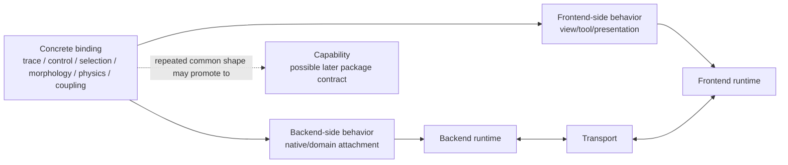

If `Capability` appears later, it must not become a runtime peer of `Backend`,
`Transport`, and `Frontend`. It would be only a package of contracts and
optional parts that the runtimes install.

Examples:

| Binding | Contract | Backend-side behavior | Frontend-side behavior |
|---|---|---|---|
| Trace | `field.append`, `field.replace`, optional future `backend/trace/{id}` resource | recorder attached to simulator reference or callback | line plot renderer, visible range state |
| Selection | `entity.clicked`, future `selection.changed`, optional future `frontend/selection` resource | reacts to selected entity, emits derived trace/filter/state messages | picking, highlight, selection UI |
| Control | `control.set`, future `control.changed`, optional future control resource | binds to simulator attribute, callback, or state path | widget, validation, display state |
| Morphology | morphology geometry/field messages, optional future geometry resources | builds or updates geometry from native simulator state | 3-D renderer, camera, picking |
| Physics | body geometry, pose, contact, force, and sensor messages | adapts MuJoCo, Unity physics, or another body engine into backend-owned state | optional body renderer, pose/contact views, inspection tools |
| Coupling | internal backend ports, optional status/diagnostic messages | routes neural outputs to physics inputs and physics outputs back to neural inputs | usually none directly; optional visual diagnostics |
| Status | status/error message schemas | emits status/error messages | status display |

Inline authoring becomes syntactic sugar for creating concrete bindings around
native Python objects:

```python
vis = cnv.inline()

vis.enable(cnv.trace("soma.v", read=lambda: soma(0.5).v, x=lambda: h.t))
vis.enable(cnv.control("stim.amp", get=lambda: stim.amp, set=lambda v: setattr(stim, "amp", v)))
vis.enable(cnv.selection())

while h.t < 100:
    h.fadvance()
    vis.tick()
```

The inline API should lower to the same shape:

```text
TraceBinding
  backend side reads native simulator state
  backend side emits Message(type=FIELD_APPEND, intent="update", ...)
  frontend side handles field messages and renders a line plot

ControlBinding
  frontend side emits Message(type=CONTROL_SET, intent="command", ...)
  backend side applies that value to native simulator state

SelectionBinding
  frontend side owns semantic selection state
  frontend side may emit Message(type=SELECTION_CHANGED, intent="update", ...)
  backend side optionally reacts to semantic selection
```

Simulator-specific attachment APIs lower to the same shape. They differ only in
how the backend-side binding resolves native targets:

```python
brain = cnv.moose.attach("/model")

brain.trace("soma Vm", target="/model/soma", attr="Vm")
brain.control("stim level", target="/model/stim", attr="level")
```

No frontend-side binding should hold the MOOSE element, NEURON section, Jaxley
object, or MuJoCo handle. Frontend behavior deals in ids, view state, widgets,
and messages.

This preserves the boundary rule:

- backend parts do not own widgets
- frontend parts do not own simulator state
- parts do not call each other across the boundary directly
- all cross-boundary v1 behavior uses `Message`
- future durable/lazy state uses `ResourceRef` and `Snapshot` only after the
  resource plane exists

Current VisPy code is already partway toward this on the frontend side:
panels, renderers, view adapters, controls, state bindings, and interaction
contexts are composable frontend concerns. The proposal makes the same idea
explicit on both sides while renaming today's classes directly.

## Coupled Backends And Co-Simulation

Some future apps need communication between simulators, not only communication
between a backend and a frontend. The clearest example is an embodied C. elegans
workflow:

```text
neural simulator -> muscle activation -> body physics
body physics -> contacts, stretch, proprioception -> neural simulator
both -> fields, traces, geometry, status -> frontend
```

That is a backend composition problem. A MuJoCo model or Unity physics process
is backend-side when it participates in simulation state. Unity is a frontend
only when it is rendering or interacting with the CompNeuroVis app as the
presentation client.

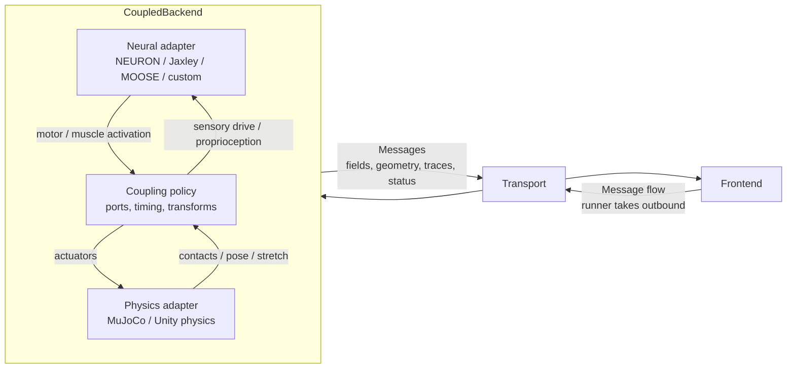

The frontend transport must not become the coupling bus between neural and
physics engines. Coupling has simulation-time semantics, so the backend owns:

- which engine is authoritative for the clock
- whether stepping is lockstep fixed-dt, substepped, event-driven, or
  latest-state asynchronous
- how neural outputs are transformed into physics inputs
- how contacts, stretch, pose, or force data become neural inputs
- how much of that internal exchange becomes visible as app messages

The composable authoring layer can still keep this simple:

```python
brain = cnv.moose.attach(
    root="/model",
    step=lambda dt: moose.start(dt),
    time=lambda: moose.element("/clock").currentTime,
)
body = cnv.physics.mujoco(model_xml)

app = cnv.coupled("c-elegans body")
app.couple(brain.output("muscle_activation"), body.input("actuators"))
app.couple(body.output("contacts"), brain.input("sensory_drive"))
app.couple(body.output("stretch"), brain.input("proprioception"))

app.trace("head neuron", brain.trace("AVAL.v"))
app.body_view(body, color_by="contact_force")
app.run()
```

This lowers to one `CoupledBackend` with internal ports. `TraceBinding`,
`ControlBinding`, `PhysicsBinding`, and `CouplingBinding` contribute backend
behavior and optional `AppSpec` declarations, but cross-boundary communication
to the frontend still uses the normal `Message` path.

This design preserves all backend possibilities:

- a plain simulator backend remains one backend
- a custom Python model remains one backend
- a callback/live app can become a generated backend
- a neural-plus-physics app becomes a coupled backend
- WebSocket, notebook, VisPy, and headless choices remain frontend/transport
  choices outside the coupling policy

## Current Runtime Flow Today

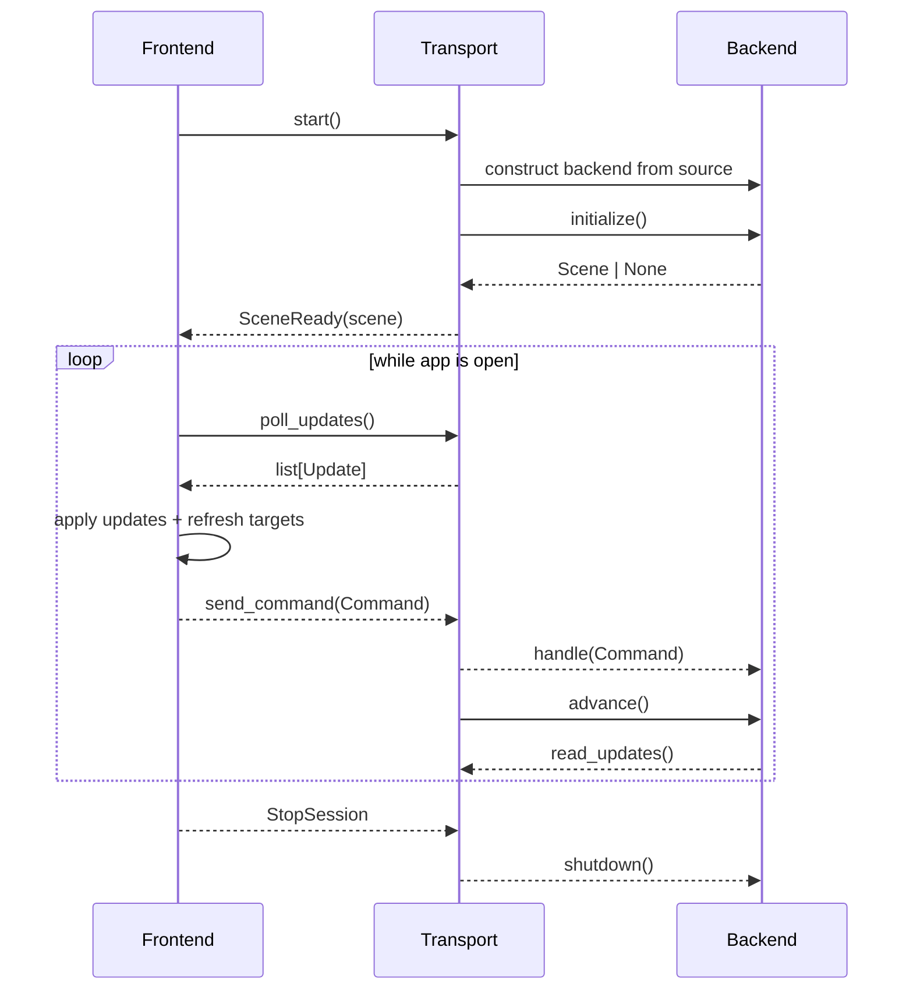

This is exactly how `VispyFrontendWindow`, `PipeTransport`, and `Session`
cooperate today. It is the current one-direction-per-message-family
implementation, not the target `Message` envelope.

Under the target names, both actors use the same queued outbound pickup
contract. The runner or transport worker owns the transport reference; the
frontend does not call `transport.send(...)` directly:

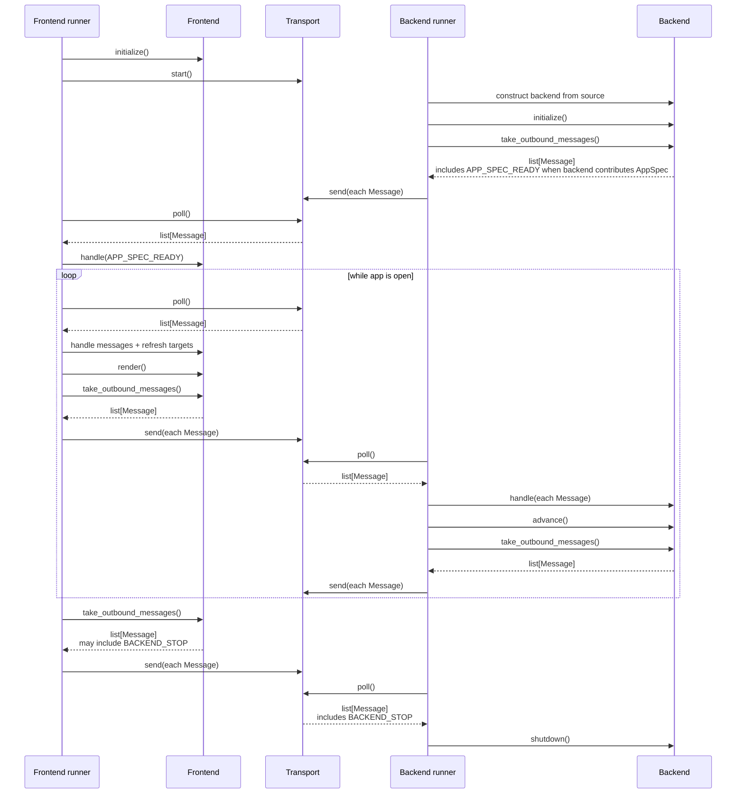

Resource reads are deliberately omitted from these runtime-flow diagrams because
the current implementation does not have them yet.

## App Mode Coverage

The simple abstraction covers existing and planned app modes.

```mermaid
flowchart TD
    subgraph Static[Static app]
        StaticBackend[NoBackend or StaticBackend]
        StaticTransport[InProcessTransport or none]
        StaticFrontend[Desktop or notebook Frontend]
    end

    subgraph Replay[Replay app]
        ReplayBackend[ReplayBackend<br/>current ReplaySession]
        ReplayTransport[PipeTransport or InProcessTransport]
        ReplayFrontend[Frontend]
    end

    subgraph Live[Live simulator app]
        SimBackend[NeuronBackend / JaxleyBackend<br/>current simulator sessions]
        SimTransport[PipeTransport today<br/>WebSocketTransport later]
        SimFrontend[VisPy Frontend today<br/>Notebook/Web later]
    end

    subgraph Coupled[Coupled simulation app]
        CoupledBackend[CoupledBackend<br/>neural adapter + physics adapter + coupler]
        CoupledTransport[Pipe / WebSocket / in-process]
        CoupledFrontend[VisPy / notebook / headless diagnostics]
    end

    subgraph Document[Document/editor app]
        DocBackend[DocumentBackend]
        DocTransport[InProcess or remote Transport]
        DocFrontend[Editor Frontend]
    end

    subgraph Headless[Headless/export app]
        ExportBackend[Backend or static AppSpec]
        NullTransport[No UI transport]
        ExportFrontend[Headless exporter]
    end

    StaticBackend --> StaticTransport --> StaticFrontend
    ReplayBackend --> ReplayTransport --> ReplayFrontend
    SimBackend --> SimTransport --> SimFrontend
    CoupledBackend --> CoupledTransport --> CoupledFrontend
    DocBackend --> DocTransport --> DocFrontend
    ExportBackend --> NullTransport --> ExportFrontend
```

Coverage table:

| App mode | Backend | Transport | Frontend | Feasible with proposal? |
|---|---|---|---|---|
| Static app spec | `NoBackend` or direct `AppSpec` | none or in-process | VisPy, notebook, exporter | Yes. Static apps do not need a backend. |
| Replay | `ReplayBackend` | pipe or in-process | any frontend consuming update-intent messages | Yes. Current `ReplaySession` proves this. |
| NEURON live | `NeuronBackend` | pipe today, WebSocket later | VisPy today, notebook later | Yes. Current `NeuronSession` proves backend shape. |
| Jaxley live | `JaxleyBackend` | pipe today, WebSocket later | VisPy today, notebook later | Yes. Current `JaxleySession` proves backend shape. |
| Neural + physics co-simulation | `CoupledBackend` containing simulator and physics adapters | pipe, WebSocket, or in-process | VisPy, notebook, or headless diagnostics | Yes as a planned backend composition pattern. Coupling stays inside the backend. |
| Notebook static | optional backend | in-process/notebook transport | notebook frontend | Yes after frontend/dependency split. |
| Notebook live | live backend | notebook comm or WebSocket | notebook frontend | Yes after transport seam and throttling. |
| NeuroML editor | document backend | in-process or remote | editor frontend | Yes, but needs document update families. |
| Headless export | backend or static app spec | none/in-process | exporter frontend | Yes, if exporter consumes `AppSpec`, selected messages, and selected resources. |

## Transport Variants

Transport is an independent axis.

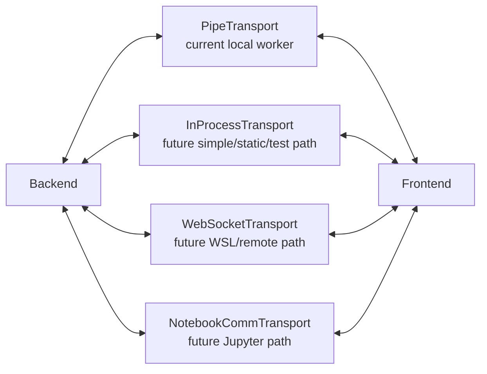

Required transport rule:

`Transport` must not know simulator details or renderer details. It moves
`Message` values and owns only lifecycle, queuing, serialization, and
backpressure policy.

Current `PipeTransport` mostly follows this rule. Future WebSocket or notebook
transports should preserve it.

## Frontend Variants

Frontend is another independent axis.

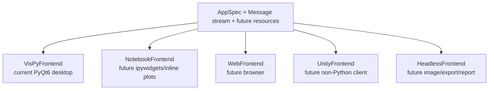

Frontend-owned responsibilities stay:

- UI state
- frontend-owned semantic resource registry
- frontend part registry
- rendering
- presentation cadence
- selection/camera/splitter state
- conversion from physical input into semantic `Message` values

Frontend must not own simulator state. Backend must not own widgets.

## Backend Variants

Backend is the model/runtime axis.

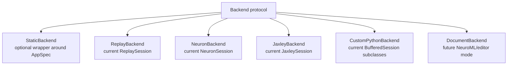

Backend-owned responsibilities:

- domain model construction or attachment
- simulation/document/replay state
- backend-owned resource registry
- message handling
- message emission
- backend part registry
- retention/history policy when it affects backend semantics

Backend should not own:

- Qt widgets
- VisPy/pyqtgraph objects
- layout drag state
- presentation throttling

## Static Apps And Optional Backend

One question is whether every app must have a backend. The answer should be no.
The abstraction still works if `Backend` is optional.

Current static surface apps already pass a run config containing a `Scene`
without a session. After the breaking rename, that should become a `RunSpec` or
`AppConfig` containing a direct `AppSpec` without a backend. That can be
described as:

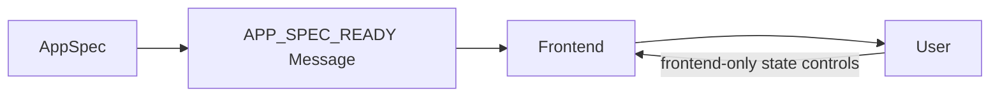

For uniform runtime APIs, a future `StaticBackend` can wrap an `AppSpec` and
emit no live updates:

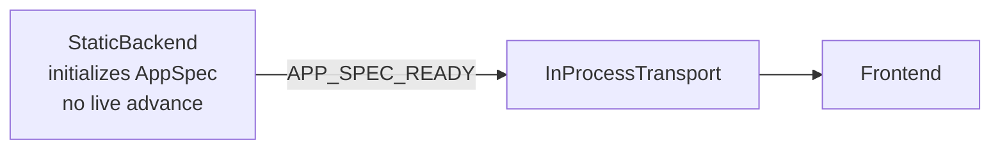

Both forms are valid target designs. The shorter static path should remain
legal as a product choice, not as a backward-compatibility concession.

## Appendix: Notebook Feasibility

Notebook support becomes easier to reason about because it is just another
frontend plus a suitable transport.

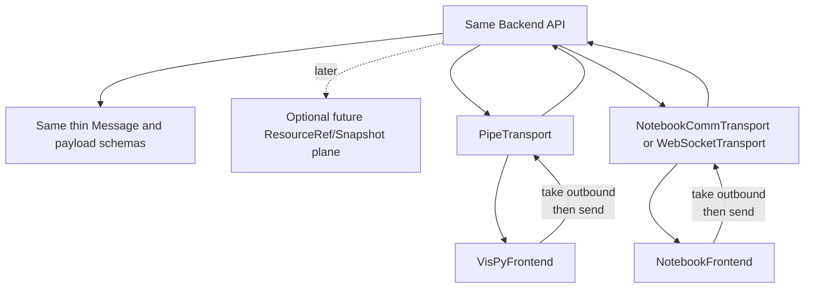

Notebook feasibility constraints remain:

- `compneurovis.core` and protocol imports must not require Qt/VisPy.
- Notebook-defined backend classes are not reliable worker sources on Windows
  spawn; live notebook backends need either in-process execution, importable
  backend factories, or a remote server.
- Notebook rendering should start with static scenes, controls, and line plots.
- Full picking/tool/3-D parity is later work.

The backend/transport/frontend split covers this without special cases.

## Appendix: Document And Editor Feasibility

Document/editor apps fit if editor-specific changes use new message types and
payload schemas instead of being forced through live trace messages.

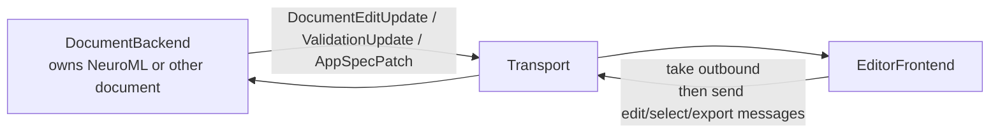

This proposal does not implement document updates. It reserves the shape:
document-specific messages can be added as new message types and payload schemas
without changing transport or frontend/backend responsibilities.

## AppRuntime Is Composition, Not Core Ownership

There still needs to be code that builds and starts the runtime pieces. The
current version of that role is spread across `run_app(...)`,
`VispyFrontendWindow`, and the Qt event loop. The long-term name can be
`AppRuntime`, `Runner`, or simply remain `run_app(...)`.

That composition role may:

- create or resolve a backend source
- create a transport
- create a frontend
- connect lifecycle hooks
- start and stop the event loop

It should not own simulator state, frontend presentation state, or semantic
shared resources. Those stay owned by `Backend` or `Frontend`.

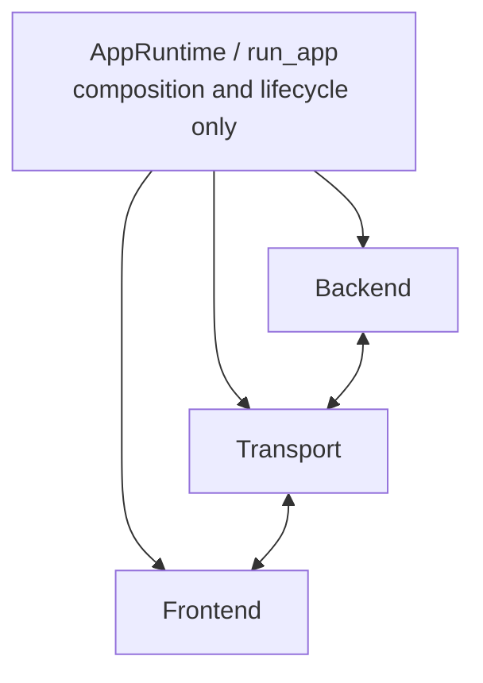

## Implementation Plan

Because this branch can break public API, the plan is a direct refactor rather
than a compatibility migration. Each phase may break imports, examples, and
docs; update them in the same phase instead of adding long-lived shims.

### Phase 1: Break To The New Vocabulary And App Contract

- Rename `Session` → `Backend` (or `BackendSession` for the abstract base),
  `NeuronSession` → `NeuronBackend`, `JaxleySession` → `JaxleyBackend`,
  `ReplaySession` → `ReplayBackend`, `BufferedSession` → `BufferedBackend`.
- Keep `PipeTransport` as the concrete pipe variant while introducing
  `Transport` as the protocol name.
- Add a narrow `Frontend` protocol around the runner-independent parts of
  `VispyFrontendWindow`.
- Rename `SessionCommand` → command-intent payload base; rename `SessionUpdate`
  → update-intent payload base; rename `StopSession` → `StopBackend`.
- Rename the current run-config `AppSpec` (holding `.session`, `.diagnostics`)
  to `RunSpec` or `AppConfig`.
- Rename `Scene` → `AppSpec`; decompose into `DataCatalog`, `ViewCatalog`,
  `InteractionCatalog`, and `LayoutCatalog` sub-catalogs.
- Keep Phase 1 catalog types compile-ready: `GeometrySpec` is a type alias over
  existing geometry declarations, `LayoutSpec` remains the current layout type,
  `ToolSpec` is omitted, and retention policy is deferred.
- Rename `SceneReady` → `AppSpecReady`; rename `ScenePatch` → `AppSpecPatch`.
- Update architecture docs to teach `Backend <-> Transport <-> Frontend` and
  `AppSpec` as the declarative app contract.
- Move or remove `startup_scene`, `is_live`, and `idle_sleep` as explicit
  backend metadata or runner policy. Do not keep them as `Session`
  compatibility hooks.
- Clarify that `AppSpec` is not owned by backend or frontend.
- Update tests, examples, public exports, imports, and authored docs in the same
  Phase 1 sweep. The checkpoint means they pass after the rename and catalog
  split are complete, not before.

Checkpoint:

```bash
python -m compileall src examples tests
pytest
python scripts/check_architecture_invariants.py
```

### Phase 2: Add Thin Typed Message

- Add `Message(type, intent, payload)` with typed `MessageType[T]` constants.
- Give each `MessageType` a name, payload type, and allowed intents so message
  dispatch remains payload-aware instead of becoming arbitrary string routing.
- Rename the former `SessionCommand` and `SessionUpdate` dataclasses into
  command/update payload schemas under the `Message` model.
- Keep message type names discoverable through a central typed registry or
  equivalent typed constants.
- Move transport-facing names toward `send(message)` and `poll()`.
- Move backend and frontend emission toward explicit
  `take_outbound_messages()` semantics before introducing composable callbacks
  or bindings.
- Keep `id`, `correlation_id`, delivery mode, resource refs, versions, and
  attachments out of the core `Message`.
- Represent errors as update-intent messages with an `Error` payload type until
  a real request/response envelope is needed.
- Keep `AppRuntime` or runner concerns as composition code, not as a fourth
  architectural layer.
- `AppSpecReady` and `AppSpecPatch` are the typed payload schemas (renamed in
  Phase 1). Keep `AppSpecPatch` broad; do not immediately split into per-catalog
  patch classes.

Checkpoint:

```bash
pytest
python -m compileall src examples tests
python scripts/check_architecture_invariants.py
```

### Phase 3: Prove Concrete Bindings Before Capability

- Add `SurfaceBinding` and `TraceBinding` as the first concrete binding slice.
  `SurfaceBinding` proves static and animated grid workflows. `TraceBinding`
  exercises native simulator attachment, typed field messages, line-plot
  rendering, reset behavior, and inline authoring pressure. Each concrete
  binding should contribute to explicit `AppSpec` catalogs (`DataCatalog`,
  `ViewCatalog`, `InteractionCatalog`) rather than contributing to a
  monolithic `Scene`.
- Add `ControlBinding` for simulator attributes, callbacks, and state paths.
- Add `ActionBinding` for semantic buttons, shortcuts, and backend/callback
  invocations.
- Add `SelectionBinding` for semantic frontend-originated state that a backend
  may react to.
- Add `MorphologyBinding` only if morphology attachment shows the same shape.
- Add `PhysicsBinding`, `PortBinding`, or `CouplingBinding` only after a real
  embodied workflow provides pressure. The intended shape is one
  `CoupledBackend` that owns neural/physics timing and internal ports, not a
  frontend-mediated coupling bus.
- Do not add generic `Capability`, `BackendPart`, or `FrontendPart` protocols
  yet. Promote them only after several concrete bindings repeat the same
  lifecycle, message, and installation structure.

Checkpoint:

```bash
pytest
python -m compileall src examples tests
python scripts/check_architecture_invariants.py
```

### Phase 4: Add Concrete Transport And Frontend Variants

- `InProcessTransport` for tests, static/simple apps, and possibly notebooks.
- `WebSocketTransport` from the existing proposal.
- `NotebookFrontend` after dependency split.
- `StaticBackend` only if it simplifies runtime APIs.
- A WSL backend server may host a simple simulator backend or a
  `CoupledBackend`; the transport should not care which one it is moving
  messages for.
- Use these implementations to decide whether message ids, correlation ids,
  delivery policy, or recovery belong in a `MessageEnvelope` or transport policy
  type.

Checkpoint:

```bash
pytest
python -m compileall src examples tests
python scripts/check_architecture_invariants.py
```

### Phase 5: Add Resource Plane Only Under Pressure

- Add `ResourceRef`, `Snapshot`, and `ResourceTransport` only when a concrete
  workflow needs durable reads, lazy data access, or backend reads of semantic
  frontend-owned state.
- Start with backend-owned resources such as large fields or trace buffers if
  lazy reads are the first pressure point.
- Add frontend-owned semantic resources such as selection, visible time range,
  or ROI only when backend behavior needs them.
- Prefer simple update-intent messages for state mirroring before adding
  request/response reads.
- Keep direct mutable shared objects out of the public model.
- End the refactor by verifying public exports, docs, examples, invariants, and
  generated indexes all use the new vocabulary.

Checkpoint:

```bash
pytest
python scripts/check_architecture_invariants.py
python scripts/generate_indexes.py --check
python -m mkdocs build --strict
```

## Non-Goals

- Do not remove `FieldAppend`, `FieldReplace`, `AppSpecPatch`, `PanelPatch`, or
  `LayoutReplace`.
- Do not collapse `append`, `patch`, and `replace` into one universal mutation
  payload; they have different semantic and performance contracts.
- Do not force static apps to construct fake live backends.
- Do not make the transport aware of simulator or frontend internals.
- Do not make the frontend own backend state.
- Do not make `Command` or `Update` top-level transport primitives.
- Do not encode command/update direction in transport method names.
- Do not put `id`, `correlation_id`, delivery mode, `ResourceRef`, version, or
  attachments in the core `Message` before a concrete transport or resource
  workflow forces that policy.
- Do not put `read(...)` or `subscribe(...)` on the base `Transport` protocol.
- Do not let message type names degrade into an arbitrary string event bus;
  keep typed payload schemas discoverable.
- Do not treat `AppSpec` (or the current `Scene`) as shared mutable state or as
  a mediator between backend and frontend.
- Do not treat backend-produced `AppSpec` as the universal path; `AppSpec` may
  come from app code, files, bindings, or backend contributions.
- Do not keep `Scene` as the central ontology once `AppSpec` catalogs land.
- Do not allow `Panel` to mean both a renderable view and a layout container.
- Do not collapse `FieldSpec` and field data into one structure; keep
  `FieldSpec` in `DataCatalog` and field data in `FieldAppend`/`FieldReplace`.
- Do not collapse `GeometrySpec` and geometry data; keep declarations in
  `DataCatalog` and dynamic values in typed messages.
- Do not treat controls as simply frontend-owned state; separate `ControlSpec`,
  widget state, backend parameters, binding behavior, and control messages.
- Do not make backend-owned and frontend-owned resources mutable shared objects.
- Do not implement a generic `Capability` system before concrete trace,
  control, selection, and morphology bindings prove a repeated shape.
- Do not make `Capability` a fourth runtime layer beside `Backend`,
  `Transport`, and `Frontend`.
- Do not use the frontend transport as the internal communication mechanism
  between coupled simulators such as a neural backend and MuJoCo or Unity
  physics. That is backend-owned co-simulation logic.
- Do not let future backend parts and frontend parts bypass the message/resource
  boundary.
- Do not add `AppRuntime`, `Host`, or runner code as a fourth state-ownership
  layer.
- Do not create long-lived compatibility aliases for old public vocabulary in
  this branch.

## Decision Tests

Before refactoring, every design step should satisfy these tests:

- Can the current VisPy app be described as `Backend + PipeTransport +
  VisPyFrontend`?
- Can a static scene still run without a backend?
- Can replay be a backend without simulator assumptions?
- Can NEURON and Jaxley share the same backend protocol without sharing domain
  implementation?
- Can WebSocket be added without changing backend or frontend semantics?
- Can notebook support be framed as a frontend/transport addition instead of a
  special case in sessions?
- Can document/editor apps add document messages without overloading
  `FieldAppend` or `AppSpecPatch`?
- Can each message type use the shared operation vocabulary without erasing the
  distinction between whole replacement, structured patching, and ordered
  append?
- Can semantic frontend state needed by the backend cross the transport without
  exposing raw widget internals?
- Can frontend-originated state changes be represented as update-intent
  messages instead of awkward command-intent messages when the intent is "this
  changed"?
- Can backend-originated asks be represented as command-intent messages now,
  with request/response deferred until a message envelope supplies correlation?
- Can large or durable state wait for `ResourceRef`, `Snapshot`, and
  `ResourceTransport` instead of bloating the first `Message` and `Transport`
  protocols?
- Can message ids, correlation ids, and delivery modes stay in envelope/policy
  extensions rather than core message semantics?
- Can `MessageType` registration make payload types and allowed intents
  discoverable enough to prevent arbitrary string dispatch?
- Can errors stay as update-intent messages with `Error` payloads until a real
  request/response envelope exists?
- Can `AppSpec` remain a declarative payload instead of becoming shared mutable
  runtime state?
- Can controls be explained without confusing frontend widget state with
  backend simulator parameters?
- Can lifecycle/composition code be explained separately as `run_app(...)` or
  `AppRuntime`, without treating it as a fourth ownership layer?
- Can trace, selection, control, morphology, and status features first be
  expressed as concrete bindings rather than a generic capability framework?
- Can a C. elegans neural simulator and a MuJoCo or Unity physics body exchange
  muscle activation, contacts, stretch, and proprioception inside a
  `CoupledBackend` without routing simulation coupling through the frontend
  transport?
- Can `attach(...)` accept native simulator roots, paths, objects, explicit
  adapters, callbacks, or ports without requiring a CompNeuroVis-owned model
  class?
- Can ambiguous simulator details be expressed through explicit trace/control
  targets, callbacks, or ports instead of hidden automatic discovery?
- Can inline Python authoring lower into backend-side binding behavior without
  exposing native simulator objects to frontend-side binding behavior?
- Can existing VisPy panels/renderers/controls inform future frontend-side
  binding shape without duplicating the frontend architecture?
- Can users learn the runtime from four nouns: `Backend`, `Transport`,
  `Frontend`, and `Message`, with `ResourceRef`, `Snapshot`, and `Capability`
  explained only as staged future extensions?

AppSpec-specific tests (from the AppSpec decomposition feedback):

- Can the app run with no backend at all?
- Can a backend contribute `AppSpec` declarations without owning the whole app
  declaration?
- Can the frontend materialize the same `AppSpec` in desktop, notebook,
  browser, or headless mode?
- Can field declarations (`FieldSpec`) exist in `AppSpec` without embedding all
  field data?
- Can controls be declared without confusing widget display state and backend
  simulator parameter state?
- Can `Panel` be cleanly classified as either a renderable view or a layout
  container — not both?
- Can a NeuroML editor use the same runtime core without pretending to be a live
  simulator scene?
- Can notebook support create multiple materialized views over the same `AppSpec`
  declarations?
- Can current examples be mechanically migrated from `Scene` to `AppSpec`
  catalogs?
- Can Phase 1 compile without undefined placeholder types such as `ToolSpec`,
  `LayoutNode`, or `RetentionPolicy`?
- Can `GeometrySpec` begin as an alias over current geometry declarations
  without forcing a premature geometry hierarchy?
- Can `AppSpecPatch` stay broad in v1 without immediate per-catalog patch
  classes?

If any answer becomes no, the abstraction is too narrow or the implementation
has leaked concerns across layers.
