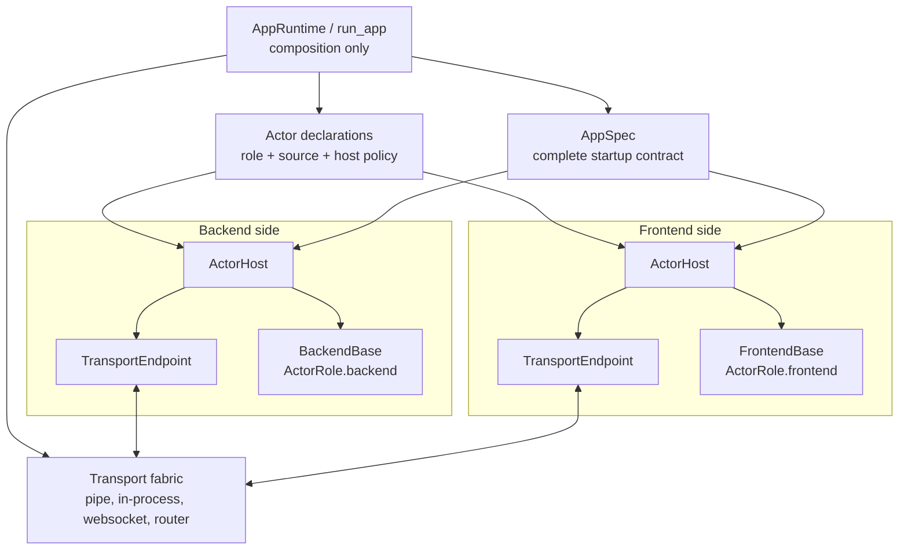
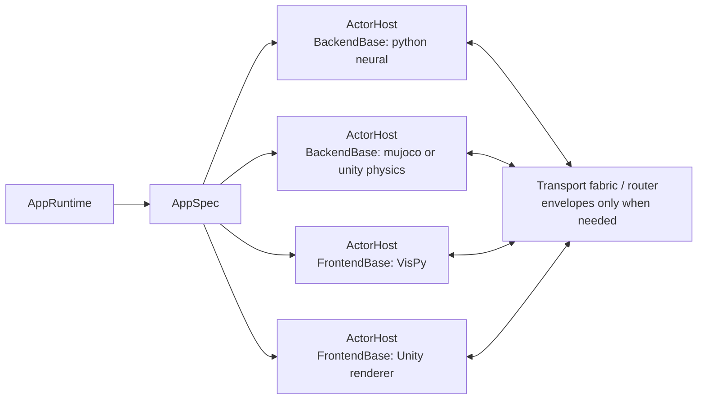
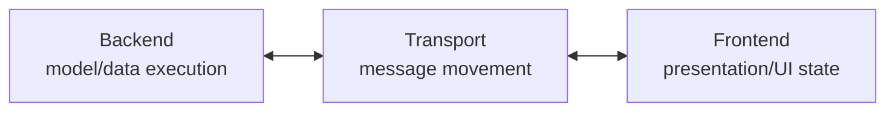
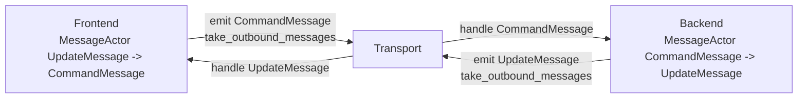
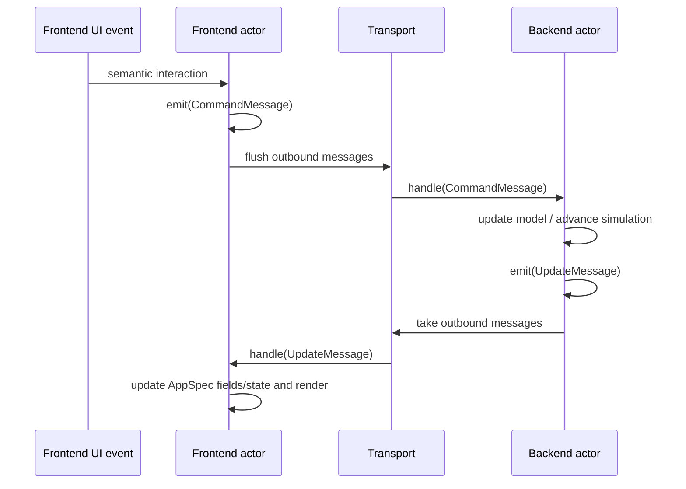
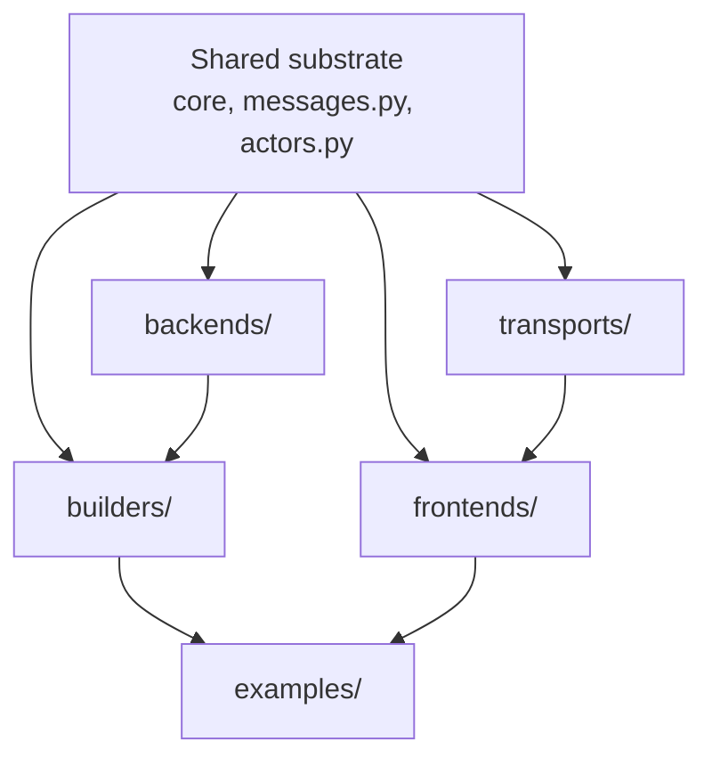

# Backend, Transport, and Frontend Refactor Log

Status: active implementation log

Related proposal:
[Backend, Transport, and Frontend Abstractions](backend-transport-frontend-proposal.md)

Related proof:
[Composable Authoring Proof](composable-authoring-proof.md)

This page records where the refactor is now, what mental model the code should
validate, and which checks prove that model has not drifted. It is intentionally
short-lived working documentation; durable lessons should move to
[Design Decisions](../decisions.md) after the refactor stabilizes.

## Current Snapshot

The runtime has been renamed around three top-level constructs:

- `Backend`: owns model execution, replay, simulation state, and backend-owned
  data updates.
- `Transport`: moves typed messages between backend and frontend.
- `Frontend`: owns presentation, user interaction, UI state, and rendering.

Shared runtime contracts now sit outside those three packages:

- `Message`: the typed envelope with an `intent` and payload.
- `MessageActor`: shared actor queue base for `handle(...)`, `emit(...)`, and
  `take_outbound_messages()`.

Current concrete package shape:

```text
compneurovis/
  core/        AppSpec, RunSpec, Field, views, controls, layout
  messages.py  Message, command/update payloads, CommandMessage, UpdateMessage
  actors.py    MessageActor shared by backend and frontend
  backends/    Backend, BufferedBackend, NEURON, Jaxley
  transports/  Transport, PipeTransport
  frontends/   Frontend, VisPy frontend
  builders/    high-level app builders
```

There should be no `runtime` package and no `session` package in the current
code path. Those names may still appear in older authored docs until the docs
sweep catches up, but they should not be active source-code concepts.

## Mental Model

### Unified Actor, Host, Role, And Transport Model

The target should have one actor abstraction. The current `MessageActor` idea
should either become that abstraction or disappear into it. There should not be
a separate `MessageActor`, `ActorDriver`, backend-only host contract, and
frontend-only host contract that each describe a different slice of the same
thing.

Core concepts:

| Concept | Meaning | Owns | Must not own |
|---|---|---|---|
| `AppRuntime` / composition | Startup coordinator for one app run | `AppSpec` construction/loading, actor declarations, host creation, transport wiring, start/stop coordination | simulator state, renderer state, message payload behavior |
| `ActorRole` | Stable role label for an actor, initially `backend` or `frontend` | routing/category identity | lifecycle, transport, semantic state |
| `Actor` / `ActorBase` | Shared runtime contract for anything that sends and receives messages | role-owned semantic state, `initialize`, `handle`, `emit`, `take_outbound_messages`, `shutdown` | process/thread/event-loop ownership, transport endpoints |
| `BackendBase` | Backend-role actor specialization | model/simulator/replay state, backend helpers such as `emit_update` | transport, frontend state, process ownership |
| `FrontendBase` | Frontend-role actor specialization | UI/render/interaction state, frontend helpers such as `emit_command` | transport, backend state, event-loop ownership |
| `ActorHost` | Generic lifecycle wrapper around any actor | actor construction, startup delivery, scheduling, message pumping, shutdown | role semantics, payload schemas |
| `TransportEndpoint` / `Transport` | Message movement between hosts | `send`, `poll`, `close`, serialization/IPC/socket resources | actor construction, actor ticking/rendering, `AppSpec` ownership |

High-level shape:



The shared actor contract is the center of the model:

```python
class Actor(Protocol):
    role: ActorRole

    def initialize(self, app_spec: AppSpec) -> None: ...
    def handle(self, message: Message[MessagePayload]) -> None: ...
    def emit(self, message: Message[MessagePayload]) -> None: ...
    def take_outbound_messages(self) -> list[Message[MessagePayload]]: ...
    def shutdown(self) -> None: ...
```

`ActorBase` owns the outbound queue and `emit(...)`. `BackendBase` and
`FrontendBase` subclass or implement that same contract. The base actor does
not have a mandatory `tick()` method. Live stepping, replay advancement, render
cadence, timers, and event loops are host or role-specific lifecycle concerns,
not the minimal actor contract.

Role-specific convenience helpers are allowed, but they are not separate actor
models:

```text
BackendBase.emit_update(payload) -> emit(update_message(payload))
FrontendBase.emit_command(payload) -> emit(command_message(payload))
```

The generic host loop is identical for backend and frontend actors:

```text
host.start()
  actor = actor_source()
  actor.initialize(app_spec)

host.step()
  for message in endpoint.poll():
      actor.handle(message)

  for message in actor.take_outbound_messages():
      endpoint.send(message)

host.stop()
  actor.shutdown()
  endpoint.close()
```

The host implementation can vary without changing the actor contract:

| Host implementation | Python's relationship | Same actor contract? |
|---|---|---|
| in-process host | Python runs actor directly | yes |
| process host (`ActorProcess`) | Python spawns Python subprocess | yes |
| Qt host (`VispyFrontendHost`) | Python runs Qt event loop in-process | yes |
| notebook host | Python runs notebook event loop | yes |
| WebSocket listener host | Python opens port; actor dials in | yes (via wire format) |
| WebSocket client host | Python dials out to running actor | yes (via wire format) |
| external signal host | Python owns only the stop signal | yes (via wire format) |

Startup is coordinated, not role-ordered. Backends and frontends both consume
the same complete `AppSpec` before runtime messages flow, but the architecture
must not depend on "backend starts first" or "frontend starts first." A remote
actor may connect before a local actor exists; a GUI window may open before a
worker process is ready; a worker may be started before a renderer. The invariant
is only that a host does not pump runtime messages for its actor until that
actor has received startup input.

Multiple backends and multiple frontends are just more actor declarations:



The simple one-backend/one-frontend path can keep bare `Message` values. The
transport fabric needs `MessageEnvelope` source/target/channel metadata only
when multiple actors, processes, languages, or delivery policies make routing
ambiguous.

Initial code layout should be compact:

```text
compneurovis/
  core/
    actor.py       ActorRole, Actor protocol, ActorBase queue behavior
    app.py         AppSpec, RunSpec, DiagnosticsSpec
  backends/
    base.py        BackendBase only
  frontends/
    base.py        FrontendBase only
  hosts.py         ActorHost implementations and host policies
  transports/
    base.py        TransportEndpoint / Transport protocol
    pipe.py        pipe endpoints only
```

Avoid long-lived duplicate abstractions:

- Do not keep `MessageActor` as a separate public concept if `ActorBase` exists.
- Do not let `PipeTransport` construct, initialize, tick, or shut down actors.
- Do not let a frontend actor hold a transport endpoint.
- Do not create backend-only and frontend-only host contracts before the shared
  `ActorHost` contract exists.
- Do not add a router/envelope to the simple path until more than one actor on
  either side requires source/target routing.

### AppRuntime: Orchestrator Design

`AppRuntime` is the authoritative coordinator for a single app run. It owns no
simulation state and no renderer state. It owns the startup contract, the stop
signal, and the threading policy.

#### Why AppRuntime

`run_app` currently calls `s.run()` sequentially. This works only because Qt's
`run()` blocks the main thread. Any headless frontend (static, notebook,
test-mode) would fall through immediately. More importantly there is no shared
place for an actor to signal "I am done" — each host calls its own cleanup
independently.

`AppRuntime` gives every actor a common stop signal and gives `run_app` a
uniform blocking contract that is not coupled to Qt.

#### Interface

```python
class AppRuntime:
    # Read-only after construction — passed to every host as the startup contract.
    app_spec: AppSpec

    # Resolved diagnostics config — applied before any actor starts.
    diagnostics: DiagnosticsSpec | None

    def stop(self) -> None:
        """Signal all actors and wait() to begin shutdown."""

    def is_stopped(self) -> bool:
        """True once stop() has been called."""

    def wait(self, items: list[tuple[ActorSpec, Startable]]) -> None:
        """Start run() for every startable, block until all finish."""
```

`AppRuntime` is a main-process-only object. Subprocess actors receive a
snapshot (pickle) of `app_spec` at start time and cannot reference the live
runtime. They signal termination only through the transport (sending a stop
message) or through a shared `multiprocessing.Event` that `AppRuntime` owns.

#### ActorHostSource Signature

`host_source` currently has the signature:

```python
ActorHostSource = Callable[[AppSpec, TransportEndpoint | None], Startable]
```

After this change it becomes:

```python
ActorHostSource = Callable[[AppRuntime, TransportEndpoint | None], Startable]
```

Hosts call `runtime.app_spec` to read the startup contract and `runtime.stop()`
to signal the end of their lifecycle (e.g., when the Qt window closes). The
host no longer needs `app_spec` passed separately.

#### Foreground vs Background Threading

Some hosts must run in the main thread (Qt's `app.exec()` owns the main event
loop entry point). Others are fire-and-forget workers that run on a daemon
thread. `ActorSpec` carries this as a flag:

```python
@dataclass(slots=True)
class ActorSpec:
    id: str
    role: ActorRole
    host_source: ActorHostSource | None = None  # None = open connection slot, wait for actor to dial in
    runs_in_foreground: bool = False            # True only for the actor that owns app.exec()
```

The constraint is not "at most one window" — it is "at most one actor owns the
main-thread event loop entry point." Multiple Qt windows sharing the same
`QApplication` are perfectly valid: only one `VispyFrontendHost` has
`runs_in_foreground=True` (its `run()` calls `vispy_app.run()`); any additional
`VispyFrontendHost` instances have `runs_in_foreground=False` (their `run()` is
a no-op — they create their window and register a Qt timer, which fires on the
shared loop already owned by the foreground host).

`AppRuntime.wait()` uses this flag to dispatch correctly:

```python
def wait(self, items: list[tuple[ActorSpec, Startable]]) -> None:
    foreground = [(spec, s) for spec, s in items if spec.runs_in_foreground]
    background = [(spec, s) for spec, s in items if not spec.runs_in_foreground]

    threads = [threading.Thread(target=s.run, daemon=True) for _, s in background]
    for t in threads:
        t.start()

    if foreground:
        # One actor owns the main event loop (e.g., Qt). Others share it passively.
        _, fg = foreground[0]
        fg.run()           # blocks until the event loop exits
        self.stop()        # propagate stop to all background actors

    else:
        # Headless or all-remote: poll until stop() is signalled or all threads finish.
        while not self.is_stopped() and any(t.is_alive() for t in threads):
            time.sleep(0.05)
        self.stop()

    for t in threads:
        t.join(timeout=5.0)
```

At most one `runs_in_foreground=True` actor should exist per run. Validation in
`run_app` should assert this before starting anything.

#### Actor Declaration Topology

All actors expected to participate in a run must be declared in `run_spec.actors`,
including remote or non-Python actors that Python did not spawn. The declaration
is not about ownership — it is about topology. The orchestrator needs the full
actor set upfront to:

1. **Wire the transport** — a `pipe_transport` or WebSocket transport factory
   allocates endpoint slots keyed by actor ID.
2. **Distribute AppSpec** — every declared actor receives the startup contract
   before message flow begins.
3. **Coordinate lifecycle** — `runtime.wait()` knows when the run is complete
   only if it knows all participants.

`host_source=None` means "open a connection slot and wait for this actor to
dial in." The orchestrator creates the endpoint but does not spawn or own the
actor process. `host_source` set means "Python hosts this actor directly."

| `host_source` value | Python's relationship to the actor |
|---|---|
| `None` | Opens endpoint slot; actor connects independently |
| `ActorProcess(...)` | Python spawns a Python subprocess |
| `VispyFrontendHost(...)` | Python runs it in-process under Qt |
| `WebSocketListenerHost(...)` | Python opens a named port; actor connects by URL |
| `WebSocketClientHost(...)` | Python dials out; actor is already listening |

#### Three Entry Points, One Sugar Layer

The fundamental split is between the orchestrator and the actors it coordinates.
These are independent concerns and can run in separate processes:

```python
# 1. Pure orchestrator — topology + transport + AppSpec authority + lifecycle.
#    All host_source must be None. Waits for actors to connect.
run_orchestrator(RunSpec(
    app_spec=build_app_spec(),
    actors=[
        ActorSpec("backend", BACKEND),   # host_source=None: wait for connection
        ActorSpec("frontend", FRONTEND), # host_source=None: wait for connection
    ],
    transport=websocket_transport("backend", "frontend", port=9000),
))

# 2. Actor client — connect to an existing orchestrator as a specific role.
run_as_backend(MyBackend, "ws://host:9000/backend")
run_as_frontend(MyFrontend, "ws://host:9000/frontend")

# 3. Sugar — bundled launch when everything runs from the same script.
#    Internally: run_orchestrator + spawn each actor via its host_source.
run_app(RunSpec(
    app_spec=build_app_spec(),
    actors=[
        ActorSpec("backend", BACKEND, host_source=lambda rt, ep: ActorProcess(MyBackend, ...)),
        ActorSpec("frontend", FRONTEND, host_source=lambda rt, ep: VispyFrontendHost(...),
                  runs_in_foreground=True),
    ],
    transport=pipe_transport("backend", "frontend"),
))
```

`run_app` is pure sugar: it takes a `RunSpec` where every `host_source` is set,
constructs the orchestrator, and spawns all actors. There is no case where
`run_app` is the right call but could not be equivalently expressed as
`run_orchestrator` + `run_as_backend` + `run_as_frontend` in separate processes.

In the pure-remote case (Unity backend + Unity frontend, Python is orchestrator
only), all actors have `host_source=None` and `runs_in_foreground=False`.
`AppRuntime.wait()` enters the headless polling branch and blocks until
`runtime.stop()` is called (e.g., triggered by a WebSocket disconnect event).

Optional consumers (e.g., a monitoring dashboard that may or may not connect)
are a future extension: `ActorSpec(..., required=False)` allocates a transport
slot and sends AppSpec if the actor connects, but its absence does not block or
fail the run. Not needed in the core path now.

#### Entry Point Pseudocode

`run_orchestrator` — the base layer, no actor hosting:

```python
def run_orchestrator(run_spec: RunSpec) -> None:
    if mp.current_process().name != "MainProcess":
        return
    assert all(s.host_source is None for s in run_spec.actors), \
        "run_orchestrator expects no hosted actors; use run_app for bundled launch."
    configure_multiprocessing()
    runtime = AppRuntime(app_spec=run_spec.app_spec, diagnostics=run_spec.diagnostics)
    configure_diagnostics(runtime.diagnostics)

    if runtime.app_spec is None:
        raise ValueError("RunSpec.app_spec is required.")

    fg_actors = [s for s in run_spec.actors if s.runs_in_foreground]
    if len(fg_actors) > 1:
        raise ValueError(f"At most one foreground actor allowed; got {[s.id for s in fg_actors]}.")

    endpoints = run_spec.transport(run_spec.actors) if run_spec.transport is not None else {}
    # Connection-slot hosts: open endpoint and wait for actor to dial in.
    items: list[tuple[ActorSpec, Startable]] = [
        (spec, ConnectionSlotHost(endpoints[spec.id]))
        for spec in run_spec.actors
    ]
    for _, s in items:
        s.start()
    try:
        runtime.wait(items)
    finally:
        for _, s in reversed(items):
            s.stop()
```

`run_app` — sugar that bundles orchestrator + hosted actors:

```python
def run_app(run_spec: RunSpec) -> None:
    if mp.current_process().name != "MainProcess":
        return
    configure_multiprocessing()
    runtime = AppRuntime(app_spec=run_spec.app_spec, diagnostics=run_spec.diagnostics)
    configure_diagnostics(runtime.diagnostics)

    if runtime.app_spec is None:
        raise ValueError("RunSpec.app_spec is required.")

    fg_actors = [s for s in run_spec.actors if s.runs_in_foreground]
    if len(fg_actors) > 1:
        raise ValueError(f"At most one foreground actor allowed; got {[s.id for s in fg_actors]}.")

    endpoints = run_spec.transport(run_spec.actors) if run_spec.transport is not None else {}
    items: list[tuple[ActorSpec, Startable]] = []
    for spec in run_spec.actors:
        endpoint = endpoints.get(spec.id)
        if spec.host_source is None:
            items.append((spec, ConnectionSlotHost(endpoint)))
        else:
            items.append((spec, spec.host_source(runtime, endpoint)))

    for _, s in items:
        s.start()
    try:
        runtime.wait(items)
    finally:
        for _, s in reversed(items):
            s.stop()
```

`run_as_backend` / `run_as_frontend` — thin client runners:

```python
def run_as_backend(backend_source: ActorSource, url: str) -> None:
    """Connect to an existing orchestrator and run as the backend actor."""
    transport = WebSocketClientTransport(url)
    host = BackendHost(actor_source=backend_source, transport=transport)
    host.start()
    try:
        host.run()
    finally:
        host.stop()

def run_as_frontend(frontend_source: ActorSource, url: str) -> None:
    """Connect to an existing orchestrator and run as the frontend actor."""
    transport = WebSocketClientTransport(url)
    host = VispyFrontendHost(actor_source=frontend_source, transport=transport)
    host.start()
    try:
        host.run()
    finally:
        host.stop()
```

`run_as_backend` and `run_as_frontend` do not construct `AppRuntime` or
`RunSpec`. They receive AppSpec over the startup channel from the orchestrator,
exactly as a locally-spawned actor would.

#### Cross-Process Boundary Rules

1. `AppRuntime` lives in the main process. Subprocess actors never hold a
   reference to it.
2. `app_spec` is serialized (pickle) and sent to the subprocess via the startup
   channel or a constructor argument. The subprocess receives a frozen snapshot.
3. Subprocess actors signal termination via transport messages or via a shared
   `multiprocessing.Event` that `AppRuntime` creates and passes to the
   `ActorProcess` constructor — not by calling `runtime.stop()` directly.
4. `ActorProcess.run()` is a no-op — the subprocess manages its own loop.
   The main process thread that started it is not blocked.

#### What AppRuntime Must NOT Own

- Simulation or model state (that is `BackendBase`).
- Render or UI state (that is `FrontendBase`).
- Transport endpoints (those are created by the `TransportFactory`).
- Actor construction logic (that is inside each `ActorHostSource`).
- `AppSpec` construction logic (that belongs in the builder or the user).

`AppRuntime` answers exactly three questions: "What is the startup contract?",
"Should we stop?", and "Which actors run in the foreground?"

### Runtime Ownership



The arrows describe logical message flow. They do not mean backend and frontend
own a transport object. A runner, transport worker, or frontend event loop
drains outbound messages and forwards them.

### Symmetric Actors



The symmetry is the contract:

```text
actor.handle(inbound_message)
actor.emit(outbound_message)
actor.take_outbound_messages()
```

Backend and frontend keep payload helpers for readability:

- `Backend.emit_update(payload)` wraps an update payload into an
  `UpdateMessage`.
- `Frontend.emit_command(payload)` wraps a command payload into a
  `CommandMessage`.

Those helpers are not the base protocol. The base protocol speaks messages.

### Message Loop



### Package Precedence



The main runtime constructs are package-level siblings. If a future module feels
like "backend plus protocol plus frontend all together," it is probably hiding a
boundary violation.

## Implementation Log

### 2026-05-13: Runtime Rename And Actor Symmetry

Implemented:

- top-level `backends`, `transports`, and `frontends` packages are the active
  runtime boundaries
- old `session` and `runtime` source packages removed
- `Scene` role renamed to `AppSpec`; run configuration is `RunSpec`
- `Message(intent, payload)` added with `CommandMessage` and `UpdateMessage`
  aliases
- `Transport.send(message)` and `Transport.poll()` move messages, not raw
  payloads
- `Backend.handle(CommandMessage)` and `Frontend.handle(UpdateMessage)` are now
  symmetric actor entrypoints
- `MessageActor` added as the shared queue base for backend/frontend emission
- backend payload emission moved to `emit_update(...)`
- frontend command emission moved to `emit_command(...)`; VisPy UI handlers no
  longer call `transport.send(command_message(...))` directly

Verification run:

```bash
python -m compileall src examples tests -q
pytest --ignore=tests/test_docs_and_indexes.py --ignore=tests/test_docs_vocabulary.py
```

Result:

```text
156 passed, 7 skipped
```

Known issue:

```bash
python scripts/check_architecture_invariants.py
```

currently fails because generated reference docs are stale. That is expected
until the docs/index regeneration step runs.

### 2026-05-13: AppSpec as Startup Contract

Implemented the agreed model where AppSpec is a declarative startup contract
distributed to all actors before the runtime message loop begins — not a runtime
message.

- `AppSpecReady` removed from `messages.py` and all message type registries
- `Backend.initialize(app_spec: AppSpec)` now *consumes* AppSpec (both base
  and all concrete implementations)
- `Frontend.initialize(app_spec: AppSpec)` same symmetric contract
- `Backend.startup_app_spec()` classmethod removed from the base protocol
- `resolve_startup_app_spec_source()` removed from `backends/base.py`
- Concrete backends split into two phases:
  - `build_startup_app_spec(self) -> AppSpec` — pre-protocol, runs in the
    worker's startup phase, builds model and returns AppSpec; not part of
    the base `Backend` protocol
  - `initialize(self, app_spec: AppSpec)` — protocol-level, called after
    AppSpec is distributed
- `PipeTransport` gains a startup channel (one-way `Pipe` for process mode,
  `SimpleQueue` for thread mode) separate from the runtime update pipe
- Worker calls `build_startup_app_spec()` when no `provided_app_spec` is
  given, sends result on startup channel, then calls `initialize(app_spec)`
- `PipeTransport.poll_startup_app_spec() -> AppSpec | None` lets the frontend
  poll for the startup AppSpec without treating it as a runtime message
- `VispyFrontendWindow._poll_transport()` calls `poll_startup_app_spec()` on each
  tick until `app_spec` is set, then calls `initialize(app_spec)`
- When `RunSpec.app_spec` is provided (replay, static apps), the frontend
  initializes immediately in `__init__` and the worker receives the same
  AppSpec as `provided_app_spec` - no startup channel send needed

### Cross-Language Design Intent

The architecture is designed to support non-Python backends and frontends (e.g.
Unity/C#, browser JS). The current Python-only path is coherent, but the
following contracts need wire-format definitions before cross-language actors
can participate:

- **AppSpec wire format** — AppSpec is pure data; a JSON schema allows any
  language to receive and deserialize the startup contract. The startup
  channel sends a serialized AppSpec, not a Python pickle.
- **Message wire format** — `UpdateMessage` and `CommandMessage` payloads need
  a JSON or protobuf schema for non-Python transports. The `Transport`
  abstraction already isolates this: a WebSocket transport can serialize on
  send and deserialize on poll without the backend or frontend knowing.
- **Protocol is behavioral, not Python-specific** — `Backend` and `Frontend`
  are Python ABCs for the Python path. For other languages, the protocol is
  defined by the wire format alone: implement `initialize(app_spec)`,
  `advance()`, `handle(message)`, `emit_update(payload)` in your language and
  connect via a compatible transport.

Nothing in the current refactor breaks this path. The next step that forces it
is writing the first non-Python transport (WebSocket backend or Unity frontend).

## Current Open Work

Immediate cleanup:

- finish authored-doc terminology sweep from `Session`/`Scene` to
  `Backend`/`AppSpec` where the prose describes current behavior
- regenerate reference indexes after code and docs settle
- update tutorials and concepts so new agents do not relearn the old model

AppRuntime implementation (next):

- implement `AppRuntime` class in `src/compneurovis/core/runtime.py` per the
  design above
- change `ActorHostSource` signature to `(runtime, endpoint)` everywhere
- make `ActorSpec.host_source` optional (`ActorHostSource | None = None`);
  `None` means open a connection slot, wait for actor to dial in
- add `runs_in_foreground: bool = False` to `ActorSpec`
- add `ConnectionSlotHost` — a `Startable` that holds an endpoint open and
  waits for a remote actor to connect; used by `run_orchestrator`
- split `run_app` into three entry points:
  - `run_orchestrator(run_spec)` — pure fabric, all `host_source=None`
  - `run_as_backend(backend_source, url)` — client runner, no `RunSpec`
  - `run_as_frontend(frontend_source, url)` — client runner, no `RunSpec`
  - `run_app(run_spec)` — sugar over the above; stays as the convenient
    single-script entry point when everything is co-located
- update `VispyFrontendHost` to call `runtime.stop()` on Qt window close and
  to read `runtime.app_spec` instead of receiving `app_spec` directly
- update `ActorProcess` to receive a `multiprocessing.Event` stop signal from
  the runtime instead of relying on transport teardown alone
- update builders (`build_neuron_app`, `build_jaxley_app`, `build_replay_app`,
  `build_surface_app`) to set `runs_in_foreground=True` on the frontend spec

Runtime follow-up:

- decide whether static apps should stay as direct `RunSpec(app_spec=...)` or
  gain an optional `StaticBackend`
- add a typed `MessageType` registry only when payload validation and
  discoverability need it
- keep `ResourceRef`, `Snapshot`, and resource transport separate from the base
  transport until real large/lazy state workflows force them

Authoring follow-up:

- start concrete trace/control/action/selection bindings before any generic
  `Capability` abstraction
- keep backend subclassing as an advanced escape hatch, not the primary public
  authoring path

## Validation Questions

Use these when reviewing diagrams or future patches:

- Can the runtime still be explained as `Backend <-> Transport <-> Frontend`?
- Do backend and frontend both speak `handle`, `emit`, and
  `take_outbound_messages`?
- Does transport move messages without owning their semantics?
- Does frontend state remain frontend-owned?
- Does backend state remain backend-owned?
- Are static apps still possible without inventing a fake live backend?
- Did a new helper create a fourth runtime construct, or is it clearly shared
  substrate or composition code?

AppRuntime-specific:

- Does `AppRuntime` own anything other than `app_spec`, stop signal, and
  foreground/background threading policy?
- Is `app_spec` read-only after `AppRuntime` is constructed?
- Does any subprocess actor hold a live reference to `AppRuntime`?
- Is there exactly zero or one `runs_in_foreground=True` actor per run?
- When the Qt window closes, does `runtime.stop()` propagate to all background
  actors before `run_app` returns?
- Does a headless run (no foreground actor) still block `run_app` until all
  background actors finish or `stop()` is called?
- Are all expected actors — including remote and non-Python actors — declared in
  `run_spec.actors`? Is any actor's topology implicit or discovered at runtime
  rather than declared upfront?
- Does the `host_source` for each remote actor provide a transport endpoint
  without Python needing to own or spawn the remote process?
- Can the same `RunSpec` topology be run as: (a) a single bundled script via
  `run_app`, (b) a pure orchestrator via `run_orchestrator` with actors joining
  independently via `run_as_backend` / `run_as_frontend`?
- Does `run_as_backend` / `run_as_frontend` construct any `AppRuntime` or
  `RunSpec`? It should not — it is a client, not a coordinator.
- Is `run_app` strictly additive sugar over `run_orchestrator`? If something
  only works via `run_app` and not via `run_orchestrator` + clients, a boundary
  is being violated.
