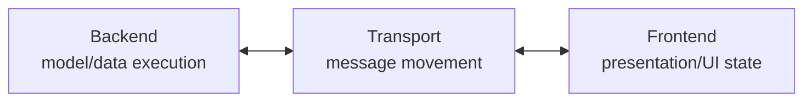
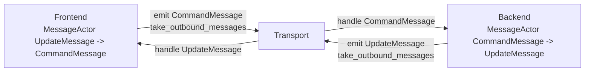
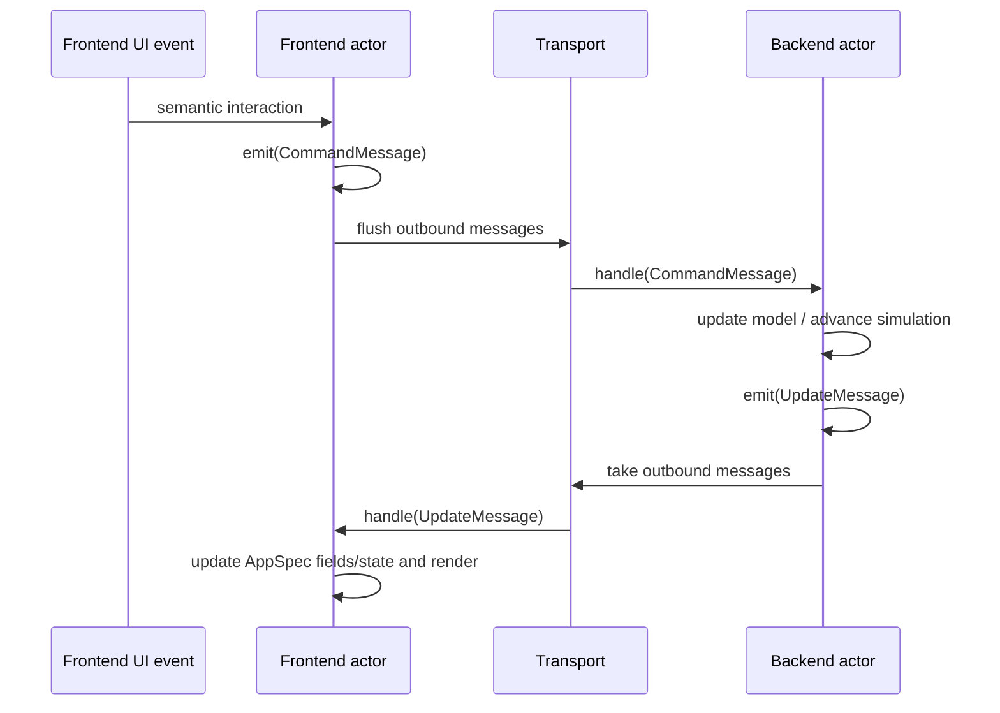
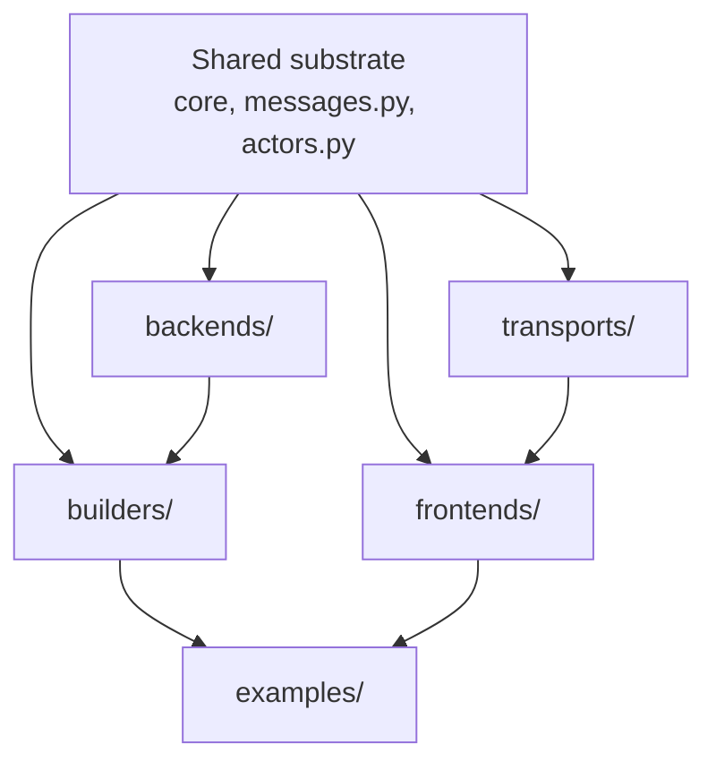

# Backend, Transport, and Frontend Refactor Log

Status: active implementation log

Related proposal:
[Backend, Transport, and Frontend Abstractions](backend-transport-frontend-proposal.md)

Related proof:
[Composable Authoring Proof](composable-authoring-proof.md)

This page records where the refactor is now, what mental model the code should
validate, and which checks prove that model has not drifted. It is intentionally
short-lived working documentation; durable lessons should move to
[Design Decisions](../decisions.md) after the refactor stabilizes.

## Current Snapshot

The runtime has been renamed around three top-level constructs:

- `Backend`: owns model execution, replay, simulation state, and backend-owned
  data updates.
- `Transport`: moves typed messages between backend and frontend.
- `Frontend`: owns presentation, user interaction, UI state, and rendering.

Shared runtime contracts now sit outside those three packages:

- `Message`: the typed envelope with an `intent` and payload.
- `MessageActor`: shared actor queue base for `handle(...)`, `emit(...)`, and
  `take_outbound_messages()`.

Current concrete package shape:

```text
compneurovis/
  core/        AppSpec, RunSpec, Field, views, controls, layout
  messages.py  Message, command/update payloads, CommandMessage, UpdateMessage
  actors.py    MessageActor shared by backend and frontend
  backends/    Backend, BufferedBackend, NEURON, Jaxley
  transports/  Transport, PipeTransport
  frontends/   Frontend, VisPy frontend
  builders/    high-level app builders
```

There should be no `runtime` package and no `session` package in the current
code path. Those names may still appear in older authored docs until the docs
sweep catches up, but they should not be active source-code concepts.

## Mental Model

### Runtime Ownership



The arrows describe logical message flow. They do not mean backend and frontend
own a transport object. A runner, transport worker, or frontend event loop
drains outbound messages and forwards them.

### Symmetric Actors



The symmetry is the contract:

```text
actor.handle(inbound_message)
actor.emit(outbound_message)
actor.take_outbound_messages()
```

Backend and frontend keep payload helpers for readability:

- `Backend.emit_update(payload)` wraps an update payload into an
  `UpdateMessage`.
- `Frontend.emit_command(payload)` wraps a command payload into a
  `CommandMessage`.

Those helpers are not the base protocol. The base protocol speaks messages.

### Message Loop



### Package Precedence



The main runtime constructs are package-level siblings. If a future module feels
like "backend plus protocol plus frontend all together," it is probably hiding a
boundary violation.

## Implementation Log

### 2026-05-13: Runtime Rename And Actor Symmetry

Implemented:

- top-level `backends`, `transports`, and `frontends` packages are the active
  runtime boundaries
- old `session` and `runtime` source packages removed
- `Scene` role renamed to `AppSpec`; run configuration is `RunSpec`
- `Message(intent, payload)` added with `CommandMessage` and `UpdateMessage`
  aliases
- `Transport.send(message)` and `Transport.poll()` move messages, not raw
  payloads
- `Backend.handle(CommandMessage)` and `Frontend.handle(UpdateMessage)` are now
  symmetric actor entrypoints
- `MessageActor` added as the shared queue base for backend/frontend emission
- backend payload emission moved to `emit_update(...)`
- frontend command emission moved to `emit_command(...)`; VisPy UI handlers no
  longer call `transport.send(command_message(...))` directly

Verification run:

```bash
python -m compileall src examples tests -q
pytest --ignore=tests/test_docs_and_indexes.py --ignore=tests/test_docs_vocabulary.py
```

Result:

```text
156 passed, 7 skipped
```

Known issue:

```bash
python scripts/check_architecture_invariants.py
```

currently fails because generated reference docs are stale. That is expected
until the docs/index regeneration step runs.

## Current Open Work

Immediate cleanup:

- finish authored-doc terminology sweep from `Session`/`Scene` to
  `Backend`/`AppSpec` where the prose describes current behavior
- regenerate reference indexes after code and docs settle
- update tutorials and concepts so new agents do not relearn the old model

Runtime follow-up:

- decide whether static apps should stay as direct `RunSpec(app_spec=...)` or
  gain an optional `StaticBackend`
- add a typed `MessageType` registry only when payload validation and
  discoverability need it
- keep `ResourceRef`, `Snapshot`, and resource transport separate from the base
  transport until real large/lazy state workflows force them

Authoring follow-up:

- start concrete trace/control/action/selection bindings before any generic
  `Capability` abstraction
- keep backend subclassing as an advanced escape hatch, not the primary public
  authoring path

## Validation Questions

Use these when reviewing diagrams or future patches:

- Can the runtime still be explained as `Backend <-> Transport <-> Frontend`?
- Do backend and frontend both speak `handle`, `emit`, and
  `take_outbound_messages`?
- Does transport move messages without owning their semantics?
- Does frontend state remain frontend-owned?
- Does backend state remain backend-owned?
- Are static apps still possible without inventing a fake live backend?
- Did a new helper create a fourth runtime construct, or is it clearly shared
  substrate or composition code?
