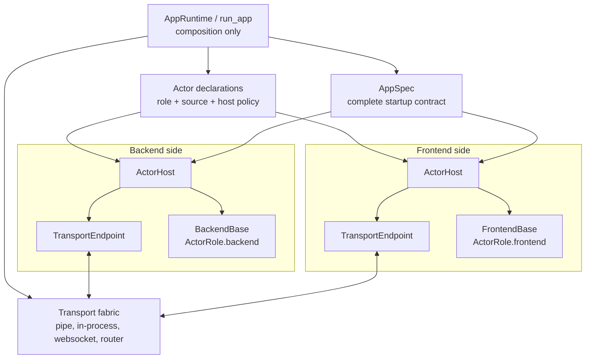
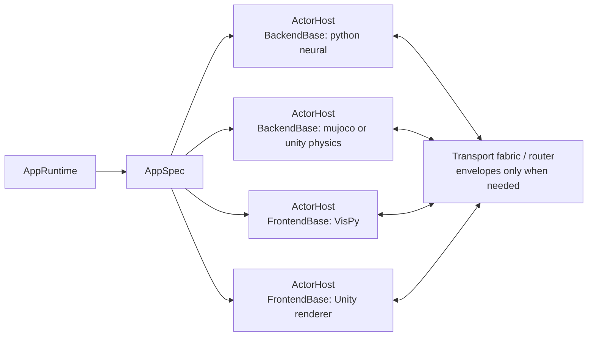
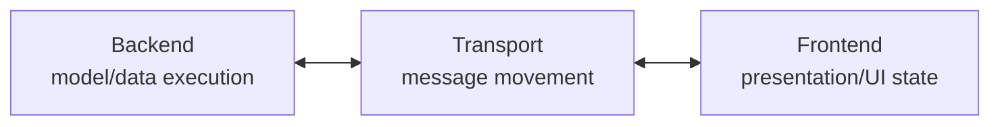
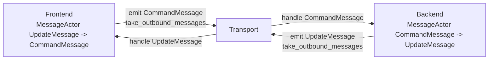
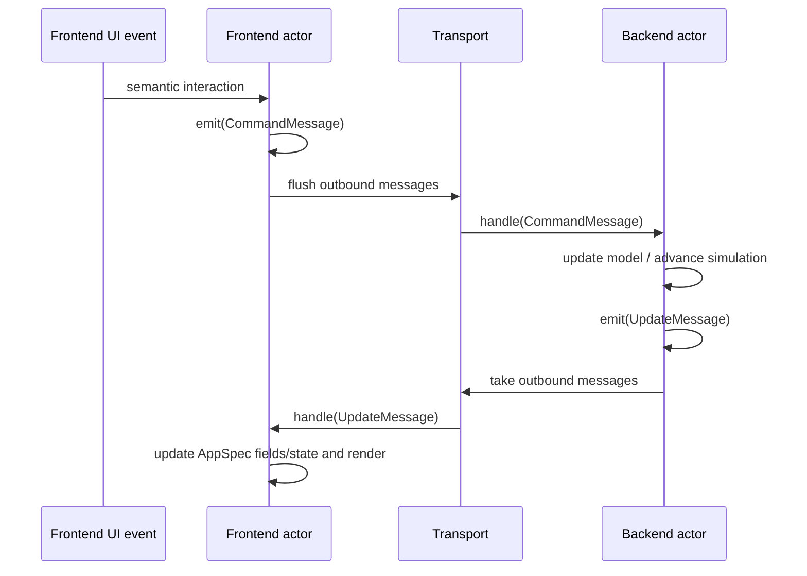
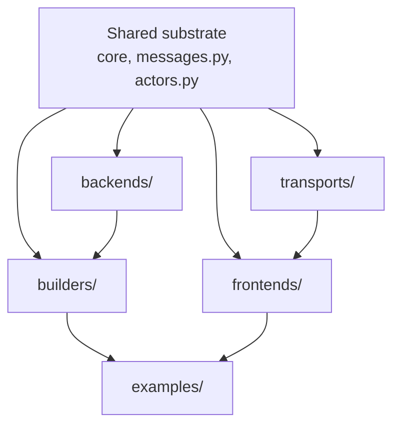

# Backend, Transport, and Frontend Refactor Log

Status: active implementation log

Related proposal:
[Backend, Transport, and Frontend Abstractions](backend-transport-frontend-proposal.md)

Related proof:
[Composable Authoring Proof](composable-authoring-proof.md)

This page records where the refactor is now, what mental model the code should
validate, and which checks prove that model has not drifted. It is intentionally
short-lived working documentation; durable lessons should move to
[Design Decisions](../decisions.md) after the refactor stabilizes.

## Current Snapshot

The runtime has been renamed around three top-level constructs:

- `Backend`: owns model execution, replay, simulation state, and backend-owned
  data updates.
- `Transport`: moves typed messages between backend and frontend.
- `Frontend`: owns presentation, user interaction, UI state, and rendering.

Shared runtime contracts now sit outside those three packages:

- `Message`: the typed envelope with an `intent` and payload.
- `MessageActor`: shared actor queue base for `handle(...)`, `emit(...)`, and
  `take_outbound_messages()`.

Current concrete package shape:

```text
compneurovis/
  core/        AppSpec, RunSpec, Field, views, controls, layout
  messages.py  Message, command/update payloads, CommandMessage, UpdateMessage
  actors.py    MessageActor shared by backend and frontend
  backends/    Backend, BufferedBackend, NEURON, Jaxley
  transports/  Transport, PipeTransport
  frontends/   Frontend, VisPy frontend
  builders/    high-level app builders
```

There should be no `runtime` package and no `session` package in the current
code path. Those names may still appear in older authored docs until the docs
sweep catches up, but they should not be active source-code concepts.

## Mental Model

### Unified Actor, Host, Role, And Transport Model

The target should have one actor abstraction. The current `MessageActor` idea
should either become that abstraction or disappear into it. There should not be
a separate `MessageActor`, `ActorDriver`, backend-only host contract, and
frontend-only host contract that each describe a different slice of the same
thing.

Core concepts:

| Concept | Meaning | Owns | Must not own |
|---|---|---|---|
| `AppRuntime` / composition | Startup coordinator for one app run | `AppSpec` construction/loading, actor declarations, host creation, transport wiring, start/stop coordination | simulator state, renderer state, message payload behavior |
| `ActorRole` | Stable role label for an actor, initially `backend` or `frontend` | routing/category identity | lifecycle, transport, semantic state |
| `Actor` / `ActorBase` | Shared runtime contract for anything that sends and receives messages | role-owned semantic state, `initialize`, `handle`, `emit`, `take_outbound_messages`, `shutdown` | process/thread/event-loop ownership, transport endpoints |
| `BackendBase` | Backend-role actor specialization | model/simulator/replay state, backend helpers such as `emit_update` | transport, frontend state, process ownership |
| `FrontendBase` | Frontend-role actor specialization | UI/render/interaction state, frontend helpers such as `emit_command` | transport, backend state, event-loop ownership |
| `ActorHost` | Generic lifecycle wrapper around any actor | actor construction, startup delivery, scheduling, message pumping, shutdown | role semantics, payload schemas |
| `TransportEndpoint` / `Transport` | Message movement between hosts | `send`, `poll`, `close`, serialization/IPC/socket resources | actor construction, actor ticking/rendering, `AppSpec` ownership |

High-level shape:



The shared actor contract is the center of the model:

```python
class Actor(Protocol):
    role: ActorRole

    def initialize(self, app_spec: AppSpec) -> None: ...
    def handle(self, message: Message[MessagePayload]) -> None: ...
    def emit(self, message: Message[MessagePayload]) -> None: ...
    def take_outbound_messages(self) -> list[Message[MessagePayload]]: ...
    def shutdown(self) -> None: ...
```

`ActorBase` owns the outbound queue and `emit(...)`. `BackendBase` and
`FrontendBase` subclass or implement that same contract. The base actor does
not have a mandatory `tick()` method. Live stepping, replay advancement, render
cadence, timers, and event loops are host or role-specific lifecycle concerns,
not the minimal actor contract.

Role-specific convenience helpers are allowed, but they are not separate actor
models:

```text
BackendBase.emit_update(payload) -> emit(update_message(payload))
FrontendBase.emit_command(payload) -> emit(command_message(payload))
```

The generic host loop is identical for backend and frontend actors:

```text
host.start()
  actor = actor_source()
  actor.initialize(app_spec)

host.step()
  for message in endpoint.poll():
      actor.handle(message)

  for message in actor.take_outbound_messages():
      endpoint.send(message)

host.stop()
  actor.shutdown()
  endpoint.close()
```

The host implementation can vary without changing the actor contract:

| Host implementation | Python's relationship | Same actor contract? |
|---|---|---|
| in-process host | Python runs actor directly | yes |
| process host (`ActorProcess`) | Python spawns Python subprocess | yes |
| Qt host (`VispyFrontendHost`) | Python runs Qt event loop in-process | yes |
| notebook host | Python runs notebook event loop | yes |
| WebSocket listener host | Python opens port; actor dials in | yes (via wire format) |
| WebSocket client host | Python dials out to running actor | yes (via wire format) |
| external signal host | Python owns only the stop signal | yes (via wire format) |

Startup is coordinated, not role-ordered. Backends and frontends both consume
the same complete `AppSpec` before runtime messages flow, but the architecture
must not depend on "backend starts first" or "frontend starts first." A remote
actor may connect before a local actor exists; a GUI window may open before a
worker process is ready; a worker may be started before a renderer. The invariant
is only that a host does not pump runtime messages for its actor until that
actor has received startup input.

Multiple backends and multiple frontends are just more actor declarations:



The simple one-backend/one-frontend path can keep bare `Message` values. The
transport fabric needs `MessageEnvelope` source/target/channel metadata only
when multiple actors, processes, languages, or delivery policies make routing
ambiguous.

Initial code layout should be compact:

```text
compneurovis/
  core/
    actor.py       ActorRole, Actor protocol, ActorBase queue behavior
    app.py         AppSpec, RunSpec, DiagnosticsSpec
  backends/
    base.py        BackendBase only
  frontends/
    base.py        FrontendBase only
  hosts.py         ActorHost implementations and host policies
  transports/
    base.py        TransportEndpoint / Transport protocol
    pipe.py        pipe endpoints only
```

Avoid long-lived duplicate abstractions:

- Do not keep `MessageActor` as a separate public concept if `ActorBase` exists.
- Do not let `PipeTransport` construct, initialize, tick, or shut down actors.
- Do not let a frontend actor hold a transport endpoint.
- Do not create backend-only and frontend-only host contracts before the shared
  `ActorHost` contract exists.
- Do not add a router/envelope to the simple path until more than one actor on
  either side requires source/target routing.

### AppRuntime: Orchestrator Design

`AppRuntime` is the authoritative coordinator for a single app run. It owns no
simulation state and no renderer state. It owns the startup contract, the stop
signal, and the threading policy.

#### Why AppRuntime

`run_app` currently calls `s.run()` sequentially. This works only because Qt's
`run()` blocks the main thread. Any headless frontend (static, notebook,
test-mode) would fall through immediately. More importantly there is no shared
place for an actor to signal "I am done" — each host calls its own cleanup
independently.

`AppRuntime` gives every actor a common stop signal and gives `run_app` a
uniform blocking contract that is not coupled to Qt.

#### Interface

```python
class AppRuntime:
    # Read-only after construction — passed to every host as the startup contract.
    app_spec: AppSpec

    # Resolved diagnostics config — applied before any actor starts.
    diagnostics: DiagnosticsSpec | None

    def stop(self) -> None:
        """Signal all actors and wait() to begin shutdown."""

    def is_stopped(self) -> bool:
        """True once stop() has been called."""

    def wait(self, items: list[tuple[ActorSpec, Startable]]) -> None:
        """Start run() for every startable, block until all finish."""
```

`AppRuntime` is a main-process-only object. Subprocess actors receive a
snapshot (pickle) of `app_spec` at start time and cannot reference the live
runtime. They signal termination only through the transport (sending a stop
message) or through a shared `multiprocessing.Event` that `AppRuntime` owns.

#### ActorHostSource Signature

`host_source` currently has the signature:

```python
ActorHostSource = Callable[[AppSpec, TransportEndpoint | None], Startable]
```

After this change it becomes:

```python
ActorHostSource = Callable[[AppRuntime, TransportEndpoint | None], Startable]
```

Hosts call `runtime.app_spec` to read the startup contract and `runtime.stop()`
to signal the end of their lifecycle (e.g., when the Qt window closes). The
host no longer needs `app_spec` passed separately.

#### Foreground vs Background Threading

Some hosts must run in the main thread (Qt's `app.exec()` owns the main event
loop entry point). Others are fire-and-forget workers that run on a daemon
thread. `ActorSpec` carries this as a flag:

```python
@dataclass(slots=True)
class ActorSpec:
    id: str
    role: ActorRole
    host_source: ActorHostSource | None = None  # None = open connection slot, wait for actor to dial in
    runs_in_foreground: bool = False            # True only for the actor that owns app.exec()
```

The constraint is not "at most one window" — it is "at most one actor owns the
main-thread event loop entry point." Multiple Qt windows sharing the same
`QApplication` are perfectly valid: only one `VispyFrontendHost` has
`runs_in_foreground=True` (its `run()` calls `vispy_app.run()`); any additional
`VispyFrontendHost` instances have `runs_in_foreground=False` (their `run()` is
a no-op — they create their window and register a Qt timer, which fires on the
shared loop already owned by the foreground host).

`AppRuntime.wait()` uses this flag to dispatch correctly:

```python
def wait(self, items: list[tuple[ActorSpec, Startable]]) -> None:
    foreground = [(spec, s) for spec, s in items if spec.runs_in_foreground]
    background = [(spec, s) for spec, s in items if not spec.runs_in_foreground]

    threads = [threading.Thread(target=s.run, daemon=True) for _, s in background]
    for t in threads:
        t.start()

    if foreground:
        # One actor owns the main event loop (e.g., Qt). Others share it passively.
        _, fg = foreground[0]
        fg.run()           # blocks until the event loop exits
        self.stop()        # propagate stop to all background actors

    else:
        # Headless or all-remote: poll until stop() is signalled or all threads finish.
        while not self.is_stopped() and any(t.is_alive() for t in threads):
            time.sleep(0.05)
        self.stop()

    for t in threads:
        t.join(timeout=5.0)
```

At most one `runs_in_foreground=True` actor should exist per run. Validation in
`run_app` should assert this before starting anything.

#### Actor Declaration Topology

All actors expected to participate in a run must be declared in `run_spec.actors`,
including remote or non-Python actors that Python did not spawn. The declaration
is not about ownership — it is about topology. The orchestrator needs the full
actor set upfront to:

1. **Wire the transport** — a `pipe_transport` or WebSocket transport factory
   allocates endpoint slots keyed by actor ID.
2. **Distribute AppSpec** — every declared actor receives the startup contract
   before message flow begins.
3. **Coordinate lifecycle** — `runtime.wait()` knows when the run is complete
   only if it knows all participants.

`host_source=None` means "open a connection slot and wait for this actor to
dial in." The orchestrator creates the endpoint but does not spawn or own the
actor process. `host_source` set means "Python hosts this actor directly."

| `host_source` value | Python's relationship to the actor |
|---|---|
| `None` | Opens endpoint slot; actor connects independently |
| `ActorProcess(...)` | Python spawns a Python subprocess |
| `VispyFrontendHost(...)` | Python runs it in-process under Qt |
| `WebSocketListenerHost(...)` | Python opens a named port; actor connects by URL |
| `WebSocketClientHost(...)` | Python dials out; actor is already listening |

#### Three Entry Points, One Sugar Layer

The fundamental split is between the orchestrator and the actors it coordinates.
These are independent concerns and can run in separate processes:

```python
# 1. Pure orchestrator — topology + transport + AppSpec authority + lifecycle.
#    All host_source must be None. Waits for actors to connect.
run_orchestrator(RunSpec(
    app_spec=build_app_spec(),
    actors=[
        ActorSpec("backend", BACKEND),   # host_source=None: wait for connection
        ActorSpec("frontend", FRONTEND), # host_source=None: wait for connection
    ],
    transport=websocket_transport("backend", "frontend", port=9000),
))

# 2. Actor client — connect to an existing orchestrator as a specific role.
run_as_backend(MyBackend, "ws://host:9000/backend")
run_as_frontend(MyFrontend, "ws://host:9000/frontend")

# 3. Sugar — bundled launch when everything runs from the same script.
#    Internally: run_orchestrator + spawn each actor via its host_source.
run_app(RunSpec(
    app_spec=build_app_spec(),
    actors=[
        ActorSpec("backend", BACKEND, host_source=lambda rt, ep: ActorProcess(MyBackend, ...)),
        ActorSpec("frontend", FRONTEND, host_source=lambda rt, ep: VispyFrontendHost(...),
                  runs_in_foreground=True),
    ],
    transport=pipe_transport("backend", "frontend"),
))
```

`run_app` is pure sugar: it takes a `RunSpec` where every `host_source` is set,
constructs the orchestrator, and spawns all actors. There is no case where
`run_app` is the right call but could not be equivalently expressed as
`run_orchestrator` + `run_as_backend` + `run_as_frontend` in separate processes.

In the pure-remote case (Unity backend + Unity frontend, Python is orchestrator
only), all actors have `host_source=None` and `runs_in_foreground=False`.
`AppRuntime.wait()` enters the headless polling branch and blocks until
`runtime.stop()` is called (e.g., triggered by a WebSocket disconnect event).

Optional consumers (e.g., a monitoring dashboard that may or may not connect)
are a future extension: `ActorSpec(..., required=False)` allocates a transport
slot and sends AppSpec if the actor connects, but its absence does not block or
fail the run. Not needed in the core path now.

#### Entry Point Pseudocode

`run_orchestrator` — the base layer, no actor hosting:

```python
def run_orchestrator(run_spec: RunSpec) -> None:
    if mp.current_process().name != "MainProcess":
        return
    assert all(s.host_source is None for s in run_spec.actors), \
        "run_orchestrator expects no hosted actors; use run_app for bundled launch."
    configure_multiprocessing()
    runtime = AppRuntime(app_spec=run_spec.app_spec, diagnostics=run_spec.diagnostics)
    configure_diagnostics(runtime.diagnostics)

    if runtime.app_spec is None:
        raise ValueError("RunSpec.app_spec is required.")

    fg_actors = [s for s in run_spec.actors if s.runs_in_foreground]
    if len(fg_actors) > 1:
        raise ValueError(f"At most one foreground actor allowed; got {[s.id for s in fg_actors]}.")

    endpoints = run_spec.transport(run_spec.actors) if run_spec.transport is not None else {}
    # Connection-slot hosts: open endpoint and wait for actor to dial in.
    items: list[tuple[ActorSpec, Startable]] = [
        (spec, ConnectionSlotHost(endpoints[spec.id]))
        for spec in run_spec.actors
    ]
    for _, s in items:
        s.start()
    try:
        runtime.wait(items)
    finally:
        for _, s in reversed(items):
            s.stop()
```

`run_app` — sugar that bundles orchestrator + hosted actors:

```python
def run_app(run_spec: RunSpec) -> None:
    if mp.current_process().name != "MainProcess":
        return
    configure_multiprocessing()
    runtime = AppRuntime(app_spec=run_spec.app_spec, diagnostics=run_spec.diagnostics)
    configure_diagnostics(runtime.diagnostics)

    if runtime.app_spec is None:
        raise ValueError("RunSpec.app_spec is required.")

    fg_actors = [s for s in run_spec.actors if s.runs_in_foreground]
    if len(fg_actors) > 1:
        raise ValueError(f"At most one foreground actor allowed; got {[s.id for s in fg_actors]}.")

    endpoints = run_spec.transport(run_spec.actors) if run_spec.transport is not None else {}
    items: list[tuple[ActorSpec, Startable]] = []
    for spec in run_spec.actors:
        endpoint = endpoints.get(spec.id)
        if spec.host_source is None:
            items.append((spec, ConnectionSlotHost(endpoint)))
        else:
            items.append((spec, spec.host_source(runtime, endpoint)))

    for _, s in items:
        s.start()
    try:
        runtime.wait(items)
    finally:
        for _, s in reversed(items):
            s.stop()
```

`run_as_backend` / `run_as_frontend` — thin client runners:

```python
def run_as_backend(backend_source: ActorSource, url: str) -> None:
    """Connect to an existing orchestrator and run as the backend actor."""
    transport = WebSocketClientTransport(url)
    host = BackendHost(actor_source=backend_source, transport=transport)
    host.start()
    try:
        host.run()
    finally:
        host.stop()

def run_as_frontend(frontend_source: ActorSource, url: str) -> None:
    """Connect to an existing orchestrator and run as the frontend actor."""
    transport = WebSocketClientTransport(url)
    host = VispyFrontendHost(actor_source=frontend_source, transport=transport)
    host.start()
    try:
        host.run()
    finally:
        host.stop()
```

`run_as_backend` and `run_as_frontend` do not construct `AppRuntime` or
`RunSpec`. They receive AppSpec over the startup channel from the orchestrator,
exactly as a locally-spawned actor would.

#### Cross-Process Boundary Rules

1. `AppRuntime` lives in the main process. Subprocess actors never hold a
   reference to it.
2. `app_spec` is serialized (pickle) and sent to the subprocess via the startup
   channel or a constructor argument. The subprocess receives a frozen snapshot.
3. Subprocess actors signal termination via transport messages or via a shared
   `multiprocessing.Event` that `AppRuntime` creates and passes to the
   `ActorProcess` constructor — not by calling `runtime.stop()` directly.
4. `ActorProcess.run()` is a no-op — the subprocess manages its own loop.
   The main process thread that started it is not blocked.

#### What AppRuntime Must NOT Own

- Simulation or model state (that is `BackendBase`).
- Render or UI state (that is `FrontendBase`).
- Transport endpoints (those are created by the `TransportFactory`).
- Actor construction logic (that is inside each `ActorHostSource`).
- `AppSpec` construction logic (that belongs in the builder or the user).

`AppRuntime` answers exactly three questions: "What is the startup contract?",
"Should we stop?", and "Which actors run in the foreground?"

### Runtime Ownership



The arrows describe logical message flow. They do not mean backend and frontend
own a transport object. A runner, transport worker, or frontend event loop
drains outbound messages and forwards them.

### Symmetric Actors



The symmetry is the contract:

```text
actor.handle(inbound_message)
actor.emit(outbound_message)
actor.take_outbound_messages()
```

Backend and frontend keep payload helpers for readability:

- `Backend.emit_update(payload)` wraps an update payload into an
  `UpdateMessage`.
- `Frontend.emit_command(payload)` wraps a command payload into a
  `CommandMessage`.

Those helpers are not the base protocol. The base protocol speaks messages.

### Message Loop



### Package Precedence



The main runtime constructs are package-level siblings. If a future module feels
like "backend plus protocol plus frontend all together," it is probably hiding a
boundary violation.

## Implementation Log

### 2026-05-13: Runtime Rename And Actor Symmetry

Implemented:

- top-level `backends`, `transports`, and `frontends` packages are the active
  runtime boundaries
- old `session` and `runtime` source packages removed
- `Scene` role renamed to `AppSpec`; run configuration is `RunSpec`
- `Message(intent, payload)` added with `CommandMessage` and `UpdateMessage`
  aliases
- `Transport.send(message)` and `Transport.poll()` move messages, not raw
  payloads
- `Backend.handle(CommandMessage)` and `Frontend.handle(UpdateMessage)` are now
  symmetric actor entrypoints
- `MessageActor` added as the shared queue base for backend/frontend emission
- backend payload emission moved to `emit_update(...)`
- frontend command emission moved to `emit_command(...)`; VisPy UI handlers no
  longer call `transport.send(command_message(...))` directly

Verification run:

```bash
python -m compileall src examples tests -q
pytest --ignore=tests/test_docs_and_indexes.py --ignore=tests/test_docs_vocabulary.py
```

Result:

```text
156 passed, 7 skipped
```

Known issue:

```bash
python scripts/check_architecture_invariants.py
```

currently fails because generated reference docs are stale. That is expected
until the docs/index regeneration step runs.

### 2026-05-13: AppSpec as Startup Contract

Implemented the agreed model where AppSpec is a declarative startup contract
distributed to all actors before the runtime message loop begins — not a runtime
message.

- `AppSpecReady` removed from `messages.py` and all message type registries
- `Backend.initialize(app_spec: AppSpec)` now *consumes* AppSpec (both base
  and all concrete implementations)
- `Frontend.initialize(app_spec: AppSpec)` same symmetric contract
- `Backend.startup_app_spec()` classmethod removed from the base protocol
- `resolve_startup_app_spec_source()` removed from `backends/base.py`
- Concrete backends split into two phases:
  - `build_startup_app_spec(self) -> AppSpec` — pre-protocol, runs in the
    worker's startup phase, builds model and returns AppSpec; not part of
    the base `Backend` protocol
  - `initialize(self, app_spec: AppSpec)` — protocol-level, called after
    AppSpec is distributed
- `PipeTransport` gains a startup channel (one-way `Pipe` for process mode,
  `SimpleQueue` for thread mode) separate from the runtime update pipe
- Worker calls `build_startup_app_spec()` when no `provided_app_spec` is
  given, sends result on startup channel, then calls `initialize(app_spec)`
- `PipeTransport.poll_startup_app_spec() -> AppSpec | None` lets the frontend
  poll for the startup AppSpec without treating it as a runtime message
- `VispyFrontendWindow._poll_transport()` calls `poll_startup_app_spec()` on each
  tick until `app_spec` is set, then calls `initialize(app_spec)`
- When `RunSpec.app_spec` is provided (replay, static apps), the frontend
  initializes immediately in `__init__` and the worker receives the same
  AppSpec as `provided_app_spec` - no startup channel send needed

### Cross-Language Design Intent

The architecture is designed to support non-Python backends and frontends (e.g.
Unity/C#, browser JS). The current Python-only path is coherent, but the
following contracts need wire-format definitions before cross-language actors
can participate:

- **AppSpec wire format** — AppSpec is pure data; a JSON schema allows any
  language to receive and deserialize the startup contract. The startup
  channel sends a serialized AppSpec, not a Python pickle.
- **Message wire format** — `UpdateMessage` and `CommandMessage` payloads need
  a JSON or protobuf schema for non-Python transports. The `Transport`
  abstraction already isolates this: a WebSocket transport can serialize on
  send and deserialize on poll without the backend or frontend knowing.
- **Protocol is behavioral, not Python-specific** — `Backend` and `Frontend`
  are Python ABCs for the Python path. For other languages, the protocol is
  defined by the wire format alone: implement `initialize(app_spec)`,
  `advance()`, `handle(message)`, `emit_update(payload)` in your language and
  connect via a compatible transport.

Nothing in the current refactor breaks this path. The next step that forces it
is writing the first non-Python transport (WebSocket backend or Unity frontend).

### 2026-05-15: Inline Sugar API

#### Goal

Heavy simulation backends such as NEURON cannot share a process with the Qt
event loop. Single-process approaches (step thread + Qt in same process) cause
slider unresponsiveness and eventual freezes due to GIL contention and Qt event
starvation. The inline API provides a matplotlib-style module-level interface
that hides subprocess isolation entirely:

```python
import compneurovis.inline as cnv

cnv.trace("Membrane voltage", read={"Vm": lambda: model.v_mv}, x=lambda: t_ms[0])
cnv.control("tau", label="Membrane tau (ms)",
            get=lambda: model.tau, set=lambda v: setattr(model, "tau", v),
            min=2.0, max=80.0)
cnv.action("reset", label="Reset state", fn=_reset, resets_fields=True)
cnv.show(step=_step, dt_ms=DT_MS, speed=lambda: max(1, int(display_dt_ms[0] / DT_MS)),
         title="LIF Model")
```

No `if __name__ == '__main__':` guard. No threading or subprocess management
visible to the user.

#### Architecture: Existing Infrastructure Was Sufficient

The key result is that the backend/transport/frontend architecture required
**zero changes** to support the inline API. The only new type is `InlineBackend`,
a thin `BackendBase` subclass that wraps the user's step function and bindings.
Everything else — `BackendHost`, `VispyFrontendHost`, `AppRuntime`,
`PipeEndpoint`, `make_pipe_pair` — is used as-is.

```
User script
  └── cnv.trace / cnv.control / cnv.action  →  InlineApp (binding accumulator)
  └── cnv.show()
        ├── [main process]  build AppSpec → spawn backend subprocess
        │                   AppRuntime + VispyFrontendHost + VispyFrontendWindow
        └── [subprocess]    InlineBackend(BackendBase) + BackendHost
```

`InlineApp` is not a runtime actor. It is a binding accumulator: it collects
`TraceBinding`, `ControlBinding`, and `ActionBinding` descriptors and builds
the `AppSpec`. `show()` is the single entry point that orchestrates the run.

#### `InlineBackend` — the only new type

```python
class InlineBackend(BackendBase):
    def handle(self, message):
        # dispatch SetControl → c.set(value)
        # dispatch InvokeAction → a.fn(); emit FieldReplace if resets_fields

    def advance(self):
        # run N steps, _sample() per step
        # drain accumulators → emit_update(FieldAppend)

    def idle_sleep(self) -> float:
        return 1.0 / 60.0
```

`BackendHost.step()` calls `receive()` → `advance()` → `flush()` on each tick.
The host already handles `StopBackend`, pipe draining, and outbound flushing —
`InlineBackend` only contains simulation-specific logic.

#### Accumulator Pattern

`_sample()` is called per simulation step, appending to an in-memory buffer.
`_drain_message()` is called once per frame and emits a single `FieldAppend`
with shape `(n_series, n_steps_this_frame)`. This batches all steps into one
message per frame rather than one message per step, keeping pipe traffic bounded
regardless of simulation speed.

`resets_fields=True` on an `ActionBinding` causes the backend to immediately
emit `FieldReplace` for all traces after invoking the action, clearing the
frontend's accumulated data when the x-axis jumps backward on reset.

#### `show()` — three flat branches

```python
def show(self, *, step, dt_ms, speed, title):
    self._title = title
    if _backend_endpoint is not None:
        # subprocess: _cnv_script_worker set the endpoint — run as backend actor
        backend = InlineBackend(traces=..., controls=..., actions=..., ...)
        host = BackendHost(endpoint=_backend_endpoint)
        host.start(lambda: backend, self._build_app_spec())
        try:
            while not host.should_stop():
                started = time.monotonic()
                host.step()
                remaining = host.idle_sleep() - (time.monotonic() - started)
                if remaining > 0:
                    time.sleep(remaining)
        except (BrokenPipeError, OSError):
            pass  # frontend closed the pipe — exit cleanly
        finally:
            host.stop()

    elif mp.current_process().name == "MainProcess":
        # main process: orchestrate — spawn backend subprocess, run Qt frontend
        script_path = inspect.stack()[-1].filename
        app_spec = self._build_app_spec()
        pair = make_pipe_pair(left_name="frontend", right_name="backend")
        configure_multiprocessing()
        backend_process = mp.Process(target=_cnv_script_worker, args=(script_path, pair.right))
        backend_process.start()
        pair.right.close()
        runtime = AppRuntime(app_spec=app_spec)
        frontend_host = VispyFrontendHost(actor_source=VispyFrontendWindow,
                                          runtime=runtime, endpoint=pair.left)
        frontend_host.start()
        frontend_host.run()   # blocks until Qt exits
        frontend_host.stop()
        backend_process.join(timeout=2)
        if backend_process.is_alive():
            backend_process.terminate()
            backend_process.join()

    # else: subprocess bootstrap re-import (Windows spawn fixup_main) — do nothing
```

The three branches map exactly to the three roles in the architecture:
backend actor, orchestrator + frontend actor, and no-op.

#### Subprocess Isolation Mechanics

The challenge is spawning a subprocess from the user's top-level script without
an `if __name__ == '__main__':` guard. Three mechanisms work together:

**1. `_cnv_script_worker` at module top level**

```python
def _cnv_script_worker(script_path: str, endpoint: PipeEndpoint) -> None:
    import compneurovis.inline as _inline
    _inline._backend_endpoint = endpoint
    _inline._app = _inline.InlineApp()   # reset bootstrap pollution (see below)
    runpy.run_path(script_path, run_name="__main__")
```

Must be a top-level module function — `multiprocessing.spawn` pickles the
target by qualified name (`compneurovis.inline._cnv_script_worker`). A lambda
or nested function would not be picklable. Do not move or rename.

**2. Module-level endpoint flag**

```python
_backend_endpoint: PipeEndpoint | None = None
```

`_cnv_script_worker` sets this before `runpy.run_path` re-runs the user script.
`show()` checks it first to decide role. `None` in the main process; set in the
subprocess worker.

**3. Windows spawn bootstrap pitfall**

On Windows, `multiprocessing.spawn` calls `_fixup_main_from_path()` which
**re-runs the user's script as `__main__` before calling the target function**.
At that moment `_backend_endpoint` is still `None`. Without the
`mp.current_process().name == "MainProcess"` guard, `show()` would attempt to
spawn a second subprocess, causing:

```
RuntimeError: An attempt has been made to start a new process before the
current process has finished its bootstrapping phase.
```

The `name == "MainProcess"` check correctly routes:
- `_backend_endpoint is not None` → backend actor (worker has fired)
- `name == "MainProcess"` → orchestrator (spawn child, start frontend)
- else → bootstrap re-import no-op (child process, before worker fires)

**4. Bootstrap binding pollution**

The bootstrap re-run executes all `cnv.trace/control/action` calls, populating
`_app` with binding indices 0–N. Then `_cnv_script_worker` fires and
`runpy.run_path` runs the script again, appending indices N+1–2N. The backend
would send `field_3_...` but the frontend's `AppSpec` was built from `field_0_...`,
causing a `KeyError`. Fix: reset `_app` in `_cnv_script_worker` before
`runpy.run_path` so the real backend run starts from a clean slate.

#### BrokenPipeError on Close

When the user closes the Qt window, `VispyFrontendHost.stop()` closes the
frontend pipe endpoint. The backend's next `BackendHost.flush()` →
`endpoint.send()` throws `BrokenPipeError`. The backend loop wraps the host
step in `try / except (BrokenPipeError, OSError)` so the subprocess exits
cleanly rather than printing a traceback.

#### Qt Import Isolation

`VispyFrontendWindow` and `VispyFrontendHost` import vispy with
`use(app="pyqt6", gl="gl+")` at module level. These imports are deferred to
the `MainProcess` branch of `show()` so the backend subprocess never initializes
Qt. All other imports (`BackendBase`, `BackendHost`, `AppRuntime`,
`configure_multiprocessing`, `PipeEndpoint`) are top-level in `inline.py`.

### 2026-05-15: Line Plot Refresh Rate — Critical Performance Finding

#### Root Cause of QTimer Gap Doubling

Setting `max_refresh_hz=60.0` on `LinePlotViewSpec` causes the Qt poll loop to
degrade and eventually freeze. Mechanism:

1. Every 16ms poll call triggers `_flush_due_line_plot_refreshes()` (rate limit
   satisfied at 60Hz interval = 16.7ms).
2. `host.refresh()` calls pyqtgraph `setData()` + `setXRange()` which takes
   5–15ms per panel (CPU-side Qt widget update, not GL).
3. QTimer fires 16ms after `_poll()` returns. If `_poll()` took 15ms, next gap
   = 31ms instead of 16ms.
4. At 31ms gap, the rate limit is still satisfied → render fires again → gap
   grows to 47ms, 63ms, 78ms...
5. Backend sends at 60Hz (16ms); frontend polls at ~32Hz. Pipe backlog grows
   from 3 msgs/poll → 15+ msgs/poll. Eventually the pipe buffer fills, the
   backend blocks on `send()`, and the window freezes.

#### Fix

Never set `max_refresh_hz` above 30 in `LinePlotViewSpec`. Leave it `None` to
use the frontend default (`DEFAULT_LINE_PLOT_MAX_REFRESH_HZ = 15.0`).

At 15Hz (66ms interval), most polls skip the render. The pyqtgraph refresh
cost amortizes across 4+ polls, keeping average poll time well under 16ms.
Data still accumulates at full backend rate; only the visual cadence drops
to ~15Hz, which is smooth enough for live simulation visualization.

The main branch's `DEFAULT_LINE_PLOT_MAX_REFRESH_HZ = 15.0` constant exists
precisely because this problem was encountered before. The sugar API must
respect this default and must not override it upward.

#### Diagnostic Pattern

When troubleshooting poll loop performance, add per-poll timing:

```python
if total_ms > 5.0 or gap_ms > 40.0 or _poll_count[0] % 120 == 0:
    print(f"[frontend] poll={_poll_count[0]:6d}  gap={gap_ms:6.1f}ms  msgs={len(msgs):3d}  recv={t_recv_ms:5.2f}ms  total={total_ms:6.2f}ms")
```

Symptom pattern for refresh-rate-induced freeze:
- Gaps grow in multiples of 16ms: 16 → 31 → 47 → 63 → 78...
- `msgs` per poll grows proportionally (1× → 2× → 3×...)
- Window becomes unresponsive to sliders/buttons
- Eventually gaps plateau at a high value and window freezes entirely
- Backend logs may continue (it is blocked on pipe send, not crashed)

### 2026-05-15: Notebook Frontend

#### Goal

Provide a `show_notebook()` API on `NeuronAttachAdapter` and `JaxleyAttachAdapter`
that renders inline in any notebook environment — VS Code, JupyterLab, and classic
Jupyter Notebook — without requiring the user to know anything about vispy or widget
backends.

#### Architecture

```
User notebook cell
  └── app.show_notebook()
        ├── make_inprocess_pair()        in-process queue transport
        ├── backend = _make_backend()    build backend (Jaxley or NEURON)
        ├── app_spec = backend.build_startup_app_spec()
        ├── BackendHost(backend_endpoint)
        │     └── daemon thread          JAX/NEURON release GIL → real parallelism
        └── NotebookHost(frontend_endpoint)
              ├── vispy SceneCanvas(show=False)   offscreen OpenGL, hidden Qt window
              │     └── MorphologyRenderer        existing visual code reused as-is
              │     └── canvas.render() → PNG → ipywidgets.Image
              ├── ipympl matplotlib figure        interactive zoom/pan
              │     └── line.set_data() + draw_idle() for live trace
              ├── ipyevents mouse handler         drag-to-rotate morphology
              └── VBox([morph_widget, fig.canvas, stop_btn])
```

**Why threading and not subprocess**: The subprocess path (`show()`) re-runs the
entire script file as the subprocess entry point. Notebook cells have no file to
re-run — the model lives in cell state that cannot be pickled and re-executed in a
child process. Threading works because JAX releases the GIL during XLA dispatch and
NEURON releases it during `h.fadvance()`, so simulation runs in parallel with the
asyncio poll loop.

**Known limitation**: `canvas.render()` does synchronous Qt GL work on the main
thread. This briefly blocks the asyncio loop during morphology re-renders, causing
occasional matplotlib `draw_idle()` delays during morphology rotation. Acceptable
for the current use case.

#### Vispy Backend Selection

`vispy.use()` can only be called once per process. The notebook host calls it via
`_ensure_vispy_backend()`:

```python
def _ensure_vispy_backend() -> None:
    from vispy.app import _default_app as _da
    if _da.default_app is None:
        from vispy import use
        use(app="pyqt6", gl="gl+")
```

`_da.default_app` is `None` before any `use()` call and an `Application` object
after. This guard means the host selects pyqt6 on a fresh kernel, but leaves an
already-configured backend (e.g. `jupyter_rfb` in JupyterLab) untouched.

The `VispyFrontendWindow` / `VispyFrontendHost` eager import chain that previously
fired `use(app="pyqt6", gl="gl+")` at import time was made lazy:

- `compneurovis/frontends/vispy/__init__.py` — `__getattr__` defers the import
  of `VispyFrontendWindow` and `VispyFrontendHost` until they are accessed by name
- `compneurovis/frontends/__init__.py` — same lazy `__getattr__` pattern
- `compneurovis/__init__.py` — `VispyFrontendHost`/`VispyFrontendWindow` moved to
  the lazy `_OPTIONAL_EXPORTS` dict

Result: importing any `compneurovis` submodule in a notebook no longer triggers
vispy backend selection.

#### Rendering Stack

| Panel | Library | Why |
|---|---|---|
| Morphology | vispy offscreen `canvas.render()` → `ipywidgets.Image` | Reuses `MorphologyRenderer` exactly; OpenGL-accelerated coloring; fast for hundreds of segments |
| Voltage trace | `ipympl` matplotlib figure | Interactive zoom/pan out of the box; live update via `line.set_data()` + `draw_idle()`; works everywhere ipywidgets works |
| Interactivity | `ipyevents` on morphology image | Drag-to-rotate (azimuth/elevation), scroll-to-zoom; `prevent_default_action=True` stops browser image drag |

Mouse events set a `_morph_dirty` flag rather than calling `_render_morph()`
directly. The asyncio poll loop checks and clears the flag each tick (~33ms).
This keeps the mouse handler instant and prevents it from blocking matplotlib
updates.

#### Stop Mechanism

The Stop button in the VBox sends `StopBackend` through the frontend endpoint:

```python
self._endpoint.send(command_message(StopBackend()))
```

`BackendHost.receive()` checks for `StopBackend`, sets `_stop_requested = True`,
and the backend thread's `should_stop()` check exits the loop cleanly on the next
tick. The asyncio poll task is also cancelled.

#### Files

| File | Change |
|---|---|
| `frontends/vispy/notebook_host.py` | New — universal notebook host (vispy + ipympl + ipyevents) |
| `frontends/vispy/notebook_host_jupyterlab.py` | Renamed from `notebook_host.py` — JupyterLab-only rfb version preserved |
| `backends/neuron/attach.py` | Added `show_notebook()` to `NeuronAttachAdapter` |
| `backends/jaxley/attach.py` | Updated `show_notebook()` to use universal host |
| `scratch/hh_neuron_notebook.ipynb` | New — NEURON HH notebook test |
| `scratch/hh_jaxley_notebook.ipynb` | Updated — no vispy imports needed |
| `scratch/hh_neuron_inline.py` | Renamed from `hh_inline.py` |
| `scratch/hh_neuron_attach.py` | Renamed from `hh_attach.py` |

#### Dependencies Added

- `ipympl` — interactive matplotlib in notebooks
- `ipyevents` — DOM event listener on ipywidgets

## Current Open Work

Immediate cleanup:

- finish authored-doc terminology sweep from `Session`/`Scene` to
  `Backend`/`AppSpec` where the prose describes current behavior
- regenerate reference indexes after code and docs settle
- update tutorials and concepts so new agents do not relearn the old model

AppRuntime implementation (next):

- implement `AppRuntime` class in `src/compneurovis/core/runtime.py` per the
  design above
- change `ActorHostSource` signature to `(runtime, endpoint)` everywhere
- make `ActorSpec.host_source` optional (`ActorHostSource | None = None`);
  `None` means open a connection slot, wait for actor to dial in
- add `runs_in_foreground: bool = False` to `ActorSpec`
- add `ConnectionSlotHost` — a `Startable` that holds an endpoint open and
  waits for a remote actor to connect; used by `run_orchestrator`
- split `run_app` into three entry points:
  - `run_orchestrator(run_spec)` — pure fabric, all `host_source=None`
  - `run_as_backend(backend_source, url)` — client runner, no `RunSpec`
  - `run_as_frontend(frontend_source, url)` — client runner, no `RunSpec`
  - `run_app(run_spec)` — sugar over the above; stays as the convenient
    single-script entry point when everything is co-located
- update `VispyFrontendHost` to call `runtime.stop()` on Qt window close and
  to read `runtime.app_spec` instead of receiving `app_spec` directly
- update `ActorProcess` to receive a `multiprocessing.Event` stop signal from
  the runtime instead of relying on transport teardown alone
- update builders (`build_neuron_app`, `build_jaxley_app`, `build_replay_app`,
  `build_surface_app`) to set `runs_in_foreground=True` on the frontend spec

Runtime follow-up:

- decide whether static apps should stay as direct `RunSpec(app_spec=...)` or
  gain an optional `StaticBackend`
- add a typed `MessageType` registry only when payload validation and
  discoverability need it
- keep `ResourceRef`, `Snapshot`, and resource transport separate from the base
  transport until real large/lazy state workflows force them

Transport follow-up:

- `InProcessTransport` is explicitly **not** a target. The backend always lives
  in a subprocess — that is the design invariant for NEURON, Jaxley, and any
  heavy simulator. In-process transport would only matter if backend and
  frontend shared a process, which they deliberately do not.
- The transport axis is: **what IPC/network mechanism crosses the process
  boundary?** The two targets are:
  - `PipeTransport` — local subprocess, current path
  - `WebSocketTransport` — remote subprocess, WSL backend, or notebook kernel
    talking to a browser or notebook frontend
- The inline API's subprocess isolation mechanic (`_cnv_script_worker` +
  endpoint flag) stays identical for WebSocket. The only change is what
  endpoint type is passed to the backend worker and what the frontend host
  connects over.
- Notebook support has been implemented via in-process threading + vispy offscreen
  rendering. The in-process transport (`make_inprocess_pair`) is used because
  notebook state cannot be pickled into a subprocess. A WebSocket transport path
  remains possible for remote kernels but is not yet needed.

Authoring follow-up:

- start concrete trace/control/action/selection bindings before any generic
  `Capability` abstraction
- keep backend subclassing as an advanced escape hatch, not the primary public
  authoring path

### Next: Authoring API Unification Implementation

This section lists every source file that needs changing and every piece that
needs building to make the new `cnv.monitor / cnv.show` API work. The scratch
files listed above are the acceptance targets — the implementation is done when
those files run correctly with the new API.

#### New things to build

**`cnv.monitor(simulation)` function** — does not exist yet. Lives in
`src/compneurovis/inline.py` (module-level) or a new `src/compneurovis/api.py`.
Accepts:
- callable → wraps as generic step-driven backend (replaces `step=` on `show()`)
- generator → wraps as generator-driven backend
- `NeuronAttachAdapter` / `JaxleyAttachAdapter` instance → registers as a
  domain backend
- future: any object with a recognised adapter protocol

Multiple `cnv.monitor()` calls accumulate adapters onto the implicit session.
`cnv.show()` compiles all of them into a `RunSpec`.

**Shared adapter base class** — does not exist yet. All of
`NeuronAttachAdapter`, `JaxleyAttachAdapter`, and the generic Python adapter
should share:
- `trace()`, `control()`, `action()` accumulator methods
- `_ControlBinding`, `_ActionBinding` dataclasses (currently copy-pasted in
  three files)
- `show()` — compiles to `RunSpec` + `run_app` or `start_app` based on
  environment detection
- `_make_backend(title) -> BackendBase` — the single customisation point

Lives in a new `src/compneurovis/adapters/base.py` or
`src/compneurovis/backends/attach.py`.

**Environment auto-detection in `show()`** — does not exist yet. Single `show()`
method on the adapter base (and on the module-level implicit session) that:
1. Checks `get_script_backend_endpoint()` — subprocess backend role path
2. Checks `IPython.get_ipython()` — notebook path → `start_app` +
   `ThreadBackendHost`
3. Checks `mp.current_process().name == "MainProcess"` — desktop path →
   `run_app` + `ScriptBackendProcess`

**`cnv.neuron` and `cnv.jaxley` public namespaces** — do not exist yet.
Currently users import `from compneurovis.backends.neuron.attach import attach`
which is an internal path. The public surface should be:
- `import compneurovis.neuron as cnv_neuron; cnv_neuron.attach(...)`
- or `cnv.neuron.attach(...)` via a `neuron` attribute on the `compneurovis`
  package

Thin module files `src/compneurovis/neuron.py` and
`src/compneurovis/jaxley.py` that re-export from the backend packages.

#### Files to change

| File | What changes |
|---|---|
| `src/compneurovis/inline.py` | Remove `step`, `dt_ms`, `speed`, `title` from `show()`. Add `cnv.monitor()`. Move step/callable wrapping into the monitor registration path. |
| `src/compneurovis/backends/neuron/attach.py` | Inherit from shared adapter base. Delete duplicated `_ControlBinding`, `_ActionBinding`, `control()`, `action()`. Delete `show_notebook()` — auto-detection in `show()` replaces it. Remove `title` arg from `show()`. |
| `src/compneurovis/backends/jaxley/attach.py` | Same as neuron attach. |
| `src/compneurovis/frontends/vispy/notebook_host.py` | `launch_notebook()` stays but becomes an internal helper called by the auto-detection path in `show()`, not a public API. |
| `src/compneurovis/__init__.py` | Add `cnv.monitor` to public exports. Add `neuron` and `jaxley` namespace re-exports. |

#### What does NOT need changing

- `src/compneurovis/core/run.py` — `run_app`, `start_app`, `run_orchestrator`
  are already correct. No changes needed.
- `src/compneurovis/core/hosts.py` — `AppHandle`, `ScriptBackendProcess`,
  `ThreadBackendHost`, `get_script_backend_endpoint` are already correct.
- `scratch/sine_wave.py` — keep as-is. Raw `RunSpec` bespoke path, no sugar
  involved.
- `scratch/jaxley_hh_validate.py`, `jaxley_hh_sweep.py`,
  `jaxley_param_sweep.py`, `jaxley_multicell_param_sweep.py` — no UI sugar,
  not affected.

### Next: Simulator Attach APIs (`cnv.neuron.attach`, `cnv.jaxley.attach`)

The inline sugar API (`cnv.trace/control/action/show`) works for pure-Python
models but cannot express the value of the NEURON or Jaxley backends: morphology
visualization, fast bulk voltage sampling via `h.PtrVector`, click-to-trace
segment selection, and proper simulator dt handling. The current `NeuronBackend`
subclass approach delivers all of that but requires scientists to rewrite their
model into a framework class — exactly what the proposal's "Native Attachment
Contract" says to avoid.

The next authoring step is a `cnv.neuron.attach()` API:

```python
from neuron import h
import compneurovis.neuron as cnv_neuron

# Build model normally — no framework class required
soma = h.Section(name="soma")
soma.insert("hh")
stim = h.IClamp(soma(0.5))
stim.amp = 0.1

app = cnv_neuron.attach(
    sections=[soma],
    step=lambda: h.fadvance(),
    time=lambda: float(h.t),
)
app.control("IClamp (nA)", get=lambda: stim.amp, set=lambda v: setattr(stim, "amp", v), min=-0.2, max=0.5)
app.show(title="HH attach")
```

What `attach()` provides that the plain inline API cannot:

| Feature | inline API | attach API |
|---|---|---|
| Subprocess isolation | yes | yes |
| Arbitrary Python traces | yes | yes |
| Morphology 3-D view | no | yes — auto-built from sections |
| Bulk voltage sampling | no | yes — `h.PtrVector` |
| Click-to-trace segment | no | yes |
| NEURON dt / display_dt | manual via `speed=` | automatic |

#### Design

`cnv.neuron.attach()` returns an adapter object that:

1. Accepts existing NEURON section handles — no rewriting the model
2. Calls `NeuronAppSpecBuilder` to auto-build morphology geometry and AppSpec
   from the supplied sections, just as `NeuronBackend.build_startup_app_spec()`
   does today
3. Accepts optional `.trace()` / `.control()` / `.action()` calls for extra
   bindings on top of the default voltage display and trace view
4. Wraps everything in the same subprocess isolation as the inline API:
   `_attach_script_worker` sets an endpoint flag, re-runs the user script,
   and drives a `NeuronBackend`-derived actor via `BackendHost`

The subprocess mechanics are identical to the inline API:
- top-level `_attach_script_worker` function (picklable by name)
- module-level endpoint flag checked in `.show()` to choose role
- `mp.current_process().name == "MainProcess"` guard for the orchestrator branch
- `BrokenPipeError` catch on window close

The adapter lowers to a `NeuronBackend` subclass generated or composed at
`.show()` time from the collected handles and bindings — the subclass is an
implementation detail, never a public authoring surface.

Same shape will apply to `cnv.jaxley.attach()` once the NEURON version is
proven.

### 2026-05-15: Authoring API Unification — `cnv.monitor` And Empty `show()`

#### Decisions

**`show()` takes no arguments.** All configuration is declared before `show()`.
`show()` is always an empty fire — it compiles whatever has been declared into a
`RunSpec` and calls `run_app` or `start_app`. No topology, step function, dt,
speed, or title belongs on `show()`.

**`step` is not a public concept.** The previous `cnv.show(step=_step, dt_ms=DT_MS)`
API leaks backend execution concerns into the authoring surface. Each backend owns
its own execution model internally — NEURON calls `h.fadvance()`, Jaxley runs its
JAX integrator, a custom Python model calls its own advance function. The user
declares what to observe; CompNeuroVis mediates between simulation and frontend.

**`cnv.monitor(simulation)` is the universal attach point.** A single function
accepts anything that can be wrapped as a backend:

```python
cnv.monitor(lambda: model.step(DT_MS))   # callable — generic Python model
cnv.monitor(run_lif())                    # generator — yields each step
cnv.monitor(cnv.neuron.attach(sections=[soma]))   # NEURON adapter
cnv.monitor(cnv.jaxley.attach(cells=[cell]))      # Jaxley adapter
cnv.monitor(remote_sim)                   # future: remote/WebSocket adapter
```

CompNeuroVis resolves the wrapper from the type. Observation declarations
(`cnv.trace`, `cnv.control`, `cnv.action`) are independent of execution source
and attach to whatever `cnv.monitor` declared.

**Multi-backend is the same pattern:**

```python
cnv.monitor(neural)
cnv.monitor(body)
cnv.show()
```

Multiple `cnv.monitor` calls declare multiple backends. `cnv.show()` wires them
all to the frontend. The orchestrator handles routing.

**"Inline" is a mode, not an object.** `InlineApp` and `InlineBackend` remain
as internal implementation. The public vocabulary is the module-level API:
`cnv.trace / cnv.control / cnv.action / cnv.monitor / cnv.show`. There is no
public `InlineApp` class.

**Single adapter base.** `NeuronAttachAdapter`, `JaxleyAttachAdapter`, and any
future domain adapter share a common base. The only customization point is
`_make_backend()`. `trace()`, `control()`, `action()`, `show()`,
`show_notebook()` are shared. `TraceBinding` uses callables throughout — the
same mechanism works for pure Python, NEURON, and Jaxley because all expose
plain Python accessors.

**`show_notebook()` removed.** `show()` auto-detects environment — subprocess
for desktop, thread for notebook. Single entry point, no caller needs to choose.

**`run_app = start_app().wait()`.**  `start_app` is the canonical execution
path. `run_app` is three lines: MainProcess guard + `start_app(run_spec).wait()`.
`AppHandle.wait()` calls `run()` on the foreground actor (Qt event loop, main
thread) and then stops everything. Non-foreground actors have `run()` called
immediately in `start_app`; foreground actors are deferred to `wait()`.

#### Design Rationale

**Why `show_notebook()` was wrong.**
Having both `show()` and `show_notebook()` on the same adapter object mixed two
concerns: *what to visualize* (the adapter's job) and *how to launch it* (an
environment concern). The user was forced to know which environment they were in
before calling show. This is friction that belongs to the library, not the user.
The reference is `plt.show()` — matplotlib does not expose `plt.show_notebook()`.
Single `show()` that auto-detects is the right contract.

**Why auto-detection and not explicit import paths.**
An alternative is separate import paths: `from compneurovis.notebook import attach`
vs `from compneurovis import attach`. This makes the environment explicit but adds
ceremony and creates a foot-gun — users pick the wrong path and get a confusing
error rather than correct behavior. Auto-detection via `IPython.get_ipython()` is
reliable and is the modern library trend (Plotly, PyVista). For power users who
want explicit control, the underlying `start_app(RunSpec(...))` is always
accessible.

**Why `start_app` is canonical and `run_app` is sugar.**
`run_app` and `start_app` previously had separate, largely duplicated
implementations. The key behavioral difference: `run_app` blocks on the Qt event
loop; `start_app` returns an `AppHandle` immediately. But this is not a
fundamental difference in execution model — it is just whether the caller wants
to block. `start_app` is the canonical path. `run_app` is three lines:
MainProcess guard + `start_app(run_spec).wait()`.

**Why `AppHandle.wait()` defers the foreground actor's `run()`.**
Qt requires its event loop to run on the main thread. `vispy_app.run()` (the
blocking Qt call) must be called from the main thread, after all other actors are
already running. If `start_app` called `run()` on all actors including the
foreground one, Qt would block inside `start_app` and the function would never
return an `AppHandle`. The split is: `start_app` calls `run()` on all
non-foreground actors (subprocess no-ops, thread starts, asyncio tasks) and
returns. `AppHandle.wait()` then calls `run()` on the foreground actor from the
main thread, blocking until Qt exits, then stops everything.

**Why notebooks use `ThreadBackendHost` and not `ScriptBackendProcess`.**
The subprocess path (`ScriptBackendProcess`) works by re-running the user's
script file via `runpy.run_path`. Notebook cells have no script file — the model
lives in kernel memory that cannot be pickled or re-executed in a child process.
Threading is the only option. The GIL is not a concern: NEURON releases it during
`h.fadvance()` and JAX releases it during XLA dispatch, so the simulation thread
runs in genuine parallel with the asyncio frontend poll loop.

**Why the orchestrator does not own clock synchronization.**
The orchestrator is generic — it must serve static apps, document apps, NeuroML
editors, replay apps, and multi-backend simulations equally. Baking in clock
synchronization logic would make it simulator-specific. For multi-backend
simulations (e.g. NEURON + MuJoCo), the backends are independent actors. If they
need to synchronize, that is the user's problem — they wire it themselves in their
own code (shared queue, shared event, whatever suits them). CompNeuroVis observes
what each backend emits and mediates display. The orchestrator owns lifecycle,
`AppSpec` distribution, and message routing — nothing more.


| Topology | Pattern | Status |
|---|---|---|
| T1 single-process | `cnv.monitor(sim); cnv.show()` → in-process transport | ✅ |
| T2 subprocess | `cnv.monitor(sim); cnv.show()` → `ScriptBackendProcess` + pipe | ✅ |
| T2 NEURON/Jaxley | `cnv.monitor(cnv.neuron.attach(...)); cnv.show()` | ✅ |
| T3 notebook thread | same pattern → `ThreadBackendHost` + in-process transport | ✅ |
| T4 remote | `cnv.monitor(remote_adapter)` → WebSocket transport | 🔜 when WebSocket lands |
| T6 N backends | `cnv.monitor(a); cnv.monitor(b); cnv.show()` | 🔜 fan-in routing not yet built |
| T5/T7 | existing gaps, pattern is consistent | ❌ no change |

The `cnv.monitor(simulation)` vocabulary is consistent with the full matrix.
No topology requires breaking this API surface. Gaps T5/T6/T7 are transport and
routing gaps, not authoring API gaps.

#### Reference Examples

These scratch files remain the canonical authoring targets for the new API:

| File | Mode | What it covers |
|---|---|---|
| `scratch/sine_wave_inline.py` | inline, pure Python | simplest possible case |
| `scratch/lif_inline.py` | inline, pure Python | controls, actions, multi-trace |
| `scratch/hh_neuron_inline.py` | inline, NEURON via callables | domain sim, no morphology |
| `scratch/hh_neuron_attach.py` | attach, NEURON | morphology view, domain backend |
| `scratch/hh_jaxley_attach.py` | attach, Jaxley | same for JAX |

#### Scratch Files To Refactor

Files that need updating to match the new API. `sine_wave.py` is the only one
that should stay as raw `RunSpec` — it is the canonical "bespoke" authoring
reference and proves the low-level API still works.

| File | Current pattern | Target pattern |
|---|---|---|
| `scratch/lif_inline.py` | `cnv.show(step=_step, dt_ms=DT_MS, speed=..., title=...)` | `cnv.monitor(...)` declares execution; `cnv.show()` empty |
| `scratch/sine_wave_inline.py` | `cnv.show(step=_step, dt_ms=DT_MS, title=...)` | same |
| `scratch/hh_neuron_inline.py` | `cnv.show(step=lambda: h.fadvance(), dt_ms=0.025, speed=100, title=...)` | same |
| `scratch/hh_neuron_attach.py` | `from backends.neuron.attach import attach` + `app.show(title=...)` | `cnv.neuron.attach(...)` + `cnv.monitor(app)` + `cnv.show()` |
| `scratch/hh_jaxley_attach.py` | `from backends.jaxley.attach import attach` + `app.show(title=...)` | `cnv.jaxley.attach(...)` + `cnv.monitor(app)` + `cnv.show()` |

`sine_wave.py` — keep as-is. Raw `RunSpec` + `BackendBase` subclass. This is the
"bespoke" authoring path — it already compiles down to `RunSpec` + `run_app` and
requires no changes. Its verbosity is intentional: it shows the full machinery
that the sugar API hides.

## Validation Questions

Use these when reviewing diagrams or future patches:

- Can the runtime still be explained as `Backend <-> Transport <-> Frontend`?
- Do backend and frontend both speak `handle`, `emit`, and
  `take_outbound_messages`?
- Does transport move messages without owning their semantics?
- Does frontend state remain frontend-owned?
- Does backend state remain backend-owned?
- Are static apps still possible without inventing a fake live backend?
- Did a new helper create a fourth runtime construct, or is it clearly shared
  substrate or composition code?

AppRuntime-specific:

- Does `AppRuntime` own anything other than `app_spec`, stop signal, and
  foreground/background threading policy?
- Is `app_spec` read-only after `AppRuntime` is constructed?
- Does any subprocess actor hold a live reference to `AppRuntime`?
- Is there exactly zero or one `runs_in_foreground=True` actor per run?
- When the Qt window closes, does `runtime.stop()` propagate to all background
  actors before `run_app` returns?
- Does a headless run (no foreground actor) still block `run_app` until all
  background actors finish or `stop()` is called?
- Are all expected actors — including remote and non-Python actors — declared in
  `run_spec.actors`? Is any actor's topology implicit or discovered at runtime
  rather than declared upfront?
- Does the `host_source` for each remote actor provide a transport endpoint
  without Python needing to own or spawn the remote process?
- Can the same `RunSpec` topology be run as: (a) a single bundled script via
  `run_app`, (b) a pure orchestrator via `run_orchestrator` with actors joining
  independently via `run_as_backend` / `run_as_frontend`?
- Does `run_as_backend` / `run_as_frontend` construct any `AppRuntime` or
  `RunSpec`? It should not — it is a client, not a coordinator.
- Is `run_app` strictly additive sugar over `run_orchestrator`? If something
  only works via `run_app` and not via `run_orchestrator` + clients, a boundary
  is being violated.
