# Composable Authoring Proof

Status: proposal proof

Related proposal:
[Backend, Transport, and Frontend Abstractions](backend-transport-frontend-proposal.md)

## Core Answer

A thin vocabulary rename is not enough by itself.

The `Session` -> `Backend`, `Scene` -> `AppSpec`, and
`SessionCommand`/`SessionUpdate` -> `Message` refactor is worth doing only if it
turns the current class-heavy runtime into a smaller internal substrate. It must
not become the public authoring model for scientific users.

The desired public model is:

```text
normal Python data or simulator objects
+ things to view
+ things to control
+ layout preference
+ optional live stepping
= app
```

Users should not have to start by subclassing a backend. They should be able to
compose a visualization around arrays, callbacks, simulator objects, or replayed
data, and CompNeuroVis should lower that composition into the runtime objects:

```text
Composable authoring -> AppSpec + optional Backend + Message stream
```

The current staged approach works if Phase 1 is treated as runtime cleanup, not
as the final public API. Phase 1 should make the internal names honest. The
following concrete binding work should make users write less runtime code.

## Target Mental Model

The beginner-facing explanation should be five verbs:

| Verb | User meaning | Runtime lowering |
|---|---|---|
| `show` | Display data that already exists. | `AppSpec` with data, view, interaction, and layout catalogs. No backend required. |
| `stream` | Compute or receive values over time. | A generated backend or adapter emits `FieldAppend`, `FieldReplace`, and status messages. |
| `attach` | Bind visualization to native simulator roots, paths, objects, callbacks, or explicit adapters. | Domain adapters create concrete trace, morphology, control, and selection bindings without taking model ownership. |
| `couple` | Connect multiple simulation engines through typed ports. | A coupled backend owns engine adapters, timing, transforms, and internal port exchange. |
| `compose` | Add views, controls, tools, and layout without changing app mode. | Bindings contribute to the same `AppSpec` and message vocabulary. |

This is a lowering model, not a new DSL. A user can still write normal NEURON,
Jaxley, MOOSE, MuJoCo, Unity-physics, NumPy, or custom Python code.
CompNeuroVis attaches visualization, interaction, and coupling behavior around
that code.

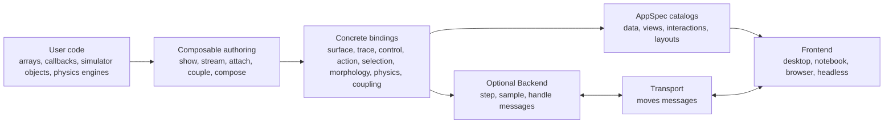

The important simplification is that the authoring layer composes features. The
runtime layer still has only:

```text
Backend <-> Transport <-> Frontend
```

When this proof draws `AppSpec --> Frontend`, it means materialization through
the runtime's `APP_SPEC_READY` message. Static apps can use an in-process
message from `AppRuntime`; live apps receive the same message through a
transport.

When this proof draws `Frontend --> Transport`, it means logical outbound
message flow. The frontend queues semantic messages internally; the runner or
transport loop calls `take_outbound_messages()` and then sends those messages
through the transport.

## Authoring Tiers

The same runtime should support three levels of user control:

| Tier | Typical user | What they write | What they avoid |
|---|---|---|---|
| Simple builder | Data visualization user | `show_surface(z)`, `live_trace(fn)`, `attach_neuron(sections)` | backend classes, field ids, message payloads |
| Composer object | Scientific Python user | `app.trace(...)`, `app.control(...)`, `app.layout(...)` | manual `AppSpec` assembly and command dispatch |
| Runtime protocol | Library extender | custom `Backend`, `Frontend`, `Transport`, or message payloads | high-level defaults that hide control |

The middle tier is the key target. It should feel like plotting or lightweight
dashboard construction, not frontend-framework programming.

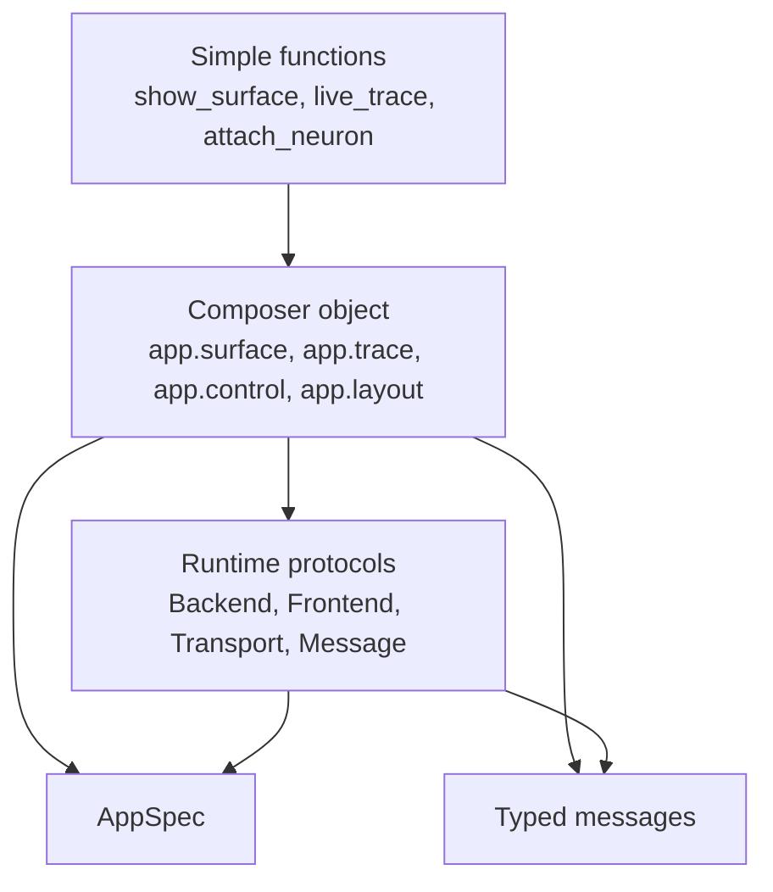

Backend subclasses remain valid, but they become the escape hatch. They should
not be the first concept shown to a user who wants to plot simulator state.

## Native Attachments Are Handles

`attach(...)` should be read as "make a CompNeuroVis adapter over my native
model," not "make my model conform to a CompNeuroVis class."

The attached value can be one of several shapes:

| Shape | User expectation | Example |
|---|---|---|
| Simulator root path | The adapter resolves native objects by path. | `cnv.moose.attach("/model")` |
| Simulator object | The adapter starts from an existing native object. | `cnv.moose.attach(moose.element("/model"))` |
| Explicit adapter | The user supplies resolution, stepping, or metadata. | `cnv.attach(MyMooseAdapter(root="/model"))` |
| Runtime hooks | The user supplies time/step behavior explicitly. | `cnv.moose.attach(root="/model", step=step_fn, time=time_fn)` |
| Callbacks | The user exposes values without simulator-specific discovery. | `trace(read=lambda: soma(0.5).v)` |
| Ports | A coupled backend exchanges values between engines. | `brain.output("muscle_activation")` |

Bindings then state the actual observation, mutation, or coupling semantics:

```python
brain = cnv.moose.attach(
    root="/model",
    step=lambda dt: moose.start(dt),
    time=lambda: moose.element("/clock").currentTime,
)

brain.trace("AVAL Vm", target="/model/AVAL/soma", attr="Vm")
brain.control("stim amp", target="/model/stim", attr="level")
brain.output("muscle_activation", read=read_muscle_activation)
brain.input("sensory_drive", write=write_sensory_drive)
```

This has three consequences:

- native simulator code remains native
- automatic discovery is optional and best-effort
- ambiguity is resolved with explicit targets, callbacks, adapters, or ports

The frontend still never sees native simulator handles. It sees `AppSpec`
declarations, stable ids, and messages.

## Lowering Contract

Concrete bindings are the bridge between friendly authoring and the runtime.
They are not yet generic `Capability` objects. The generic name should wait
until repeated concrete bindings prove one shared lifecycle.

| Binding | User-facing job | AppSpec contribution | Backend contribution | Frontend contribution | Messages |
|---|---|---|---|---|---|
| `SurfaceBinding` | Show a 2-D grid as a surface. | field spec, grid geometry spec, surface view, optional controls, layout panel | optional frame source for live/replay surfaces | surface renderer and visual state | `FieldReplace`, optional frontend-local state change |
| `TraceBinding` | Plot one or more scalar values over time. | field spec, line plot view, plot panel; later bounded-history metadata | recorder or callback sampler, reset replacement | line renderer, rolling window display | `FieldAppend`, `FieldReplace` |
| `ControlBinding` | Expose a parameter or view option. | control spec and placement | optional target setter, callback, or simulator attribute writer | widget state and validation | `SetControl`, optional frontend-local state change |
| `ActionBinding` | Expose a semantic button or shortcut. | action spec and placement | optional callback or backend handler | button, shortcut, tool affordance | `InvokeAction`, optional status/error |
| `SelectionBinding` | Let a frontend selection drive data or UI. | selectable view metadata, optional dependent traces | optional selected-entity sampler or state reaction | picking, highlight, local selection state | selection-changed message, `FieldReplace`, `FieldAppend` |
| `MorphologyBinding` | Show sections/cells and bind quantities to them. | morphology geometry spec, field specs, morphology view | simulator/object adapter, sampled display values | morphology renderer and picking | `FieldReplace`, selection messages |
| `PhysicsBinding` | Attach body physics state to the app. | optional body geometry, pose fields, contact fields, body views | adapts MuJoCo, Unity physics, or another physics engine | optional body/contact rendering and inspection | `FieldReplace`, `FieldAppend`, status/error |
| `CouplingBinding` | Connect neural and physics ports. | optional diagnostics and controls | routes outputs to inputs inside a coupled backend | usually none directly; optional diagnostics | normal app messages only for visible state |

This table proves the main architectural point: composable features can install
small backend behavior and small frontend behavior without creating a fourth
runtime layer. They lower into the existing three runtime actors and the
declarative `AppSpec`.

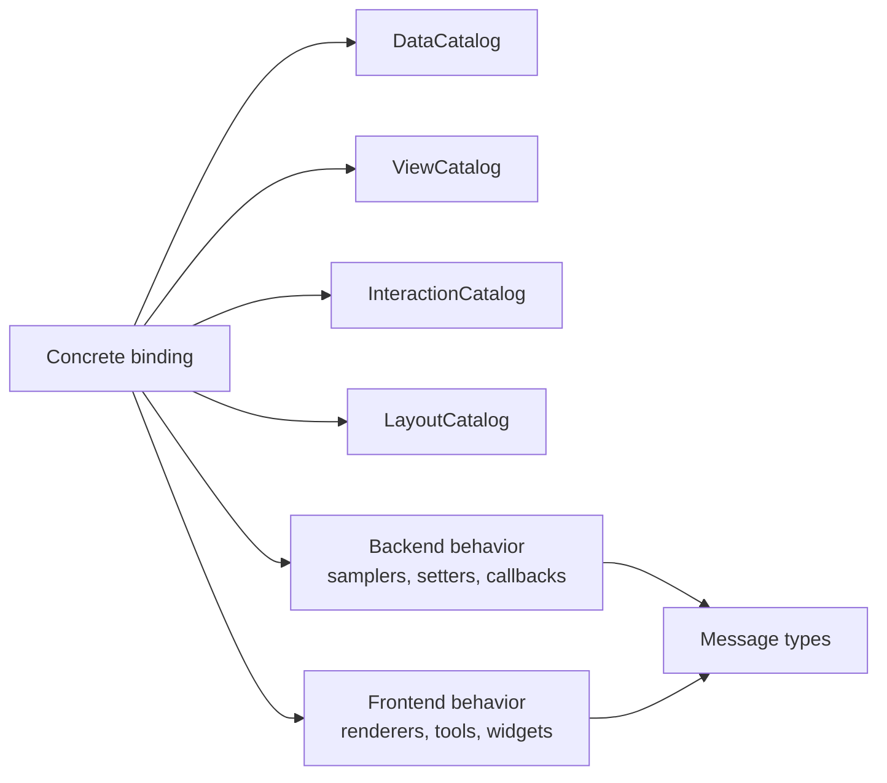

## Example Proof Matrix

| Current examples | Current shape | Composable target | Runtime proof |
|---|---|---|---|
| `examples/surface_plot/static_surface_visualizer.py` | `grid_field`, `SurfaceViewSpec`, `build_surface_app`, visual controls | `app.surface("sinc", z, x=x, y=y).view_3d(); app.control(..., target=surface.style(...))` | Static `AppSpec`; no backend required. |
| `examples/surface_plot/surface_cross_section_visualizer.py` | surface field, cross-section operator, linked line plot, controls | `surface.cross_section(axis=..., position=...).line_plot()` | One surface binding plus one derived-view binding. Visual controls can remain frontend state. |
| `examples/surface_plot/animated_surface_live.py` | `BufferedSession` subclass calls a frame function and emits `FieldReplace` | `app.surface("wave", initial=z0).stream(frame_fn, rate=...)` | Generated backend calls user function and sends `FieldReplace`. |
| `examples/surface_plot/animated_surface_replay.py` | `BufferedSession` iterates precomputed frames | `app.surface("wave", frames=frames).playback(...)` | Replay adapter is a backend over an iterator, not a user subclass. |
| `examples/debug/two_line_plots.py` | hand-built scene plus `BufferedSession` emitting `FieldAppend` | `app.trace("fast", fast_fn); app.trace("slow", slow_fn)` | Trace bindings generate fields, views, panels, append messages, and retention. |
| `examples/debug/multi_3d_views.py` | explicit morphology and surface views in one layout | `app.morphology(...); app.surface(...); app.layout(...)` | Multiple bindings contribute independent views to one `AppSpec`. |
| `examples/debug/two_morphology_views.py` | two morphology view specs over related geometry/fields | `morph.view("left", ...); morph.view("right", ...)` | Same data can materialize as multiple view declarations. |
| `examples/debug/session_error_after_open.py` | backend emits data then error | generated or custom backend raises/returns status | Errors stay message payloads, not authoring concepts. |
| `examples/neuron/complex_cell_example.py` | `NeuronSession` subclass with `build_sections`, controls, setup | `vis = cnv.neuron.attach(sections=sections); vis.morphology(sections); vis.trace(...); vis.control(...)` | NEURON adapter contributes backend sampling and morphology specs without owning model construction. |
| `examples/neuron/multicell_example.py` | `NeuronSession` subclass builds multiple cells | `vis.morphology(cells); vis.trace_many(...)` | Morphology binding handles many entities; layout remains orthogonal. |
| `examples/neuron/c_elegans_visualizer.py` | `NeuronSession` over imported SWC sections | `vis.morphology(load_swc(...))` | SWC import is data/model preparation; visualization is the same morphology binding. |
| `examples/neuron/hh_point_model_controls.py` | pure `BufferedSession` for point model traces and controls | `sim = cnv.live(step=step); sim.trace(...); sim.control(...); sim.action(...)` | Callback backend replaces subclass for common live scalar models. |
| `examples/neuron/hh_section_inspector.py` | custom `NeuronSession`, click selection, display quantity switch, linked plots | `morph = vis.morphology(...); selected = morph.selection(); vis.trace(..., source=selected)` | Selection becomes semantic frontend state sent to backend only when backend sampling depends on it. |
| `examples/neuron/signaling_cascade_vis.py` | `BufferedSession` with NEURON point processes, many controls, trace fields | `vis.trace_many(...); vis.control(..., target=attribute_ref); vis.action(...)` | Control and trace bindings remove repeated field/view/action plumbing. |
| `examples/custom/fitzhugh_nagumo_backend.py` | custom model, RK4 solver, explicit scene, `BufferedSession` | `sim = cnv.live(model, step=model.step); sim.trace(...); sim.control(...); sim.action(...)` | A generated callback backend covers common ODE-style simulations. |
| `examples/custom/lif_backend.py` | custom LIF model, controls, actions, live traces | same as custom live model | Same trace/control/action bindings as FitzHugh-Nagumo. |
| `examples/jaxley/multicell_example.py` | `JaxleySession` subclass and builder | `vis = cnv.jaxley.attach(model_or_adapter); vis.morphology(...); vis.trace(...); vis.control(...)` | Domain adapter differs, binding vocabulary stays shared. |
| Future C. elegans neural-body workflow | neural simulator plus MuJoCo/Unity physics exchanging motor and sensory state | `brain = cnv.moose.attach(root="/model", ...); app.couple(brain.output(...), body.input(...))` | One coupled backend owns simulation coupling. Frontend transport only sees app messages. |

The examples do not require one universal public base class. They require a
small set of bindings that lower into a shared runtime.

## Static Surface Proof

Today, the static surface example is already close to the target model, but it
still exposes `Field`, `GridGeometry`, `SurfaceViewSpec`, and `ControlSpec`
directly.

Illustrative target:

```python
app = cnv.app("static sinc")

surface = app.surface("sinc", z, x=x, y=y)
surface.view_3d(colormap="viridis", shaded=True)

app.control("colormap", choices=["viridis", "magma", "plasma"], target=surface.style("colormap"))
app.control("z_scale", range=(0.1, 3.0), target=surface.style("z_scale"))

app.run()
```

Lowering:

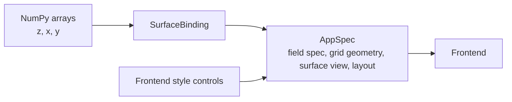

No backend is needed. This is important because "backend" should not become a
forced concept for static data visualization.

The cross-section example adds one derived view:

```python
section = surface.cross_section(axis="x", position=0.0)
section.line_plot()
```

That lowers to an operator or derived-view binding over the same field:

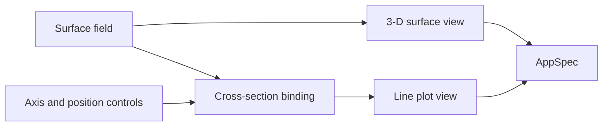

## Animated Surface And Replay Proof

The live and replay surface examples currently require direct
`BufferedSession` subclasses. That is the clearest sign that a thin rename is
not enough.

Illustrative live target:

```python
def frame(t, *, speed):
    return compute_surface(t * speed)

app = cnv.live_app("animated sinc")
surface = app.surface("wave", initial=z0, x=x, y=y)
surface.stream(frame, every="frame")
app.control("speed", range=(0.1, 5.0), default=1.0)
app.action("pause", app.pause)
app.action("reset", app.reset)
app.run()
```

Illustrative replay target:

```python
app = cnv.replay_app("animated sinc replay")
app.surface("wave", frames=frames, x=x, y=y).playback(rate_hz=30)
app.run()
```

Lowering:

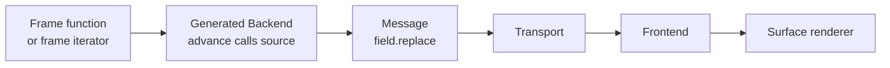

The user-facing abstraction is "stream this surface." The runtime abstraction
is still a backend that emits replace messages.

## Native NEURON Morphology Proof

The NEURON morphology examples prove why attachment matters. Users should keep
normal NEURON setup code and then add visualization.

Illustrative target:

```python
from neuron import h

soma, dendrites = build_normal_neuron_model()
stim = h.IClamp(soma(0.5))

vis = cnv.neuron.attach()
vis.morphology([soma, *dendrites], color=lambda sec: sec(0.5).v)
vis.trace("soma.v", y=lambda: soma(0.5).v, x=lambda: h.t)
vis.control("stim_amp", target=stim, attr="amp", range=(-1.0, 1.0))
vis.control("display_dt", target=vis.display_dt, range=(0.1, 10.0))
vis.run()
```

Lowering:

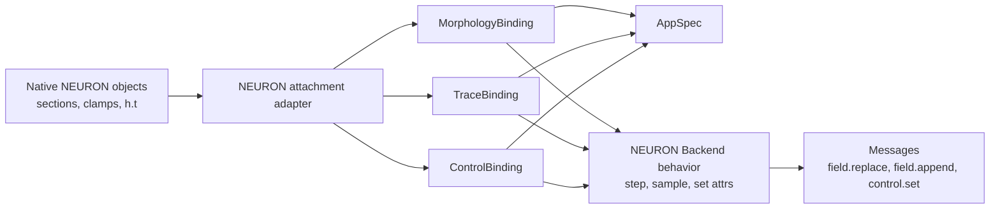

`complex_cell_example.py`, `multicell_example.py`, and
`c_elegans_visualizer.py` all fit this pattern. Their differences are in model
construction and geometry import, not in the public visualization architecture.
The native sections remain NEURON-owned; the adapter only records how to sample,
control, and visualize them.

## Point Models And Signaling Cascade Proof

The Hodgkin-Huxley point model, signaling cascade, FitzHugh-Nagumo, and LIF
examples all have the same repeated logic:

- create fields for live traces
- create line plot views
- create controls
- wire controls into model parameters
- append samples over time
- replace/reset full history when needed
- expose actions like pause, reset, excite, inhibit, or pulse

That repetition should become trace/control/action bindings.

Illustrative target:

```python
model = make_model()

sim = cnv.live(model, step=model.step, time=lambda: model.t)
sim.trace("voltage", y=lambda: model.v, window=5000)
sim.trace("current", y=lambda: model.i_ext, window=5000)
sim.control("stim_amp", target=model, attr="stim_amp", range=(-1.0, 1.0))
sim.action("reset", model.reset)
sim.action("pause", sim.pause)
sim.run()
```

Lowering:

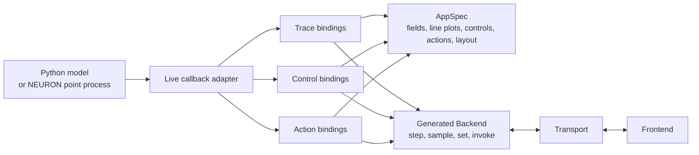

This directly covers:

- `examples/neuron/hh_point_model_controls.py`
- `examples/neuron/signaling_cascade_vis.py`
- `examples/custom/fitzhugh_nagumo_backend.py`
- `examples/custom/lif_backend.py`

Advanced users can still write a backend manually when custom scheduling,
custom buffering, or unusual performance behavior justifies it. The common case
should not require it.

## Section Inspector And Selection Proof

`hh_section_inspector.py` is the best stress test because it combines
morphology, display quantity switching, frontend picking, selection-dependent
history, controls, state patches, and linked line plots.

Illustrative target:

```python
vis = cnv.neuron.attach()

morph = vis.morphology(sections)
quantity = vis.control(
    "quantity",
    choices=["voltage", "m", "h", "n"],
    default="voltage",
)
morph.color_by(quantity)

selected = morph.selection(mode="section")

vis.trace("selected voltage", y=lambda sec: voltage_history[sec], source=selected)
vis.trace("selected gates", y=lambda sec: gate_history[sec], source=selected)
vis.trace("selected current", y=lambda sec: current_history[sec], source=selected)

vis.control("stim_scale", target=stimulus, attr="scale", range=(0.0, 3.0))
vis.run()
```

Here `vis.control(..., choices=...)` lowers to a `ControlBinding` with a choice
value spec. There is no separate `choice` authoring verb.

Lowering:

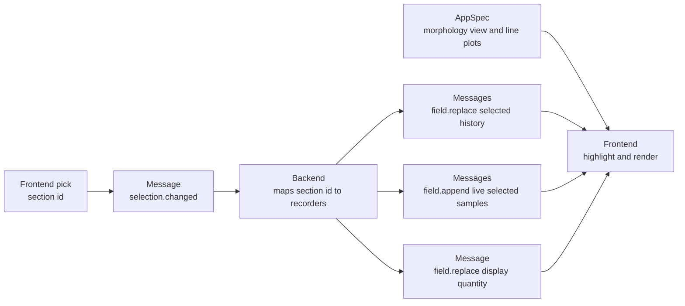

This proves that frontend-originated information does not have to be a command
every time. A section pick can be a semantic update: "selection changed." The
backend only needs to receive it when backend-side sampling depends on the
selection. Frontend-only highlight state can remain local.

## Jaxley Proof

The Jaxley multicell example should not need a separate public ontology. The
adapter changes, but the authoring concepts remain trace, morphology, control,
action, and layout.

Illustrative target:

```python
model = build_jaxley_model()

vis = cnv.jaxley.attach(model_or_adapter=model)
vis.morphology(model.cells)
vis.trace("cell voltage", source=model_voltage_source)
vis.control("stim_amp", target=stimulus_object, attr="amp")
vis.run()
```

Lowering:

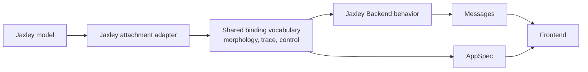

The important test is whether adding Jaxley features requires new frontend
concepts. It should not. Domain-specific code belongs in the adapter and
backend behavior.

## Coupled Neural-Physics Proof

An embodied simulation such as a C. elegans body model needs communication
between simulation engines:

- neural state drives muscles or actuators
- body physics produces contacts, pose, stretch, force, and proprioception
- those physical signals feed back into neural or muscle state
- both sides may produce traces, geometry, and diagnostic fields for the user

That communication should not go through the frontend transport. It is
simulation logic, so it belongs inside one coupled backend.

Illustrative target:

```python
brain = cnv.moose.attach(
    root="/model",
    step=lambda dt: moose.start(dt),
    time=lambda: moose.element("/clock").currentTime,
)
body = cnv.physics.mujoco("worm.xml")

app = cnv.coupled("c-elegans body")
app.couple(brain.output("muscle_activation"), body.input("actuators"))
app.couple(body.output("contacts"), brain.input("sensory_drive"))
app.couple(body.output("stretch"), brain.input("proprioception"))

app.trace("AVAL voltage", brain.trace("AVAL.v"))
app.body_view(body, color_by="contact_force")
app.control("fluid_drag", target=body, attr="drag")
app.run()
```

Lowering:

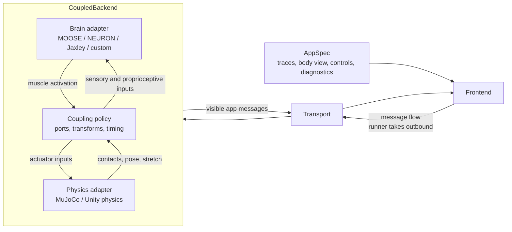

The coupling policy is the key runtime object inside the backend. It decides:

- lockstep fixed-dt vs substepping vs event-driven exchange
- which engine owns the authoritative clock
- how neural outputs become physics inputs
- how contacts, stretch, pose, and force become neural inputs
- which internal values are exposed as fields, traces, geometry, or status

Unity has two possible roles:

- `UnityFrontend` if Unity is rendering the CompNeuroVis app
- `UnityPhysicsAdapter` inside a coupled backend if Unity is running physics

The same process may eventually do both, but the architecture should keep those
roles separate. Rendering is frontend work. Physics state is backend work.

## Multi-View And Debug Proof

The debug examples are valuable because they test app composition rather than
domain integration.

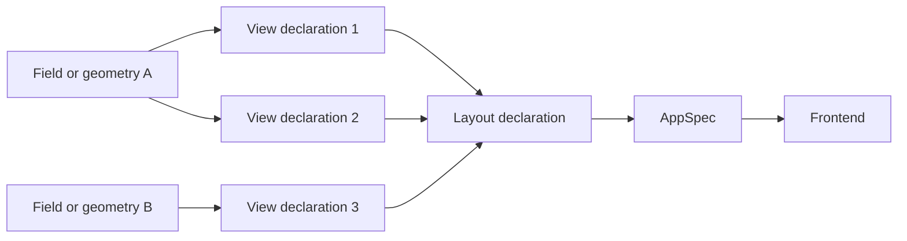

`multi_3d_views.py`, `two_morphology_views.py`, and `two_line_plots.py` all
fit this. The public API should let users add another view or layout placement
without changing app mode or backend class.

Errors also stay below the authoring surface:

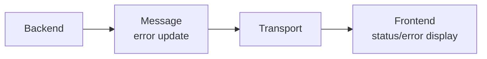

## Shared State Boundary

The current examples do not require direct shared mutable objects between
backend and frontend. They require two simpler mechanisms:

| Need | Lean mechanism | Example |
|---|---|---|
| Something changed. | Send a typed message. | field append, field replace, control set, selection changed |
| A side needs durable/lazy state later. | Add `ResourceRef`/`Snapshot` only when a real workflow needs read/subscribe behavior. | future large data, notebook state, document editor state |

The section inspector shows the rule:

- frontend highlight state can remain frontend-local
- selected section id can cross the transport as a selection-changed message
- backend can react by sampling selected traces and emitting field messages
- no shared object is needed

This keeps the first composable implementation lean. A resource plane remains a
future extension, not the default answer.

## Implication For Phase 1

Phase 1 should continue only with a stronger definition than "thin vocabulary
rename."

It should do these things:

- rename the runtime nouns directly: `Session` -> `Backend`,
  `Scene` -> `AppSpec`, transport payloads -> `Message`
- split `AppSpec` into catalogs so feature bindings have obvious places to
  contribute data, views, interactions, and layouts
- make docs and examples describe the runtime as substrate, not as the first
  authoring concept
- leave no long-lived compatibility layer for old names on this breaking branch
- keep backend subclasses available as an advanced escape hatch

It should not do these things:

- treat `NeuronBackend` or `BufferedBackend` subclassing as the normal user
  workflow
- expose `FieldAppend`, `FieldReplace`, `AppSpecPatch`, or transport messages
  as the first thing scientific users must learn
- implement generic `Capability` before concrete bindings prove the repeated
  lifecycle
- make every app look like "backend produces an app and sends it to frontend"
- force static data apps to have a backend

The minimum useful direction after the runtime rename should use the main
proposal's phase numbering. Main proposal Phase 2 creates the typed `Message`
envelope that Phase 3 bindings emit; the concrete binding slices below all live
under main proposal Phase 3:

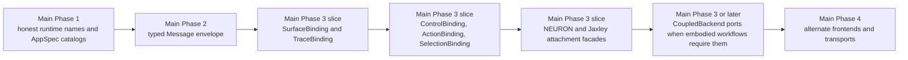

## Feasibility Checks

The composable approach is feasible if these checks stay true:

- Can a static surface app run with no backend? Yes.
- Can a live surface app be authored as a frame function rather than a backend
  subclass? Yes, through a generated backend.
- Can custom ODE models be authored as normal Python objects plus `step`,
  `trace`, `control`, and `action` declarations? Yes.
- Can NEURON users keep normal NEURON object construction? Yes, through native
  attachment adapters.
- Can Jaxley reuse the same public binding vocabulary? Yes, with a different
  domain adapter.
- Can a neural simulator and MuJoCo or Unity physics exchange contacts,
  stretch, proprioception, and motor output without turning the frontend
  transport into a simulation bus? Yes, through a coupled backend with typed
  internal ports.
- Can frontend-originated updates such as selection cross the transport without
  pretending to be commands? Yes.
- Can controls be frontend-only, backend-bound, or callback-bound? Yes, if the
  binding records the target role.
- Can notebook support reuse the model later? Yes, because `AppSpec` and
  messages are frontend-agnostic. The current implementation is still desktop
  first.
- Can advanced users still write backend classes? Yes, but that should be the
  extension tier, not the beginner tier.

If any of these checks fails during implementation, the refactor has drifted
back into a class-first framework instead of a composable scientific authoring
surface.
