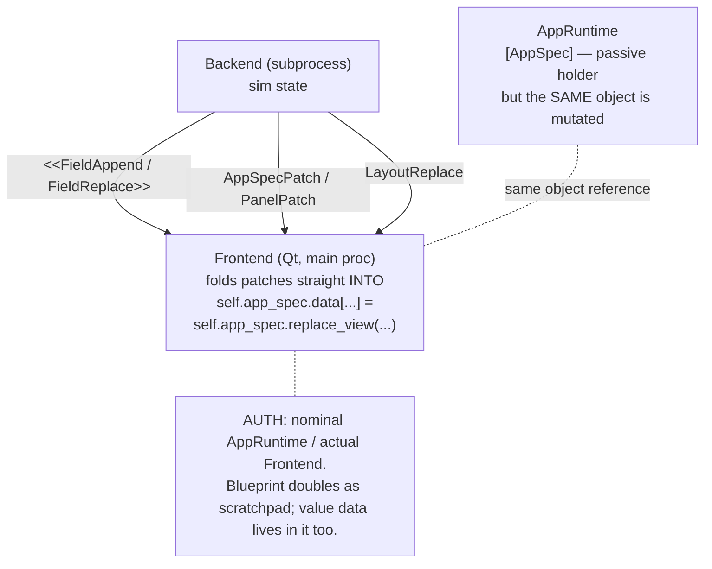
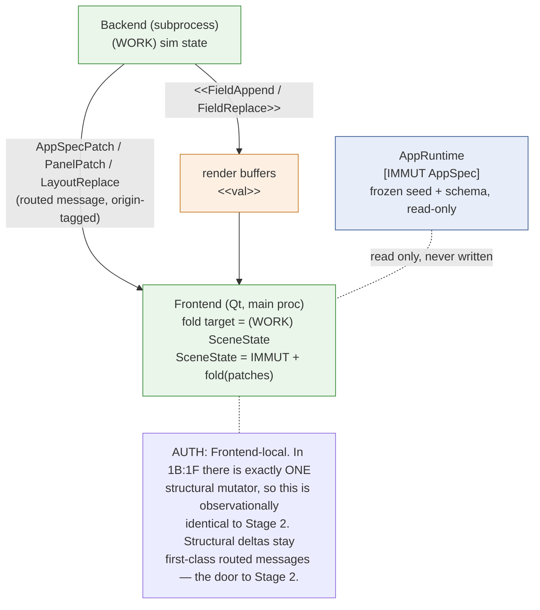
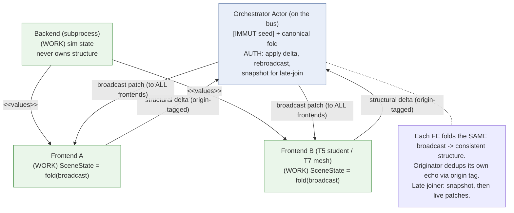

# M1 — AppSpec Authority: Staged Plan

The leak (M1): the vispy frontend folds the transport patch stream **into the
authoritative AppSpec object** every frame, so "AppSpec is authoritative and
read-only after construction" is false in practice.

Decision taken: target model is **(A) orchestrator-authoritative blueprint**,
but its costs (interaction round-trip latency, orchestrator re-bloat, a
mini distributed-consistency protocol, late-join snapshots) are *all* concentrated
in the broadcast/authority half — and none of (A)'s benefits are exercised by any
topology that exists today (all current rows are 1B:1F). So (A) is **sequenced**:
do the zero-regret data split now, defer the orchestrator-authority plumbing
until the first real multi-frontend topology.

## Tier legend

| Tier | Meaning |
|---|---|
| **IMMUT** | Immutable blueprint — AppSpec seed + schema (what fields/views/controls/layout exist, their types). Never holds per-frame values. |
| **WORK** | Per-actor mutable working state. `IMMUT + fold(patch stream) + actor runtime evolution`. Frontend's instance = `SceneState`; backend's = sim state. |
| **val** | High-rate value stream (`FieldAppend`/`FieldReplace`) — lossy render/compute buffer. Not blueprint, not necessarily persisted. |
| **AUTH** | Who is authoritative for *structural* deltas (PanelPatch / view / layout). |

---

## Stage 0 — Now (the M1 leak)

Problem: blueprint = mutable scratchpad; structural state and per-frame value
data both live inside the authoritative object.

---

## Stage 1 — Data-tier split (zero-regret, do now)

Changes (no transport/orchestrator change):
- `frontend.py` fold target `self.app_spec.*` → `self.scene.*`
- `AppRuntime` AppSpec frozen / read-only
- field values → explicit render buffers, **not** the spec
- structural patches **must remain routed messages with an origin tag** — never
  a local in-place edit (this single rule is what makes Stage 2 additive)

---

## Stage 2 — Orchestrator-authoritative (deferred: first multi-frontend topology)

Stage 1 → 2 is **purely additive**: insert the orchestrator actor that owns the
fold + rebroadcast. No actor's internal model changes — structural deltas were
already routed messages in Stage 1; the SceneState fold logic is reused verbatim.

---

## What moves, per stage

| | Stage 1 (now) | Stage 2 (deferred) |
|---|---|---|
| `frontend.py` | fold target → `self.scene` (`SceneState`) | unchanged (reuses Stage 1 fold) |
| `AppRuntime` | AppSpec frozen, read-only | gains canonical fold + rebroadcast + snapshot |
| Field values | explicit render buffers, off the spec | unchanged |
| Backend | working state already separate | unchanged (never owns structure) |
| Transport | unchanged | structural patches route to orchestrator actor |
| New component | none | Orchestrator Actor on the bus |
| Echo/consistency protocol | none needed (single mutator) | origin-tag dedup, apply order, late-join snapshot |

## Stage 1 — as implemented (2026-05-18)

- New `src/compneurovis/frontends/app_state.py`: `AppState` — thin owner,
  `__init__(seed)` does `copy.deepcopy(seed)` into `self.spec`. Fold logic
  stays in the actor (minimal, mechanical); only the mutation *target* moved
  off the authoritative object.
- `VispyFrontendWindow`: `self.app_state: AppState`; `app_spec` is now a
  read-only `@property` → `self.app_state.spec`. ~50 read sites untouched;
  `_set_app_spec` builds the `AppState` then rebinds locals to the working
  copy so `RefreshPlanner` and the fold block all operate on the copy.
- `AppRuntime.app_spec` docstring states the read-only contract; the copy
  boundary (not deep-freezing) is the enforcement — proportionate for Stage 1.
- NotebookFrontend inspected: already clean (own `_buf`, no structural fold).
- Naming: `AppState` (mutable counterpart to `AppSpec`), chosen over
  `SceneState` because the concept is per-actor/general, not frontend-only.
- Origin tag **not** added in Stage 1: structural changes already travel as
  routed messages (`AppSpecPatch`/`PanelPatch`/`LayoutReplace`), so the Stage 2
  door is open without a dead field. Stage 2 adds `origin` to `RoutedMessage`
  when the rebroadcaster exists.

## Stage 1.5 — pure spec/state split (2026-05-19)

Decision: a spec is composed of specs; immutability does not confer spec-ness.
`Field` (schema + values) was the only true value-in-spec conflation.

- New `FieldSpec` (declarative) in `core/field.py`: `id`, `dims`, `coords`
  schema, `unit`, `attrs`, and `initial_values` (declared initial condition —
  parallel to `ControlSpec.default_value`). `materialize() -> Field`.
- `Field` retained strictly as the runtime value view (renderers still consume
  it; its `.values/.select/.coord` logic untouched).
- `DataCatalog.fields: dict[str, FieldSpec]`; `core/__init__` exports both.
- Backends (`neuron/jaxley app_spec.py`) and `inline/bindings.py`
  (`_initial_field` → `_field_spec`) now build `FieldSpec`.
- `AppState = f(AppSpec)`: `AppState.fields` materialized from `FieldSpec`;
  `AppState.spec` keeps the structural working copy for spec→spec patches
  (ViewSpec replaced by ViewSpec — not a value/spec conflation).
- frontend.py field-value reads/folds go to `AppState.fields` via `_field()`;
  `View3DRefreshContext.fields` + `ctx.field()` thread live values to renderers.
- Verified: AppSpec holds only `FieldSpec`; evolving `AppState.fields` never
  mutates the blueprint; package/inline/backend/frontend modules import clean.
- **Not verified here (no display):** actual Qt desktop render + notebook
  render. Smoke-test files: `scratch/hh_neuron_attach.py`,
  `scratch/hh_neuron_inline.py`, `scratch/sine_wave_inline.py`,
  `scratch/hh_jaxley_attach.py`, `scratch/hh_neuron_notebook.ipynb`.

### Naming-parallelism survey (the rest of the spec family)

| Type/attr | Status | Recommendation |
|---|---|---|
| `FieldSpec`, `ControlSpec`, `ActionSpec`, `ViewSpec`, `OperatorSpec`, `PanelSpec`, `LayoutSpec`, `*ValueSpec` | Consistent `*Spec` | keep |
| `Geometry` / `MorphologyGeometry` / `GridGeometry` | **Not `*Spec`** — sits in `DataCatalog.geometries` beside `FieldSpec`. Purely declarative (no value/state half), so a *suffix* nit only, **not** a tier conflation | rename to `*GeometrySpec` is large mechanical churn for pure cosmetics — **defer**, optional |
| `ControlSpec.default_value` vs `FieldSpec.initial_values` | Different words for "declared start" | **keep** — "initial condition" (field) vs "default" (UI control) are domain-correct; don't force lexical uniformity |
| `LayoutCatalog.active: str` | **Tier issue** — *current selection* (state) living in the blueprint | next real (small) purity target — move active-layout-id into `AppState` |
| `AppSpec.metadata: dict` | **Tier issue** — mutable bag folded by `AppSpecPatch.metadata_updates` | move metadata overrides into `AppState` |

`active` and `metadata` are the only remaining true tier conflations (smaller
than `Field`). They currently live in `AppState.spec` (the structural working
copy) so they do **not** leak into the authoritative blueprint post-Stage-1 —
they are Stage 1.6 candidates, not blockers. `Geometry` naming is cosmetic.

## The staging contract

Stage 0→1 deletes the leak and is observationally identical to Stage 2 for every
topology that exists today. Stage 1→2 adds the authority/broadcast layer without
rewriting any actor — *provided* Stage 1 keeps structural patches as first-class
origin-tagged routed messages rather than local in-place edits.
