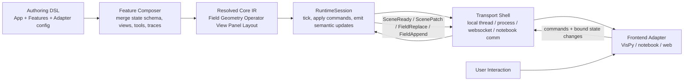
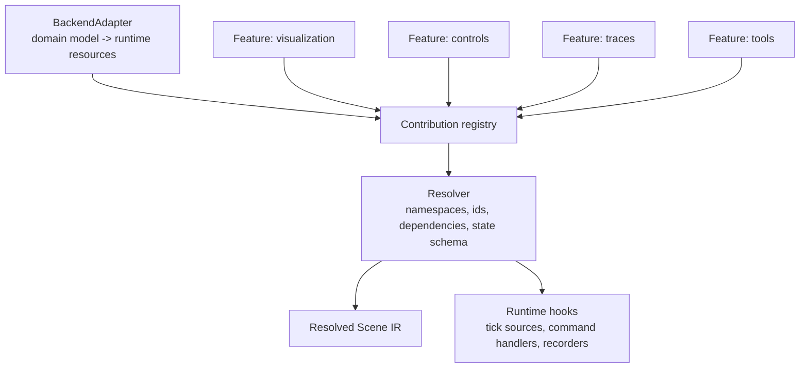
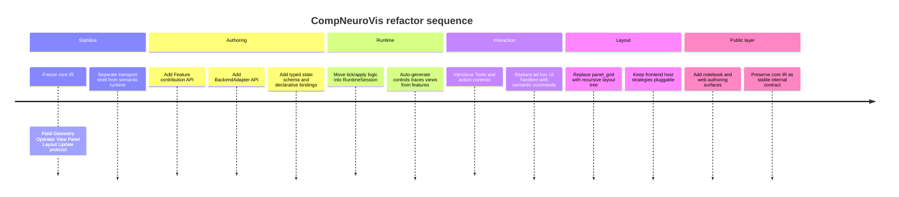

# CompNeuroVis Architecture Evaluation

## Executive summary

CompNeuroVis does **not** look fundamentally unsound. The strongest part of the design is the explicit split between data, geometry, derived operators, views, visible panels, and layout, plus a session protocol that treats the session as the authoritative owner of app state and pushes incremental updates to frontends. That is a real architectural backbone, not accidental complexity. It is much closer in spirit to the durable cores of VTK/ParaView, OpenMM, Arbor, and modern editor/runtime systems than to an ad hoc demo framework. citeturn34view0turn34view1turn35view0turn36view0

The part that feels wrong is **where the abstraction boundary currently sits for authors**. In the example session, one class is responsible for domain modeling, backend setup, scene construction, control and action declaration, trace bookkeeping, simulation stepping, state mutation, and UI event handling. That is why it feels boilerplate-heavy: the architecture is exposing what should be the internal intermediate representation and execution layer directly to app authors. The problem is less “bad separation” and more “good separation exposed one tier too low.” fileciteturn0file0

The most relevant comparison pattern across the systems surveyed is this: successful extensible platforms almost always stabilize **three tiers**. First, a narrow runtime core or IR. Second, a higher-level authoring layer that collapses repetitive wiring. Third, an execution layer that instantiates the authored graph against a concrete backend, frontend, and transport. Unity has GameObject/Component under Prefabs, ScriptableObjects, packages, and Input Actions. Unreal has UObjects/Actors/Components under Blueprints, plugins, modules, and Enhanced Input. Blender has persistent IDs/DNA/RNA under operators, modes, and add-ons. Arbor splits `recipe` from `simulation`; OpenMM splits `System`/`Force`/`Integrator` from `Context` and `Platform`; Brian2 compiles equations to device-specific runtime code; LFPy exists largely to remove raw NEURON boilerplate. citeturn3search8turn3search2turn4search1turn30search11turn5search0turn6search0turn6search1turn5search3turn8search12turn8search17turn8search0turn7search0turn36view0turn36view1turn35view0turn35view1turn26search16turn15search6

The practical conclusion is straightforward: **keep the current core model, but stop making application authors program against it directly**. CompNeuroVis should add a feature-composition layer on top of the current IR and a stricter execution layer underneath it. In concrete terms, the missing pieces are a first-class `BackendAdapter`, a declarative `Feature` contribution pipeline, a slimmer `RuntimeSession`, and declarative `Controls`, `Tools`, and `Traces` that compile into the existing scene/update protocol. Under the assumptions you gave - no fixed performance, host language, or transport constraints - that is the highest-leverage refactor. citeturn34view0turn34view1turn35view0turn36view0turn26search16turn25search13

## Assessment of the current CompNeuroVis core

The repository docs describe a system with a deliberately strong middle layer. `Field` answers “what are the values,” `Geometry` answers “where do they live,” `OperatorSpec` captures reusable derived transforms, `ViewSpec` captures rendering intent, `PanelSpec` represents visible host regions, and `LayoutSpec` controls composition. The VisPy frontend then resolves those panel specs into host widgets and inner widgets, uses refresh planning to update only affected views, and keeps 3D hosting strategy separate from view semantics. Those are all good decisions, and they are exactly the kind of “boring center, flexible edges” choices that help frameworks survive growth. citeturn34view0turn34view1turn1view0turn1view1

The docs also show that you are already resisting one of the biggest failure modes in scientific visualization software: conflating rendering hosts with data or view semantics. The distinction between a view, a visible panel, and layout topology is correct, and the planned ability to swap 3D hosting strategies without changing what a morphology or surface view means is structurally sound. That is the same kind of seam ParaView uses between pipeline/proxy/state and client-server presentation, and the same kind of seam VisPy uses between visuals, scenegraph semantics, canvas backends, and lower GL layers. citeturn34view0turn34view1turn17search6turn29search16turn22search2turn23search11turn23search16

Where the design currently overburdens authors is visible in the example session. The example manually creates domain state, constructs morphology geometry, allocates multiple fields for current display and retained history, declares control specs and action specs, constructs layout and views, advances the simulation, appends traces/history, and handles every control mutation imperatively in one session class. In other words, the same unit is acting as model adapter, feature assembler, runtime controller, and UI controller. That is not a fatal flaw in the core architecture, but it is a clear sign that the authoring tier is missing. fileciteturn0file0

The right diagnosis is therefore: **the core architecture is sound, but the public programming surface is too close to the IR**. This is exactly the position NEURON users are in when they stay at raw sections, point processes, and `Vector.record()` calls instead of climbing into LFPy wrappers or a higher-level application layer. It is also exactly why OpenMM has both an application layer and a lower core library, and why Arbor provides both `recipe`/`simulation` and a convenience `single_cell_model`. citeturn24search2turn27search6turn15search6turn35view4turn35view0turn36view1

My bottom-line evaluation is therefore: **CompNeuroVis is architecturally promising and conceptually coherent, but it needs to move complexity from per-app authorship into reusable framework-level compilation and composition mechanisms.** citeturn34view0turn34view1turn35view0turn36view0

## Lessons from engines and DCC systems

Unity’s durable pattern is not merely “components.” It is `GameObject` plus `Component` for the runtime object graph, then Prefabs and Prefab Variants for reusable authored units, ScriptableObjects for shared data independent of scene instances, packages for modular extension, Input Actions for mapping logical actions away from physical devices, and SerializedObject/UI Toolkit bindings for editor UI over serialized data. The relevant lesson for CompNeuroVis is that a good runtime core is not enough: users need prefab-like authored bundles and declarative binding over a stable serialized model. Without that, the component model degenerates into wiring boilerplate and script execution-order coupling. citeturn3search8turn3search2turn4search2turn4search1turn30search11turn30search12turn30search19

Unreal reaches a similar destination with different vocabulary. Actors contain Components; public object state is exposed through reflected UObjects; Blueprints give a node-based high-level authoring layer over the same architecture; plugins and modules package extensibility; Enhanced Input separates actions from device mappings and lets mapping contexts be added and removed dynamically. The key lesson for CompNeuroVis is that extensibility works best when the runtime object model is stable but the user-facing authoring layer is richer and more forgiving than the core. A second lesson is that tools and input need an explicit action/context model, not ad hoc widget callbacks. citeturn5search0turn5search4turn5search2turn6search0turn6search1turn6search9turn5search3turn5search11

Blender adds a lesson the game engines do not emphasize enough: **persistent data and transient tools should be different things**. Blender’s IDs/data-blocks are persistent scene data; DNA is the low-level persisted structure; RNA is the higher-level descriptive access layer; operators are transient tools invoked on events; modal operators manage interaction over time; add-ons package extensions around that model. For CompNeuroVis, this means `Scene`, `Field`, `Geometry`, and layout state should stay persistent and serializable, while `Tools` should be modeled more like Blender operators and modes: ephemeral, event-driven, stateful only as long as an interaction is active, and never the owners of the actual data model. citeturn8search12turn8search17turn8search0turn7search0turn7search10turn7search7

The most important negative lesson from these systems is also clear. When declarative authored units are missing, complexity spills into user code as giant constructors, manual ID plumbing, and imperative event handlers. Your example already has that smell. The remedy is not to collapse the architecture, but to add the authored unit that sits above it. In Unity it is the Prefab/ScriptableObject/package layer; in Unreal it is Blueprint/plugin/module; in Blender it is add-on plus operator plus persistent data-block; CompNeuroVis needs its own analog. fileciteturn0file0

## Lessons from scientific simulators and app frameworks

Among the simulator stacks, Arbor is especially instructive because it states the split plainly: a `recipe` describes a model and a `simulation` is the executable instantiation of that model. Then, for a common use case, `single_cell_model` absorbs the lower-level details of `recipe`, `context`, and `domain_decomposition`, while probes and traces remain explicit but compact. That is almost the exact conceptual split CompNeuroVis needs between `BackendAdapter` and `RuntimeSession`, with a convenience layer above both for common use cases. citeturn36view0turn36view1

OpenMM is the closest general architectural analog. Its public API layer exposes `System`, `Force`, `Integrator`, and `Context`, while the computation is delegated to lower implementation classes, kernels, and platforms. It has a separate application layer for common workflows, XML serialization for stable interchange, dynamic plugins for new platforms and force kernels, and high-level force-field XML authoring over the lower core. The key CompNeuroVis takeaway is that the right abstraction stack is: stable declarative description, execution context, pluggable backend, and a higher-level application facade. Your current IR already resembles the first piece; the missing pieces are the thin execution context and the authoring facade. citeturn35view0turn35view1turn35view2turn35view3turn35view4

Brian2 and NEST reinforce complementary points. Brian2 gives users a high-level equations DSL and compiles it into device-specific code through a `Device` and code-generation system, with monitors as first-class trace/recording objects. NEST gives users a simulator kernel accessed through PyNEST, recording backends that can write to memory, file, screen, or network, extension modules for custom models, and a REST-based NEST Server that decouples frontend from backend. Together they suggest that CompNeuroVis should let backend-specific authors work at a declarative DSL or adapter layer, while traces, recorders, and transport are framework services, not per-app responsibilities. citeturn26search16turn26search2turn26search3turn9search14turn25search2turn25search0turn31search13turn31search3turn31search5

NEURON and LFPy provide the clearest before-and-after example of boilerplate control. Raw NEURON gives sections, mechanisms, Python/HOC bridging, point processes, and `Vector.record()` hooks. LFPy sits on top and contributes higher-level cell, template-cell, synapse, electrode, and network classes that remove repetitive orchestration while still relying on the same simulator underneath. If CompNeuroVis keeps forcing end users to build at the equivalent of raw NEURON rather than the equivalent of LFPy, the boilerplate problem will persist no matter how good the core abstractions are. citeturn24search0turn24search2turn24search4turn27search6turn15search4turn15search6turn15search12

For dashboards and frontends, the main contrast is between **reactive state models** and **rerun/callback models**. Jupyter widgets keep synchronized model/view representations through comms and traitlets; Panel builds on Param and Bokeh server documents with explicit reactive parameters and watchers; Dash uses a component tree plus callback graph and browser-side JSON stores; Streamlit uses a simpler rerun-based execution model with session state and newer fragment-level partial reruns. For CompNeuroVis, the strongest inspirations are Jupyter widgets and Panel, because your existing `StateBinding` idea already points toward a typed reactive state system rather than a full-script rerun model. Streamlit is a good candidate for a later public-facing layer, but a weaker model for the core interactive runtime because the rerun contract is too coarse for the kind of incremental, semantically typed update stream your session protocol already supports. citeturn11search8turn28search2turn28search3turn12search4turn12search5turn12search12turn12search22turn20search15turn20search0turn21search16turn20search10turn13search5turn13search12turn13search1

VisPy, VTK, and ParaView matter most for the visualization side. VisPy already embodies several seams you want: scenegraph semantics, separate visuals, backend-neutral canvas/event abstractions, multiple GUI backends, explicit camera interaction styles, and even GLIR as a lower intermediate layer between high-level API and GL command execution. VTK gives the classic data-object/algorithm/pipeline model, object factories, and interaction styles. ParaView adds state files, Python traces, macros, programmable filters, and robust client-server separation on top of VTK. The clearest strategic implication is that CompNeuroVis should keep its typed scene/update model and eventually treat “authored app specs” the way ParaView treats state files and traces: as high-level reproducible artifacts over a stable pipeline core. citeturn23search9turn22search2turn23search5turn23search11turn22search0turn23search2turn23search16turn14search2turn14search19turn14search9turn33search1turn17search5turn17search6turn32search3turn32search5turn32search1turn32search0

## Comparison table and component mapping

### System comparison

| System | Architecture summary | Authoring tiers | Swap model | Tools and interaction model | Serialization and public/internal API split | Boilerplate reducers | Main tradeoffs and failure modes | Closest CompNeuroVis mapping |
|---|---|---|---|---|---|---|---|---|
| Unity | Runtime graph is GameObjects with attached Components and MonoBehaviour lifecycle. | Runtime graph below Prefabs, Prefab Variants, ScriptableObjects, packages, and editor bindings. | Packages extend editor/runtime; Input Actions abstract devices; rendering backends are mostly engine-internal from user perspective. | Input Actions/action maps separate logical actions from physical controls. | Scenes/prefabs serialize to text/YAML; ScriptableObjects are public data assets; SerializedObject/UI binding is editor-only. | Prefabs, variants, ScriptableObjects, package templates, UI bindings. | Component sprawl, hidden execution ordering, inspector-driven coupling. | `Feature` should become prefab-like; `Controls` should use declarative binding; `Tools` should use action maps over `Scene`/state. citeturn3search8turn3search2turn4search2turn4search1turn4search0turn30search11turn30search12turn30search19 |
| Unreal | Runtime graph is UObjects, Actors, and Components. | C++ core below Blueprints, reflected properties, modules, and plugins. | Plugins and modules are first-class; mapping contexts in Enhanced Input are swappable at runtime. | Enhanced Input uses Input Actions and Mapping Contexts. | Reflected UObjects are public; asset/package serialization and lower archive mechanics sit lower down. | Blueprints, plugin templates, reflected properties, modular gameplay. | Split brain between C++ and Blueprint; module/plugin boundary complexity. | Strong model for `Feature`, `BackendAdapter`, and `Tools` with input contexts. citeturn5search0turn5search4turn5search2turn6search0turn6search1turn6search9turn5search3turn5search11 |
| Blender | Persistent core is IDs/data-blocks; RNA describes access and metadata over lower DNA structures. | Persistent data below operators, modes, panels, and add-ons. | Add-ons package extensions; operators are transient tool units. | Modal operators handle long-lived interactions; keymaps and modes scope behavior. | DNA is low-level persisted structure; RNA and Python API are higher-level/public. | Add-ons, operators, property registration, panels. | Mode complexity, context-sensitive APIs, internal/public seam can be subtle. | Best model for keeping `Scene`/`Field`/`Geometry` persistent while making `Tools` transient operators. citeturn8search12turn8search17turn8search0turn7search0turn7search10turn7search7turn7search11 |
| NEURON | Low-level simulator centered on sections, mechanisms, point processes, and record/play primitives. | Python and HOC are public fronts; NMODL is a model DSL for mechanisms. | Mechanisms extend through `.mod` files and compilation; Python/HOC can front the same kernel. | Mostly programmatic; GUI tools exist, including Jupyter-compatible plotting helpers. | Public Python/HOC/NMODL APIs over a much lower simulator implementation. | Very few built-in boilerplate reducers at the app level. | Extremely flexible, but authors can get trapped in verbose low-level orchestration. | Warning sign for CompNeuroVis: do not make users live at raw `Session` + manual traces + manual controls. citeturn24search0turn24search2turn24search4turn27search6turn27search17 |
| Arbor | Explicit description/execution split: `recipe` describes model, `simulation` executes it. | Advanced users use recipe/simulation; wrappers like `single_cell_model` simplify common paths. | Mechanism catalogues, NMODL compilation, and ABI-based mechanisms enable extension. | Interaction is mostly programmatic via probes, schedules, samplers. | Public recipe/simulation/catalogue APIs over lower execution machinery. | `single_cell_model`, probes, traces, catalogues. | Lower-level recipe authoring is powerful but verbose for simple apps. | Closest analog for `BackendAdapter` -> model description, and `RuntimeSession` -> executable instantiation. citeturn36view0turn36view1turn36view2turn36view3 |
| Brian2 | High-level equations DSL lowered through devices and code generation. | Equations/NeuronGroup/Synapses/Monitors above runtime or standalone device backends. | `Device` picks runtime vs standalone and influences code generation. | Mostly programmatic; events and thresholds are declared in model strings. | Public DSL and monitor API over internal abstract code/code objects/templates. | DSL, automatic method choice, monitors, standalone generation. | Callback-like strings can become opaque; codegen internals are complex. | Strong precedent for `Feature` compilation and for treating `Traces` as first-class monitors. citeturn26search0turn26search16turn26search2turn26search3turn9search14 |
| NEST | Kernel-based spiking simulator with models, devices, rules, and recording/stimulation backends. | PyNEST is the high-level frontend; NESTML and extension modules generate/add lower-level models. | Recording backends can target memory, file, screen, or network; NEST Server exposes REST frontend/backend decoupling. | Programmatic interaction; server-client transport enables remote control. | PyNEST and NEST Server are public; internal kernel stays lower. | `Create`, `CopyModel`, built-in devices, NESTML, extension modules. | Kernel-global thinking can leak into user code; custom model path has build complexity. | Excellent model for `BackendAdapter`, `RuntimeSession`, and swappable transport. citeturn25search2turn25search0turn31search13turn31search3turn31search5 |
| Jupyter widgets | Synchronized model/view objects across kernel and frontend over comms. | High-level widgets above traitlets, comm messages, and custom widget packages. | Frontend is swappable across notebook-like hosts; custom widgets extend both kernel and browser sides. | Traitlet observation and widget events. | Public widget and traitlet APIs over comm protocol details. | Ready-made controls, traitlet syncing, cookiecutter custom widgets. | Fine-grained sync model can be conceptually heavy; dual Python/JS model required. | Useful model for `Controls` and `StateBinding`, especially for a notebook frontend. citeturn11search8turn28search2turn28search3turn28search4 |
| Dash | Layout tree plus callback graph over component props. | Declarative layout above callback wiring and component packages. | Custom React components and component packages extend the system. | Inputs/Outputs/State via callbacks; pattern-matching for dynamic collections. | Layout and callback API are public; frontend bundle handling and request machinery are lower. | Reusable components, `dcc.Store`, all-in-one components. | Callback graphs tangle quickly; state can become distributed and implicit. | Good model for a public-facing web layer, weaker model for the low-level core. citeturn20search15turn20search0turn21search16turn20search10turn21search0turn21search11turn20search23 |
| Panel | Reactive app layer over Param and Bokeh models/server sessions. | Param-declared state and Panel components above Bokeh models/documents/server. | Works across notebook and server contexts; custom reactive components are supported. | Reactive parameters, watchers, and server-side documents. | Public Param/Panel APIs over Bokeh model/document internals. | `param.Parameterized`, `pn.Param`, reactive expressions, server sessions. | Can accumulate reactivity indirection; Bokeh server model shapes deployment. | One of the best models for declarative `Controls` and state-driven `Traces`. citeturn12search4turn12search5turn12search12turn12search20turn12search22turn11search6 |
| Streamlit | Script-as-app rerun engine with per-session state. | Very high-level widget API above rerun/session semantics. | Custom components exist; frontend/backend are coupled to rerun model. | Widget interaction triggers reruns; forms and fragments reduce rerun scope. | Public widget/session APIs over internal rerun execution engine. | Minimal code for apps, `session_state`, forms, fragments. | Rerun semantics are simple but too coarse for tight incremental simulation UIs. | Good candidate for a later public layer, not the best shape for the CompNeuroVis core runtime. citeturn13search5turn13search12turn13search1turn13search11turn13search3 |
| VisPy | Scenegraph and visuals over canvas/app backends and lower GL layers. | Scene/visual APIs above gloo/gl and app backends. | Multiple GUI backends; GLIR provides an intermediate layer between high-level API and GL execution. | Canvas events and camera interaction styles are explicit. | Public scene/visual/canvas APIs over lower rendering abstractions. | SceneCanvas, visuals, cameras, reusable backends. | Easy to drift into low-level rendering details if too much leaks upward. | Strong fit for `Geometry`, `View`, `Tools`, and frontend `BackendAdapter`. citeturn23search9turn22search2turn23search5turn23search11turn22search0turn23search2turn23search16 |
| ParaView | VTK-based dataflow app with client-server and three-tier remote modes. | Pipeline/state/proxy model above VTK core; Python, trace, macro, and batch layers over GUI use. | Client-server is first-class; programmable filters and Python state/trace extend authoring. | GUI selection, multiple views, macros, traces, and programmable filters. | `.pvsm` XML and Python state files are public artifacts; lower VTK/server-manager internals stay underneath. | State files, Python trace, macros, `pvpython`, `pvbatch`. | Proxies/state can feel indirect; plugin and remote architecture add conceptual weight. | Best precedent for `Scene` as reproducible state and for future “authoring trace -> reusable app spec” tooling. citeturn17search6turn29search16turn17search5turn32search3turn32search5turn32search1turn32search0turn32search7 |
| VTK | Data-object and algorithm pipeline with rendering and interaction styles. | Data model and filters above lower rendering and factory machinery. | Object factories and wrapped toolkits support extension; Qt and other host integrations are available. | Interactor styles define event-driven interaction; user styles enable scripting-level customization. | Public data model, file formats, and pipeline APIs over lower execution details. | Pipeline composition, reusable file formats, object factories. | Can expose low-level data-motion complexity directly to users. | Best conceptual source for `Field`, `Geometry`, `OperatorSpec`, and pipeline-style view derivations. citeturn14search2turn14search19turn14search9turn33search1turn33search10turn33search21 |
| OpenMM | Layered core with public API objects, per-context implementations, and lower platforms/kernels. | Application layer above core library; XML force-fields above lower forces and kernels. | Plugins can register new Platforms and KernelFactories; Platforms swap hardware backends. | Mostly programmatic, but `Simulation` wraps common workflows cleanly. | XML serializer and XML force fields are public; lower kernels are internal. | `Simulation`, force-field XML, custom forces/integrators, plugins. | Core is elegant, but plugin and low-level extension work is specialized. | Best direct precedent for `BackendAdapter`, `RuntimeSession`, plugin backends, and serializable authored specs. citeturn35view0turn35view1turn35view2turn35view3turn35view4turn19search6 |
| LFPy | Convenience layer on top of NEURON for cells, synapses, extracellular recording, and networks. | High-level domain objects over raw NEURON primitives. | Swaps backend indirectly by relying on NEURON; extension happens through wrapper classes and domain objects. | Mostly programmatic; recording and probes are explicit domain classes. | Public wrapper API over NEURON details. | `Cell`, `TemplateCell`, `Synapse`, `RecExtElectrode`, network classes. | Wrapper still inherits simulator constraints, but massively reduces app boilerplate. | Best example of the kind of thin domain-specific packages CompNeuroVis should encourage on top of its core. citeturn15search4turn15search5turn15search6turn15search12 |

### Direct mapping into CompNeuroVis components

| CompNeuroVis component | Closest analogs | Recommendation |
|---|---|---|
| `Field` | VTK data arrays; ParaView scalar/vector arrays; Brian2 monitored variables. | Keep it minimal, typed, and frontend-agnostic. Do **not** let feature-specific semantics leak into the core `Field` type. citeturn14search19turn26search3turn17search5 |
| `Geometry` | VTK mesh/topology+geometry; NEURON section trees; LFPy morphology wrappers; VisPy visual geometry. | Keep geometry purely structural/spatial. Derived display choices belong in views, not geometry. citeturn14search19turn24search2turn15search4turn23search5 |
| `Scene` | ParaView state; Unity scene; Blender persistent data-block set. | Treat `Scene` as persistent authored state plus references, not as the place where runtime tool logic lives. citeturn32search3turn4search0turn8search12 |
| `Session` | Current CompNeuroVis authoritative session; NEST Server session; Streamlit browser session. | Narrow it. Make `Session` a transport-facing shell and move semantic execution into `RuntimeSession`. citeturn1view1turn31search13turn13search12 |
| `BackendAdapter` | Arbor `recipe`; OpenMM `Platform` plus application-layer model builder; NEST server/client seam. | Make this first-class. It should lower domain models into core scene/runtime contributions without owning UI policy. citeturn36view0turn35view0turn31search13 |
| `Feature` | Unity Prefab or package; Unreal plugin/game feature; Blender add-on; Panel component bundle. | Make this the main reusable authoring unit. Features should contribute controls, traces, tools, views, and state schema declaratively. citeturn30search11turn6search1turn7search7turn12search20 |
| `RuntimeSession` | Arbor `simulation`; OpenMM `Context`; Brian2 `Device`; NEST kernel instance. | This should own ticking, command application, and semantic updates only. No layout authoring, no repetitive spec construction. citeturn36view0turn35view0turn26search16turn25search2 |
| `Tools` | Blender operators/modal tools; Unreal Enhanced Input contexts; VTK interactor styles. | Model tools as transient interaction logic over stable scene/state. Do not bake them into persistent scene objects. citeturn7search0turn5search3turn33search1 |
| `Controls` | Jupyter widgets traitlets; Panel Param views; Dash component props and callbacks; Unity SerializedObject bindings. | Controls should be declarative bindings to typed state, not imperative `handle()` branches scattered through sessions. citeturn28search2turn12search20turn20search0turn30search12 |
| `Traces` | Brian2 monitors; NEURON `Vector.record()`; Arbor probes/traces; LFPy recording electrodes. | Make traces first-class and composable. Authors should declare “what to record” once and let the framework handle storage, retention, and plotting. citeturn26search3turn27search6turn36view1turn15search12 |

## Recommended refactor and API direction

The central refactor is to preserve the current IR while adding two new, stricter layers around it. The **upper layer** should be a feature composition system that lets authors contribute reusable pieces without touching low-level scene/update plumbing. The **lower layer** should be an execution-only runtime object that applies authored specs against a specific backend, frontend, and transport. This follows the most successful architecture pattern across Arbor, OpenMM, Brian2, ParaView, Unity, and Blender. citeturn36view0turn35view0turn26search16turn32search3turn30search11turn8search12



A good concrete rule is: **application authors should declare capabilities; framework code should assemble specs**. If a user is repeatedly writing IDs, control specs, trace fields, entity-selection handlers, and layout boilerplate, the framework is missing a composition primitive. Your docs already provide the right semantic split. What is missing is the compiler from convenient domain declarations into that split. citeturn34view0turn34view1turn32search5turn15search6



The refactor patterns I recommend are these. First, **freeze the core IR**. `Field`, `Geometry`, `OperatorSpec`, `ViewSpec`, `PanelSpec`, `LayoutSpec`, and typed update messages should stay small, stable, and intentionally dumb. Second, **make `Feature` the user-facing reusable unit**. A feature should contribute state schema, controls, tools, traces, maybe views, and optional runtime hooks, but it should not directly mutate the renderer or transport. Third, **make `BackendAdapter` the domain-lowering seam**. It should know how a NEURON/Arbor/OpenMM/LFPy model becomes fields, geometries, and runtime resources, but not how a public web UI is laid out. Fourth, **make `RuntimeSession` execution-only**. It should tick the model, apply semantic commands, and emit updates. Fifth, **replace imperative control handling with declarative bindings**. Sixth, **replace the current panel-grid topology debt with an explicit recursive layout tree**, because your own frontend docs already identify that as the remaining mismatch. citeturn34view1turn36view0turn35view0turn12search20turn28search2turn30search12

A workable minimal implementation could look like this:

```python
from __future__ import annotations
from dataclasses import dataclass, field
from typing import Protocol, Iterable, Callable, Any

# -----------------------
# Core contribution types
# -----------------------

@dataclass
class StateVar:
    key: str
    default: Any
    dtype: str = "any"

@dataclass
class ControlDecl:
    kind: str
    key: str
    label: str
    props: dict[str, Any] = field(default_factory=dict)

@dataclass
class TraceDecl:
    key: str
    source: str          # e.g. "segment:v", "probe:voltage", "field:Vm"
    retention: str = "rolling"

@dataclass
class ToolDecl:
    key: str
    kind: str            # e.g. "pick", "brush", "orbit", "scrub"
    props: dict[str, Any] = field(default_factory=dict)

@dataclass
class FeatureContribution:
    state: list[StateVar] = field(default_factory=list)
    controls: list[ControlDecl] = field(default_factory=list)
    traces: list[TraceDecl] = field(default_factory=list)
    tools: list[ToolDecl] = field(default_factory=list)
    views: list[Any] = field(default_factory=list)
    runtime_hooks: list[Callable[..., Any]] = field(default_factory=list)

class Feature(Protocol):
    def contribute(self, ctx: "ComposeContext") -> FeatureContribution: ...

class BackendAdapter(Protocol):
    def base_scene(self, ctx: "ComposeContext") -> Any: ...
    def create_runtime(self, ctx: "ComposeContext") -> "RuntimeSession": ...

class RuntimeSession(Protocol):
    def initialize(self) -> Any: ...
    def step(self) -> Iterable[Any]: ...
    def apply(self, command: Any) -> Iterable[Any]: ...

@dataclass
class ComposeContext:
    app_id: str
    config: dict[str, Any]
    state_schema: dict[str, StateVar] = field(default_factory=dict)

def compose(adapter: BackendAdapter, features: list[Feature], *, app_id: str, config: dict[str, Any]):
    ctx = ComposeContext(app_id=app_id, config=config)
    base_scene = adapter.base_scene(ctx)

    merged = FeatureContribution()
    for feature in features:
        c = feature.contribute(ctx)
        merged.state.extend(c.state)
        merged.controls.extend(c.controls)
        merged.traces.extend(c.traces)
        merged.tools.extend(c.tools)
        merged.views.extend(c.views)
        merged.runtime_hooks.extend(c.runtime_hooks)

    runtime = adapter.create_runtime(ctx)
    return {
        "scene": base_scene,
        "features": merged,
        "runtime": runtime,
    }
```

That core sketch should be followed by a declarative user-facing layer that looks more like authored “capabilities” and less like hand-built session wiring:

```python
app = compose(
    adapter=NeuronMorphologyAdapter(
        model="pharynx_muscle",
        morphology="cell1.hoc",
        mechanisms=["pas", "hh"],
    ),
    features=[
        MorphologyFeature(
            color_by="vmem",
            selectable="segments",
        ),
        LinePlotFeature(
            traces=[
                ("soma_v", "segment:soma[0.5].v"),
                ("selected_v", "selection:segment.v"),
            ],
            retention="5000 samples",
        ),
        ControlsFeature(
            slider("iclamp_amp", -50.0, 100.0, step=0.5, label="IClamp amplitude"),
            slider("iclamp_delay", 0.0, 20.0, step=0.1, label="IClamp delay"),
            select("display_quantity", ["vmem", "imem", "ina", "ik"]),
            toggle("autostep", default=True),
        ),
        ToolsFeature(
            pick_entities("segments", bind_selection="selected_segments"),
            orbit_camera("main_3d"),
            scrub_trace("selected_v"),
        ),
        TraceFeature(
            trace("selected_history", source="selection:segment.v", retention="rolling"),
            trace("soma_history", source="segment:soma[0.5].v", retention="rolling"),
        ),
    ],
    app_id="pharynx-muscle-demo",
    config={"frontend": "vispy", "transport": "local"},
)
```

In that shape, your current `Session` class turns into framework internals that lower these declarations into the existing scene protocol. The adapter owns domain lowering. Features own declarative capability contribution. Runtime owns execution. Frontend owns presentation cadence and input dispatch. That matches the direction already visible in the frontend docs, where refresh planning and panel hosting are frontend concerns rather than author concerns. citeturn34view1turn36view0turn35view0turn12search4

The biggest immediate boilerplate win would come from making `Controls`, `Tools`, and `Traces` compile down into current low-level objects automatically. In practice that means: a trace declaration creates the retention buffer field, plot view, and runtime recorder; a control declaration creates state, view bindings, validation, and command routing; a tool declaration registers interaction handlers and selection state updates. This is the same compression of repetitive orchestration that LFPy provides over NEURON, `Simulation` provides over OpenMM setup, and Panel provides over raw Bokeh documents. citeturn15search6turn35view3turn12search5

A sensible implementation order is:



If this refactor is done well, the result should feel like this:

- Core IR remains essentially what it is now.
- Example authors stop importing and instantiating half the framework to make a simple app.
- Domain packages can ship reusable feature bundles such as `MorphologyFeature`, `CableTraceFeature`, `SpikeRasterFeature`, `StateGraphFeature`, or `OpenMMTrajectoryFeature`.
- A later public-facing layer can target Dash, Panel, Streamlit, Jupyter widgets, or a custom web client **without** changing the core model. citeturn34view0turn34view1turn11search8turn12search4turn20search15turn13search5

## Open questions and limitations

This evaluation is based on the public architecture docs, the VisPy frontend docs, and the example file you provided. It does **not** include a full source audit of every implementation module, benchmark path, or test harness in the repository, so judgments about runtime cost and maintenance risk are stronger than judgments about current performance bottlenecks. citeturn1view0turn34view0turn34view1

The analysis also assumes no hard constraints on performance targets, implementation language, or transport protocol. If CompNeuroVis is secretly constrained to, for example, GPU-first multiprocess rendering, browser-only deployment, or cross-language ABI stability, some API edges would need to tighten earlier. Under the unconstrained assumption you specified, the highest-confidence recommendation is still the same: **preserve the current core, add a real authoring tier, and narrow the runtime tier.**