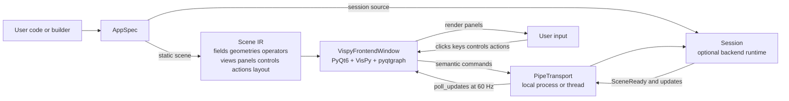
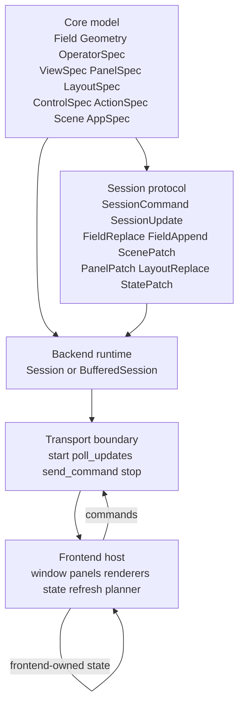
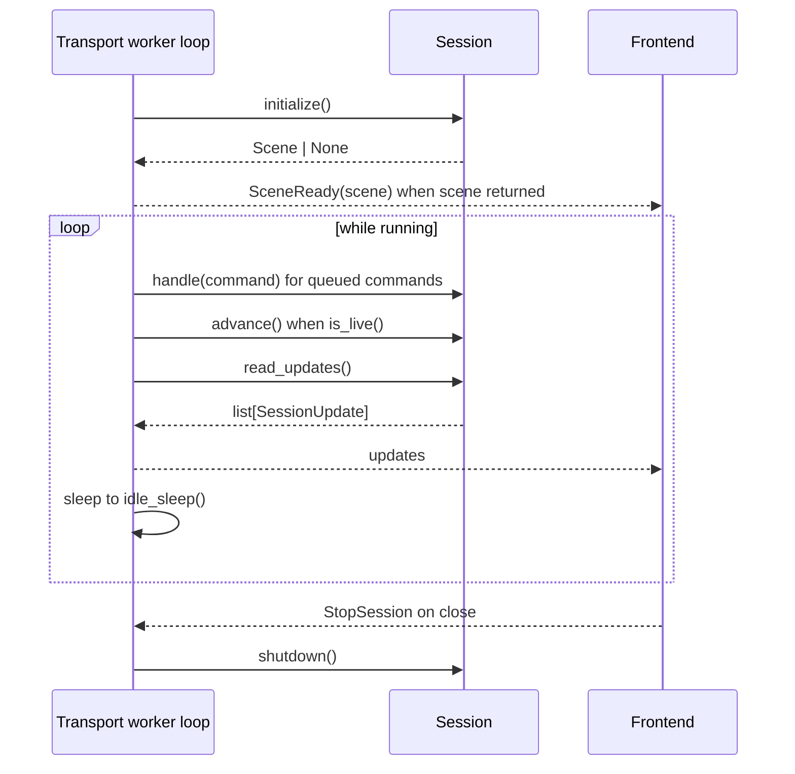
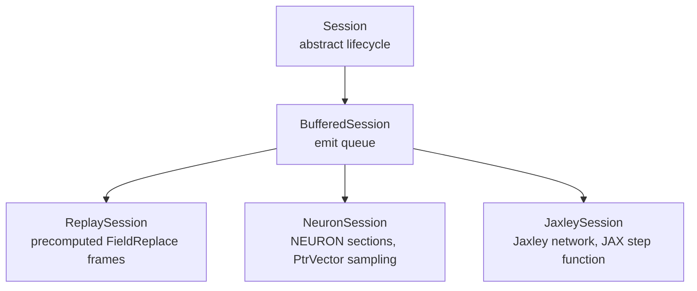
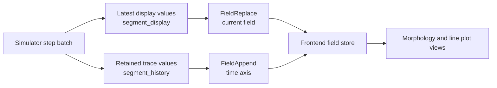
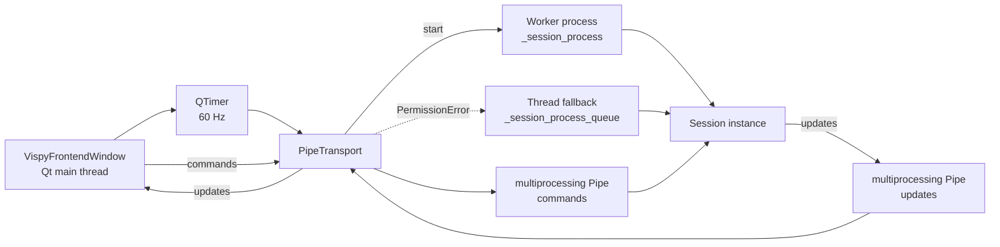
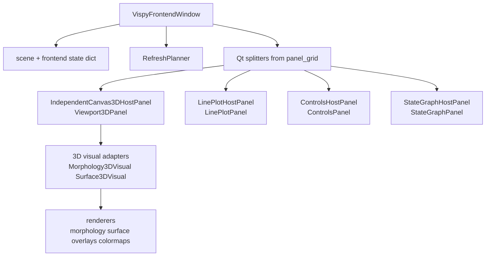
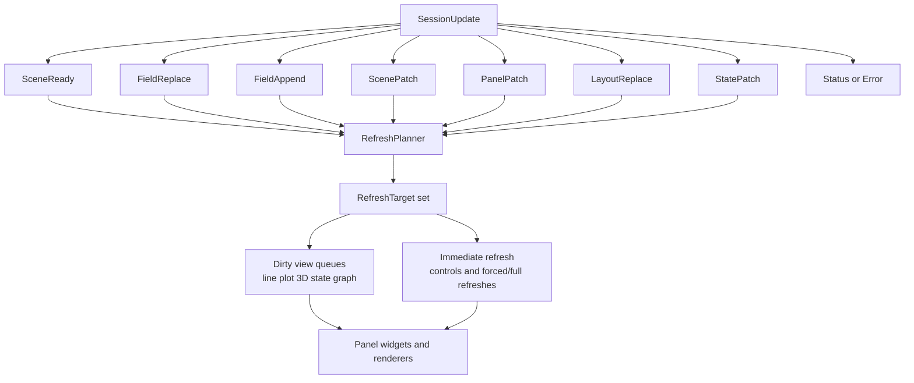
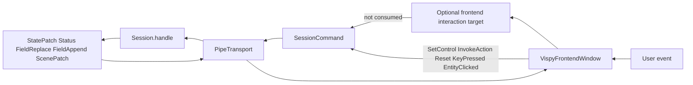
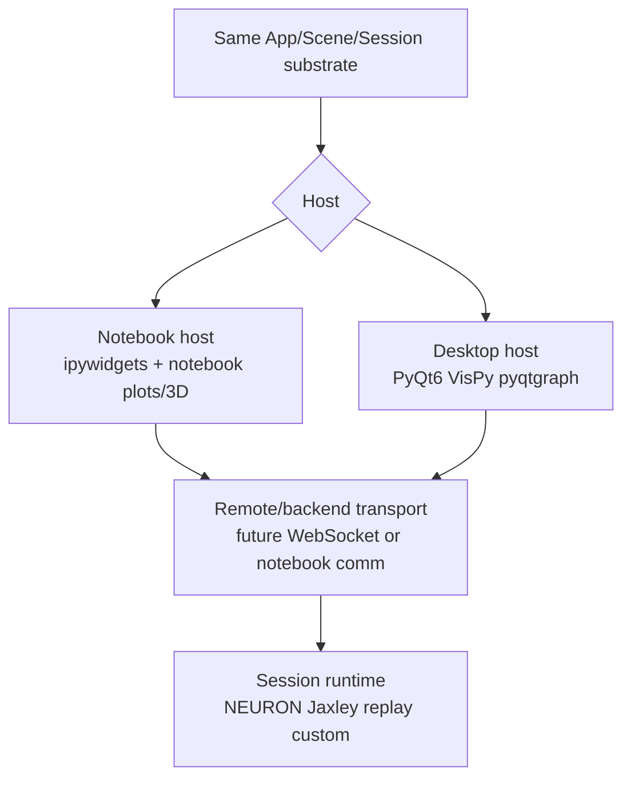

# Runtime Architecture Map

This page maps the architecture as it exists today. It focuses on the runtime
path from authored app objects, through backend sessions and transport, into the
current VisPy frontend. It also records how the current shape relates to the
notebook-host direction described in
[CompNeuroVis Architecture Proposal](design/proposals/CompNeuroVis_Architecture_Proposal.pdf).

## Big Picture Today

CompNeuroVis already has a strong middle layer: a frontend-neutral `Scene` made
from fields, geometries, operators, views, panels, controls, actions, and
layout. Live and replay backends communicate with the frontend through typed
commands and typed updates.

The current concrete host is still narrower than the long-term architecture:
`run_app(...)` always launches the PyQt6/VisPy desktop frontend, and live
sessions communicate through local `PipeTransport`.



## Abstract Layers

These are the conceptual layers that already exist in code or are implied by
the current package split.



Current implementation status:

| Layer | Current concrete code | Current limitation |
|---|---|---|
| Core model | `src/compneurovis/core` | `LayoutSpec.panel_grid` is transitional row-major topology. |
| Protocol | `src/compneurovis/session/protocol.py` | Python dataclass objects only; no language-neutral wire codec. |
| Runtime | `Session`, `BufferedSession`, `NeuronSession`, `JaxleySession`, `ReplaySession` | High-level authors still subclass sessions or assemble scenes directly for many workflows. |
| Transport | `PipeTransport` in `src/compneurovis/session/pipe.py` | Local Python process/thread only; no `AppSpec.transport` field yet. |
| Frontend | `VispyFrontendWindow` in `src/compneurovis/frontends/vispy/frontend.py` | Desktop PyQt6/VisPy only; no notebook frontend yet. |

## Core Scene Shape

`Scene` is the shared intermediate representation consumed by all current
frontends and sessions.

```mermaid
flowchart TD
    Scene[Scene]
    Fields[fields<br/>dict[str, Field]]
    Geometries[geometries<br/>dict[str, Geometry]]
    Operators[operators<br/>dict[str, OperatorSpec]]
    Views[views<br/>Morphology Surface LinePlot StateGraph]
    Controls[controls<br/>ControlSpec]
    Actions[actions<br/>ActionSpec]
    Layout[layout<br/>LayoutSpec]
    Panels[panels<br/>PanelSpec]
    Grid[panel_grid<br/>row-major topology]

    Scene --> Fields
    Scene --> Geometries
    Scene --> Operators
    Scene --> Views
    Scene --> Controls
    Scene --> Actions
    Scene --> Layout
    Layout --> Panels
    Layout --> Grid
    Views --> Fields
    Views --> Geometries
    Views --> Operators
    Panels --> Views
    Panels --> Controls
    Panels --> Actions
```

Important current facts:

- `Field` is the only data primitive for dense values.
- `Geometry` is structural and spatial, not time-varying.
- `ViewSpec` references fields, geometries, and operators by id.
- `PanelSpec` declares one visible host and the ids it contains.
- `LayoutSpec.panel_grid` arranges panel ids in flat rows. This is the main
  layout topology debt targeted by the layout workbench plan.

## Backend Abstraction

The backend-facing abstraction is `Session`.



Current session classes:



## Current Backend Implementations

| Backend path | Authoring shape today | Startup scene/data path | Live update path | Command path |
|---|---|---|---|---|
| Static surface | `build_surface_app(...)` returns `AppSpec(scene=...)` | Scene is given directly to frontend; no session required. | None unless app adds a session. | Frontend-only controls can update `StateBinding`; no backend command unless session exists. |
| Replay | `build_replay_app(scene=..., field_id=..., frames=...)` | Initial scene is passed in `AppSpec`; `ReplaySession.initialize()` also returns scene. | `ReplaySession.advance()` emits `FieldReplace` for each frame. | `Reset` sets frame index to zero and emits first frame. |
| NEURON | `build_neuron_app(MyNeuronSession)` where user subclasses `NeuronSession` | `initialize()` builds sections, geometry, display/history fields, morphology and trace views. | `advance()` runs `h.fadvance()` batches, emits display `FieldReplace` and history `FieldAppend`. | `SetControl`, `InvokeAction`, `EntityClicked`, `KeyPressed`, `Reset` dispatch through session hooks. |
| Jaxley | `build_jaxley_app(MyJaxleySession)` where user subclasses `JaxleySession` | `initialize()` builds cells/network, JAX runtime, geometry, display/history fields, views. | `advance()` calls compiled step function, emits display `FieldReplace` and history `FieldAppend`. | Same semantic command family as NEURON. |

Backend display/history pattern today:



The current simulator backends already separate latest display from retained
history through role-based default field ids. Voltage is the default sampled
quantity, not the required architectural concept.

## Current Transport Layer

`PipeTransport` is the only concrete transport today.



Current transport behavior:

- Session construction is lazy and worker-side. `PipeTransport` requires a
  `Session` subclass or top-level zero-argument factory, not an already-created
  session instance.
- On Windows, `run_app(...)` calls `configure_multiprocessing()` and uses spawn.
- If process creation hits `PermissionError`, `PipeTransport` falls back to a
  daemon thread and queues.
- `poll_updates()` drains a bounded number of update payloads per frontend poll
  and records whether more updates remain pending.
- Payloads are Python objects. There is no serialization codec boundary and no
  remote or cross-language transport today.

## Current Frontend

The current frontend is one PyQt6 main window with VisPy and pyqtgraph panels.



Frontend responsibilities today:

- Build visible panels from `PanelSpec` ids and `LayoutSpec.panel_grid`.
- Own UI state such as control values, selection, and slice positions.
- Convert user events into semantic commands when a session exists.
- Apply typed updates by mutating the local `Scene` and `Field` objects.
- Use `RefreshPlanner` to invalidate only affected targets.
- Coalesce repeated `FieldAppend` updates in one poll before mutating fields.
- Present dirty line plots, 3-D views, and state graphs on capped refresh
  schedules.

## Update Routing



Key current detail: `FieldAppend` is treated as a field mutation and currently
routed through `targets_for_field_replace(...)` after coalescing. That keeps the
frontend refresh path simple, but append-heavy live history still has array
growth cost until bounded append storage/backpressure work lands.

## Command Routing



The command vocabulary is semantic:

- `SetControl`
- `InvokeAction`
- `Reset`
- `KeyPressed`
- `EntityClicked`
- `StopSession`

The frontend sends these commands instead of raw Qt events.

## Current Structural Gaps

These gaps are real today and already align with the roadmap/backlog.

| Gap | Current state | Planned direction |
|---|---|---|
| Public authoring | Common live workflows still require session subclassing and manual scene/update knowledge. | Native attachment APIs, trace declarations, control bindings, reusable tools. |
| Layout topology | `PanelSpec` identity exists, but topology is flat `panel_grid`. | Recursive split-tree `panel_layout` with sizing rules. |
| Transport | Only local `PipeTransport`; no `AppSpec.transport` field. | `Transport` protocol, `WebSocketTransport`, backend server. |
| Notebook host | No first-class notebook frontend or notebook extra. | Separate notebook host/frontend over same scene/update substrate. |
| Package boundaries | Base install and top-level `compneurovis` import include Qt/VisPy frontend dependencies. | Future host/domain extras so notebook users do not need desktop GUI dependencies. |
| Wire protocol | Python dataclass objects over pipes. | Codec seam for remote or non-Python frontends. |

## Notebook Compatibility

The proposal PDF is right that notebooks are feasible, but current code should
not be described as notebook-ready.

Current facts that limit notebooks:

- `run_app(...)` creates or reuses a `QApplication`, opens a desktop window, and
  runs the VisPy/PyQt event loop when it owns the app.
- `AppSpec` has `scene` and `session`, but no pluggable `transport` field.
- `PipeTransport` is local process/thread IPC; it cannot connect a notebook
  frontend to a separate backend or browser renderer.
- Worker-backed sessions require a `Session` subclass or top-level factory.
  Notebook-defined classes/functions are a poor fit for Windows spawn and
  multiprocessing pickling.
- `pyproject.toml` currently makes `PyQt6`, `pyqtgraph`, and `vispy` base
  dependencies. The top-level package also imports the current frontend
  entrypoint. That conflicts with the proposal goal that notebook users should
  not need desktop GUI dependencies for notebook-only rendering.

So the notebook verdict is:

- **Same core model:** yes. `Field`, `Scene`, typed updates, controls, and
  `StateBinding` are compatible with a notebook host.
- **Simple static notebook rendering:** feasible as a first notebook frontend.
- **ipywidgets controls:** feasible because `ControlSpec` maps cleanly to
  sliders, dropdowns, checkboxes, and buttons.
- **Live line plots:** feasible if the notebook transport throttles/coalesces
  `FieldAppend` traffic.
- **Inline 3-D parity:** feasible later, but not by reusing the current Qt
  window. It needs a notebook renderer such as a browser/WebGL path or a
  notebook-compatible VisPy backend.
- **Full desktop layout parity:** not a first milestone. Notebook layout
  constraints differ from Qt splitter workbench constraints.

Recommended notebook path:



Minimal notebook milestone:

1. Split import/dependency boundaries so `compneurovis.core` and session
   protocol can import without Qt/VisPy.
2. Add a transport abstraction to `AppSpec` or a host-specific app runner.
3. Build a notebook host that renders static `Scene` data, `LinePlotViewSpec`,
   and `ControlSpec` with notebook-native widgets.
4. Add live update support for `FieldReplace`, `FieldAppend`, `StatePatch`, and
   `Status`, with notebook-specific throttling.
5. Add picking/tool parity only after static display, controls, and live traces
   are working.

## Refactor Implications

This map suggests a practical order for future refactors:

1. Keep `Scene` and typed protocol stable while improving public authoring.
2. Add native attachment and trace/control declarations above the current
   session layer.
3. Replace `panel_grid` with recursive layout topology.
4. Introduce a real transport seam before notebook, WSL, or web hosts.
5. Split host-specific dependencies so desktop and notebook users can install
   only the frontend they need.

